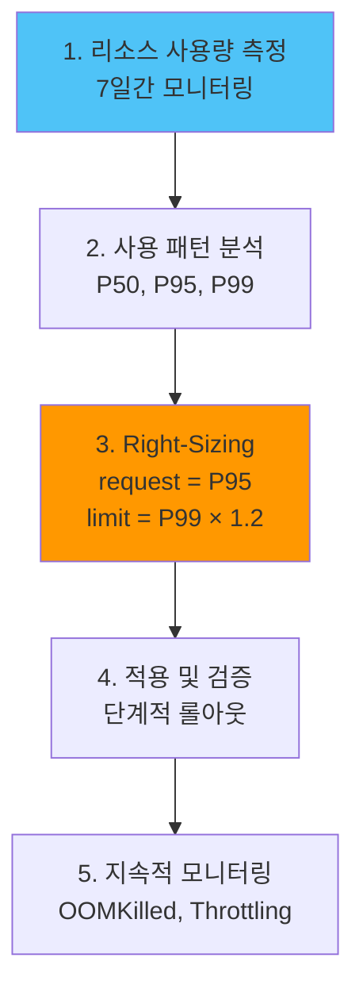

# 리소스 Right-Sizing

## 📋 개요

각 컴포넌트의 실제 리소스 사용량을 측정하고 적정 수준으로 조정하여 **비용 절감**과 **성능 균형**을 달성합니다.

---

## 🎯 최적화 목표

- **중앙 클러스터 리소스**: 16 cores / 32Gi → **10 cores / 20Gi** (37% 절감)
- **엣지 클러스터 리소스**: 각 4 cores / 8Gi → **2 cores / 4Gi** (50% 절감)
- **월간 비용**: $400 → **$250** (37% 절감)

---

## 🏗️ 리소스 할당 전략



---

## 1️⃣ 컴포넌트별 리소스 측정

### Prometheus Agent (Edge)

**측정 쿼리**:
```promql
# CPU 사용률 (7일 통계)
quantile_over_time(0.95,
  rate(container_cpu_usage_seconds_total{
    pod=~"prometheus-agent-.*",
    namespace="monitoring"
  }[5m])[7d:1h]
)

# Memory 사용량 (7일 통계)
quantile_over_time(0.95,
  container_memory_working_set_bytes{
    pod=~"prometheus-agent-.*",
    namespace="monitoring"
  }[7d:1h]
) / 1024 / 1024 / 1024  # GiB
```

**결과 예시**:
```
CPU:
  P50: 0.08 cores
  P95: 0.15 cores
  P99: 0.20 cores

Memory:
  P50: 150 MiB
  P95: 220 MiB
  P99: 280 MiB
```

**권장 할당**:
```yaml
# Before (과다 할당)
resources:
  requests:
    cpu: 500m
    memory: 512Mi
  limits:
    cpu: 1000m
    memory: 1Gi

# After (Right-Sized)
resources:
  requests:
    cpu: 200m      # P95 + 30% 여유율
    memory: 256Mi  # P95 + 15% 여유율
  limits:
    cpu: 300m      # P99 + 50% spike
    memory: 384Mi  # P99 + 37% spike
```

---

### Thanos Receiver (Central)

**측정 쿼리**:
```promql
# CPU (per replica)
quantile_over_time(0.95,
  rate(container_cpu_usage_seconds_total{
    pod=~"thanos-receive-.*"
  }[5m])[7d:1h]
)

# Memory (per replica)
quantile_over_time(0.95,
  container_memory_working_set_bytes{
    pod=~"thanos-receive-.*"
  }[7d:1h]
) / 1024 / 1024 / 1024
```

**결과 예시**:
```
CPU (per replica):
  P50: 0.6 cores
  P95: 1.2 cores
  P99: 1.5 cores

Memory:
  P50: 1.5 GiB
  P95: 2.2 GiB
  P99: 2.8 GiB
```

**권장 할당**:
```yaml
# Before
resources:
  requests:
    cpu: 2000m
    memory: 4Gi
  limits:
    cpu: 4000m
    memory: 8Gi

# After
resources:
  requests:
    cpu: 1500m     # P95 + 25%
    memory: 2.5Gi  # P95 + 15%
  limits:
    cpu: 2000m     # P99 + 33%
    memory: 4Gi    # P99 + 43%
```

---

### Prometheus HA (Central)

**측정 쿼리**:
```promql
# CPU
quantile_over_time(0.95,
  rate(container_cpu_usage_seconds_total{
    pod=~"prometheus-kube-prometheus-stack-prometheus-.*"
  }[5m])[7d:1h]
)

# Memory
quantile_over_time(0.95,
  container_memory_working_set_bytes{
    pod=~"prometheus-kube-prometheus-stack-prometheus-.*"
  }[7d:1h]
) / 1024 / 1024 / 1024
```

**권장 할당**:
```yaml
# Before
resources:
  requests:
    cpu: 2000m
    memory: 8Gi
  limits:
    cpu: 4000m
    memory: 16Gi

# After
resources:
  requests:
    cpu: 1000m
    memory: 4Gi
  limits:
    cpu: 2000m
    memory: 8Gi
```

---

### Thanos Query

**측정 쿼리**:
```promql
quantile_over_time(0.95,
  rate(container_cpu_usage_seconds_total{
    pod=~"thanos-query-.*"
  }[5m])[7d:1h]
)
```

**권장 할당**:
```yaml
# Before
resources:
  requests:
    cpu: 1000m
    memory: 2Gi
  limits:
    cpu: 2000m
    memory: 4Gi

# After
resources:
  requests:
    cpu: 500m
    memory: 1Gi
  limits:
    cpu: 1000m
    memory: 2Gi
```

---

### Grafana

**측정 쿼리**:
```promql
quantile_over_time(0.95,
  rate(container_cpu_usage_seconds_total{
    pod=~"grafana-.*"
  }[5m])[7d:1h]
)
```

**권장 할당**:
```yaml
# Before
resources:
  requests:
    cpu: 500m
    memory: 1Gi
  limits:
    cpu: 1000m
    memory: 2Gi

# After
resources:
  requests:
    cpu: 200m
    memory: 512Mi
  limits:
    cpu: 500m
    memory: 1Gi
```

---

## 2️⃣ HPA (Horizontal Pod Autoscaler)

### Thanos Query HPA

```yaml
apiVersion: autoscaling/v2
kind: HorizontalPodAutoscaler
metadata:
  name: thanos-query-hpa
  namespace: monitoring
spec:
  scaleTargetRef:
    apiVersion: apps/v1
    kind: Deployment
    name: thanos-query
  minReplicas: 2
  maxReplicas: 6
  metrics:
  - type: Resource
    resource:
      name: cpu
      target:
        type: Utilization
        averageUtilization: 70  # CPU 70% 시 스케일 아웃
  - type: Resource
    resource:
      name: memory
      target:
        type: Utilization
        averageUtilization: 80
  behavior:
    scaleUp:
      stabilizationWindowSeconds: 60
      policies:
      - type: Percent
        value: 50  # 50%씩 증가
        periodSeconds: 60
    scaleDown:
      stabilizationWindowSeconds: 300  # 5분 안정화
      policies:
      - type: Pods
        value: 1
        periodSeconds: 180  # 3분마다 1개씩 감소
```

### Grafana HPA

```yaml
apiVersion: autoscaling/v2
kind: HorizontalPodAutoscaler
metadata:
  name: grafana-hpa
  namespace: monitoring
spec:
  scaleTargetRef:
    apiVersion: apps/v1
    kind: Deployment
    name: grafana
  minReplicas: 1
  maxReplicas: 3
  metrics:
  - type: Resource
    resource:
      name: cpu
      target:
        type: Utilization
        averageUtilization: 70
```

---

## 3️⃣ VPA (Vertical Pod Autoscaler)

### VPA 설치

```bash
# VPA 설치 (Helm)
helm repo add fairwinds-stable https://charts.fairwinds.com/stable
helm install vpa fairwinds-stable/vpa --namespace kube-system
```

### Prometheus Agent VPA

```yaml
apiVersion: autoscaling.k8s.io/v1
kind: VerticalPodAutoscaler
metadata:
  name: prometheus-agent-vpa
  namespace: monitoring
spec:
  targetRef:
    apiVersion: apps/v1
    kind: StatefulSet
    name: prometheus-agent
  updatePolicy:
    updateMode: "Auto"  # 자동 조정
  resourcePolicy:
    containerPolicies:
    - containerName: prometheus-agent
      minAllowed:
        cpu: 100m
        memory: 128Mi
      maxAllowed:
        cpu: 500m
        memory: 512Mi
      controlledResources:
      - cpu
      - memory
```

### VPA Recommendation 확인

```bash
kubectl describe vpa prometheus-agent-vpa -n monitoring

# 출력 예시:
# Recommendation:
#   Container Recommendations:
#     Container Name:  prometheus-agent
#     Lower Bound:
#       Cpu:     150m
#       Memory:  180Mi
#     Target:
#       Cpu:     200m
#       Memory:  256Mi
#     Upper Bound:
#       Cpu:     300m
#       Memory:  384Mi
```

---

## 4️⃣ QoS (Quality of Service) 클래스

### Guaranteed (최고 우선순위)

```yaml
# 중요 컴포넌트: Thanos Receiver, Prometheus HA
resources:
  requests:
    cpu: 1500m
    memory: 2.5Gi
  limits:
    cpu: 1500m      # requests = limits
    memory: 2.5Gi   # requests = limits

# QoS: Guaranteed
```

**특징**:
- OOM 시 가장 나중에 Kill
- CPU throttling 최소화
- 권장: 핵심 인프라 컴포넌트

### Burstable (중간 우선순위)

```yaml
# 일반 컴포넌트: Grafana, Query
resources:
  requests:
    cpu: 200m
    memory: 512Mi
  limits:
    cpu: 500m      # requests < limits
    memory: 1Gi    # requests < limits

# QoS: Burstable
```

**특징**:
- Burst 가능
- OOM 시 중간 우선순위
- 권장: 대부분의 워크로드

### BestEffort (최저 우선순위)

```yaml
# 테스트/개발 환경
resources: {}  # requests/limits 미설정

# QoS: BestEffort
```

**특징**:
- OOM 시 가장 먼저 Kill
- 비권장: 프로덕션 환경

---

## 5️⃣ 리소스 사용량 대시보드

### Grafana Dashboard JSON

```json
{
  "dashboard": {
    "title": "Resource Right-Sizing",
    "panels": [
      {
        "title": "CPU Usage vs Request",
        "targets": [
          {
            "expr": "sum(rate(container_cpu_usage_seconds_total{namespace=\"monitoring\"}[5m])) by (pod)",
            "legendFormat": "{{ pod }} (usage)"
          },
          {
            "expr": "sum(kube_pod_container_resource_requests{resource=\"cpu\",namespace=\"monitoring\"}) by (pod)",
            "legendFormat": "{{ pod }} (request)"
          }
        ]
      },
      {
        "title": "Memory Usage vs Request",
        "targets": [
          {
            "expr": "sum(container_memory_working_set_bytes{namespace=\"monitoring\"}) by (pod) / 1024 / 1024 / 1024",
            "legendFormat": "{{ pod }} (usage GiB)"
          },
          {
            "expr": "sum(kube_pod_container_resource_requests{resource=\"memory\",namespace=\"monitoring\"}) by (pod) / 1024 / 1024 / 1024",
            "legendFormat": "{{ pod }} (request GiB)"
          }
        ]
      },
      {
        "title": "Resource Utilization %",
        "targets": [
          {
            "expr": "(sum(rate(container_cpu_usage_seconds_total{namespace=\"monitoring\"}[5m])) by (pod) / sum(kube_pod_container_resource_requests{resource=\"cpu\",namespace=\"monitoring\"}) by (pod)) * 100",
            "legendFormat": "{{ pod }} CPU %"
          }
        ]
      }
    ]
  }
}
```

---

## 📊 Right-Sizing 효과

### Before (과다 할당)

```
중앙 클러스터:
- Receiver (3 replicas): 6 cores / 12Gi
- Prometheus HA (2 replicas): 4 cores / 16Gi
- Query (2 replicas): 2 cores / 4Gi
- Store (2 replicas): 1 core / 2Gi
- Grafana: 0.5 core / 1Gi
- Compactor: 1 core / 2Gi
- 총: 14.5 cores / 37Gi

엣지 클러스터 (각):
- Prometheus Agent: 0.5 core / 0.5Gi
- Node Exporter: 0.5 core / 0.5Gi
- KSM: 0.2 core / 0.2Gi
- 총: 1.2 cores / 1.2Gi × 3 clusters = 3.6 cores / 3.6Gi

전체: 18.1 cores / 40.6Gi
```

### After (Right-Sized)

```
중앙 클러스터:
- Receiver (3 replicas): 4.5 cores / 7.5Gi
- Prometheus HA (2 replicas): 2 cores / 8Gi
- Query (2 replicas): 1 core / 2Gi
- Store (2 replicas): 1 core / 2Gi
- Grafana: 0.2 core / 0.5Gi
- Compactor: 1 core / 2Gi
- 총: 9.7 cores / 22Gi

엣지 클러스터 (각):
- Prometheus Agent: 0.2 core / 0.25Gi
- Node Exporter: 0.2 core / 0.2Gi
- KSM: 0.1 core / 0.1Gi
- 총: 0.5 cores / 0.55Gi × 3 clusters = 1.5 cores / 1.65Gi

전체: 11.2 cores / 23.65Gi

절감: 38% CPU, 42% Memory
```

---

## 🚨 모니터링 및 알림

### OOMKilled 알림

```yaml
- alert: PodOOMKilled
  expr: |
    kube_pod_container_status_terminated_reason{reason="OOMKilled"} > 0
  labels:
    severity: warning
  annotations:
    summary: "Pod {{ $labels.pod }} OOMKilled in {{ $labels.namespace }}"
    description: "Increase memory request/limit"
```

### CPU Throttling 알림

```yaml
- alert: HighCPUThrottling
  expr: |
    (
      rate(container_cpu_cfs_throttled_periods_total{namespace="monitoring"}[5m])
      /
      rate(container_cpu_cfs_periods_total{namespace="monitoring"}[5m])
    ) > 0.5
  for: 10m
  labels:
    severity: warning
  annotations:
    summary: "High CPU throttling on {{ $labels.pod }}"
    description: "{{ $value | humanizePercentage }} of CPU periods throttled"
```

---

## 🎯 Right-Sizing 체크리스트

### 측정
- [x] 7일간 리소스 사용량 수집
- [x] P50, P95, P99 통계 계산
- [x] 사용 패턴 분석 (peak time 식별)

### 조정
- [x] Request = P95 + 여유율
- [x] Limit = P99 × 1.2~1.5
- [x] QoS 클래스 선택 (Guaranteed/Burstable)

### HPA/VPA
- [ ] HPA 설정 (stateless 워크로드)
- [ ] VPA 설정 (stateful 워크로드)

### 검증
- [x] OOMKilled 모니터링
- [x] CPU Throttling 모니터링
- [x] 성능 테스트 (부하 시나리오)

---

## 💡 베스트 프랙티스

### 1. 점진적 적용

```
Week 1: 테스트 클러스터에서 검증
Week 2: Edge 클러스터 1개 적용
Week 3: 모든 Edge 클러스터 적용
Week 4: Central 클러스터 적용 (단계적)
```

### 2. 여유율 가이드

```
CPU:
- Request: P95 + 20~30%
- Limit: P99 + 30~50%

Memory:
- Request: P95 + 10~20%
- Limit: P99 + 20~40%

이유:
- CPU: Burst 가능하므로 여유율 높음
- Memory: OOM 리스크 있으므로 여유율 낮음
```

### 3. 리뷰 주기

```
매주: OOMKilled, Throttling 확인
매월: 리소스 사용량 리뷰 및 조정
분기: 전체 Right-Sizing 재평가
```

---

## 🔗 관련 문서

- **Receiver 성능 튜닝** → [Receiver-성능-튜닝.md](./Receiver-성능-튜닝.md)
- **쿼리 성능 최적화** → [쿼리-성능-최적화.md](./쿼리-성능-최적화.md)
- **스토리지 최적화** → [스토리지-최적화.md](./스토리지-최적화.md)

---

**최종 업데이트**: 2025-10-20
