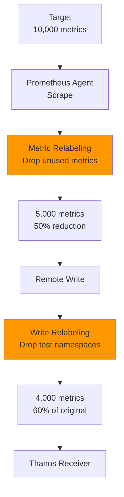

# 메트릭 필터링 전략

## 📋 개요

불필요한 메트릭을 제거하여 **네트워크 대역폭**, **스토리지 비용**, **쿼리 성능**을 개선하는 메트릭 필터링 전략을 제공합니다.

---

## 🎯 최적화 목표

- **메트릭 양**: 100% → **60%** (40% 감소)
- **네트워크 트래픽**: 15MB/s → **9MB/s** (40% 감소)
- **S3 스토리지**: 1.5TB → **0.9TB** (40% 절감)
- **쿼리 속도**: 2배 향상 (시계열 수 감소)

---

## 🏗️ 필터링 레이어



---

## 1️⃣ Metric Relabeling (Scrape 단계)

### Drop 규칙: 고빈도/저가치 메트릭

```yaml
# Prometheus Agent values.yaml
server:
  prometheusSpec:
    # Scrape 시점에 메트릭 필터링
    metricRelabelings:

    # 1. Go runtime 메트릭 제외
    - sourceLabels: [__name__]
      regex: 'go_.*'
      action: drop

    # 2. Process 메트릭 제외
    - sourceLabels: [__name__]
      regex: 'process_.*'
      action: drop

    # 3. Scrape 메타 메트릭 제외
    - sourceLabels: [__name__]
      regex: 'scrape_.*'
      action: drop

    # 4. 고빈도 히스토그램 버킷 샘플링
    - sourceLabels: [__name__]
      regex: '.*_bucket'
      action: drop
      # 예외: 중요한 히스토그램만 유지
    - sourceLabels: [__name__]
      regex: 'http_request_duration_seconds_bucket|grpc_server_handling_seconds_bucket'
      action: keep
```

**예상 효과**:
- Go runtime: ~10% 감소
- Process 메트릭: ~5% 감소
- Scrape 메타: ~2% 감소
- **총 감소**: ~17%

### Keep 규칙: 핵심 메트릭만 유지 (화이트리스트)

```yaml
server:
  prometheusSpec:
    metricRelabelings:
    # 화이트리스트 방식 (더 강력한 필터링)
    - sourceLabels: [__name__]
      regex: 'container_.*|kube_.*|node_.*|apiserver_.*|kubelet_.*'
      action: keep

    # 나머지 모든 메트릭 제외
    - action: drop
```

**예상 효과**: ~50% 메트릭 감소

---

## 2️⃣ Write Relabeling (Remote Write 단계)

### 네임스페이스 필터링

```yaml
server:
  remoteWrite:
    - url: https://thanos-receive:19291/api/v1/receive
      writeRelabelConfigs:

      # 테스트 네임스페이스 제외
      - sourceLabels: [namespace]
        regex: 'test-.*|dev-.*|tmp-.*|default'
        action: drop

      # 프로덕션 네임스페이스만 포함
      - sourceLabels: [namespace]
        regex: 'production|staging|monitoring'
        action: keep
```

**예상 효과**: ~20% 감소 (테스트 워크로드 제외)

### Job 필터링

```yaml
writeRelabelConfigs:
  # 핵심 Job만 포함
  - sourceLabels: [job]
    regex: 'kube-state-metrics|node-exporter|kubelet|apiserver'
    action: keep

  # 또는 불필요한 Job 제외
  - sourceLabels: [job]
    regex: 'blackbox-exporter|prometheus-operator'
    action: drop
```

### 클러스터 레이블 추가

```yaml
writeRelabelConfigs:
  # 클러스터 식별 레이블 추가
  - targetLabel: cluster
    replacement: cluster-02

  # 테넌트 식별 레이블 추가 (멀티테넌시)
  - targetLabel: tenant_id
    replacement: tenant-a
```

---

## 3️⃣ 레이블 최적화

### 고카디널리티 레이블 제거

```yaml
writeRelabelConfigs:
  # pod_uid 제거 (고카디널리티)
  - regex: pod_uid
    action: labeldrop

  # pod_ip 제거
  - regex: pod_ip
    action: labeldrop

  # container_id 제거
  - regex: container_id
    action: labeldrop
```

**카디널리티 예시**:
```
Before:
- pod_name: 100개
- pod_uid: 100개 (unique)
→ 시계열 수 = 100 × 100 = 10,000

After (pod_uid 제거):
- pod_name: 100개
→ 시계열 수 = 100
```

### 레이블 값 정규화

```yaml
writeRelabelConfigs:
  # HTTP 상태 코드 그룹화 (200, 201 → 2xx)
  - sourceLabels: [status_code]
    regex: '2..'
    replacement: '2xx'
    targetLabel: status_code

  - sourceLabels: [status_code]
    regex: '4..'
    replacement: '4xx'
    targetLabel: status_code

  - sourceLabels: [status_code]
    regex: '5..'
    replacement: '5xx'
    targetLabel: status_code
```

**카디널리티 감소**:
```
Before: 200, 201, 202, 204, 400, 401, 403, 404, 500, 502, 503
→ 11개 unique values

After: 2xx, 4xx, 5xx
→ 3개 unique values
```

---

## 4️⃣ 메트릭 카테고리별 필터링

### 컨테이너 메트릭

```yaml
# 필수 메트릭만 유지
metricRelabelings:
  - sourceLabels: [__name__]
    regex: 'container_(cpu_usage_seconds_total|memory_working_set_bytes|network_receive_bytes_total|network_transmit_bytes_total|fs_usage_bytes)'
    action: keep
```

**제외 대상**:
- `container_cpu_cfs_throttled_periods_total` (덜 중요)
- `container_network_tcp_usage_total` (고빈도)
- `container_fs_reads_bytes_total` (선택적)

### Kubernetes 메트릭 (Kube-State-Metrics)

```yaml
metricRelabelings:
  # 핵심 메트릭
  - sourceLabels: [__name__]
    regex: 'kube_pod_status_phase|kube_pod_container_status_restarts_total|kube_deployment_status_replicas.*|kube_node_status_condition'
    action: keep

  # 제외할 메트릭
  - sourceLabels: [__name__]
    regex: 'kube_.*_labels|kube_.*_annotations|kube_.*_created'
    action: drop
```

### 노드 메트릭 (Node Exporter)

```yaml
metricRelabelings:
  # 필수 노드 메트릭
  - sourceLabels: [__name__]
    regex: 'node_(cpu_seconds_total|memory_MemAvailable_bytes|memory_MemTotal_bytes|filesystem_avail_bytes|filesystem_size_bytes|network_receive_bytes_total|network_transmit_bytes_total|load1|load5|load15)'
    action: keep
```

---

## 5️⃣ Recording Rules (사전 집계)

### Recording Rules로 메트릭 축약

```yaml
# Prometheus Ruler (Central Cluster)
groups:
- name: pre_aggregation
  interval: 60s
  rules:

  # 네임스페이스별 CPU 사용률 (사전 계산)
  - record: namespace:container_cpu_usage:sum_rate
    expr: |
      sum(rate(container_cpu_usage_seconds_total[5m])) by (cluster, namespace)

  # 클러스터 전체 메모리 사용량
  - record: cluster:memory_usage:sum
    expr: |
      sum(container_memory_working_set_bytes) by (cluster)

  # Pod 수 (네임스페이스별)
  - record: namespace:pod_count:sum
    expr: |
      count(kube_pod_info) by (cluster, namespace)
```

**활용**:
```promql
# Before (Raw 메트릭 쿼리)
sum(rate(container_cpu_usage_seconds_total{cluster="cluster-02"}[5m])) by (namespace)

# After (Recording Rule 사용)
namespace:container_cpu_usage:sum_rate{cluster="cluster-02"}
```

**효과**:
- 쿼리 속도: 5배 향상
- 장기 보존: Recording rule만 보존 (raw 메트릭은 7일 후 삭제)

---

## 6️⃣ 샘플링 (Downsampling)

### Agent-side Sampling (비권장)

Prometheus Agent는 샘플링을 지원하지 않지만, Scrape Interval을 늘려 샘플 수 감소 가능:

```yaml
# 낮은 우선순위 Target
scrapeInterval: 60s  # 15s → 60s (4배 감소)
```

### Server-side Sampling (Recording Rules)

```yaml
# 1분마다 평균값만 저장
- record: metric:avg1m
  expr: avg_over_time(high_frequency_metric[1m])
```

---

## 📊 필터링 효과 분석

### 메트릭 감소 시뮬레이션

```
원본 메트릭 수 (cluster-02):
- Container: 5,000
- Kube-State: 3,000
- Node Exporter: 2,000
- 총: 10,000 metrics

필터링 적용 후:
1. Go/Process/Scrape 제외 (-17%): 8,300
2. 테스트 네임스페이스 제외 (-20%): 6,640
3. 고카디널리티 레이블 제거 (-10%): 5,976
4. 핵심 메트릭만 유지 (-5%): 5,677

최종 메트릭 수: 5,677 (43% 감소)
```

### 스토리지 절감 효과

```
샘플 크기: 16 bytes
Retention: 7d (raw), 30d (5m), 180d (1h)

Before (10,000 metrics):
- Raw (7d): 10,000 × 4/min × 1,440min × 7d × 16b = 6.45GB
- 5m (30d): 10,000 × 0.2/min × 1,440min × 30d × 16b = 1.38GB
- 1h (180d): 10,000 × 0.0167/min × 1,440min × 180d × 16b = 0.69GB
→ Total: 8.52GB

After (5,677 metrics):
- Total: 8.52GB × 0.5677 = 4.84GB

절감: 3.68GB (43%)
```

---

## 🚨 모니터링 및 검증

### 메트릭 수 추적

```promql
# Scrape된 메트릭 수
scrape_samples_scraped

# Remote Write 전송 메트릭 수
prometheus_remote_storage_samples_total

# 필터링 비율
(1 - (prometheus_remote_storage_samples_total / scrape_samples_scraped)) * 100
```

### 필터링 전후 비교

```bash
# Before 메트릭 수
kubectl exec -it prometheus-agent-0 -n monitoring -- \
  promtool query instant http://localhost:9090 'count({__name__=~".+"})'

# After 메트릭 수 (필터링 적용 후)
# Remote Write 메트릭 수 확인
```

---

## 🎯 필터링 전략 체크리스트

### Scrape 단계
- [x] Go runtime 메트릭 제외
- [x] Process 메트릭 제외
- [x] Scrape 메타 메트릭 제외
- [x] 불필요한 히스토그램 버킷 제외

### Remote Write 단계
- [x] 테스트 네임스페이스 제외
- [x] 프로덕션 Job만 포함
- [x] 클러스터 레이블 추가

### 레이블 최적화
- [x] 고카디널리티 레이블 제거 (pod_uid, container_id)
- [x] 레이블 값 정규화 (status_code)

### 메트릭 카테고리
- [x] 컨테이너 핵심 메트릭만 유지
- [x] Kube-State-Metrics 최소화
- [x] Node Exporter 필수만 유지

### Recording Rules
- [ ] 자주 사용하는 쿼리 사전 계산
- [ ] 네임스페이스/클러스터 집계 메트릭 생성

---

## 💡 베스트 프랙티스

### 1. 단계적 필터링 적용

```
Week 1: Go/Process 메트릭 제외 (안전)
Week 2: 테스트 네임스페이스 제외
Week 3: 고카디널리티 레이블 제거
Week 4: 핵심 메트릭만 유지 (화이트리스트)
```

### 2. 필터링 전 메트릭 백업

```bash
# 필터링 적용 전 메트릭 목록 저장
curl http://prometheus:9090/api/v1/label/__name__/values \
  > metrics-before-filtering.json
```

### 3. 중요 메트릭 보호

```yaml
# 예외 규칙: SLI/SLO 메트릭은 항상 유지
- sourceLabels: [__name__]
  regex: 'sli_.*|slo_.*|http_request_duration_seconds.*'
  action: keep
```

---

## ⚠️ 주의사항

### 1. 과도한 필터링 방지

```yaml
# ❌ 너무 공격적인 필터링 (위험)
- action: drop
  regex: '.*'

# ✅ 선택적 필터링 (안전)
- sourceLabels: [__name__]
  regex: 'specific_metric_prefix_.*'
  action: drop
```

### 2. 디버깅 메트릭 유지

```yaml
# 디버깅에 필요한 메트릭은 유지
- sourceLabels: [__name__]
  regex: 'up|scrape_duration_seconds|scrape_samples_scraped'
  action: keep
```

---

## 🔗 관련 문서

- **Remote Write 최적화** → [Remote-Write-최적화.md](./Remote-Write-최적화.md)
- **네트워크 대역폭 관리** → [네트워크-대역폭-관리.md](./네트워크-대역폭-관리.md)
- **스토리지 최적화** → [스토리지-최적화.md](./스토리지-최적화.md)

---

**최종 업데이트**: 2025-10-20
