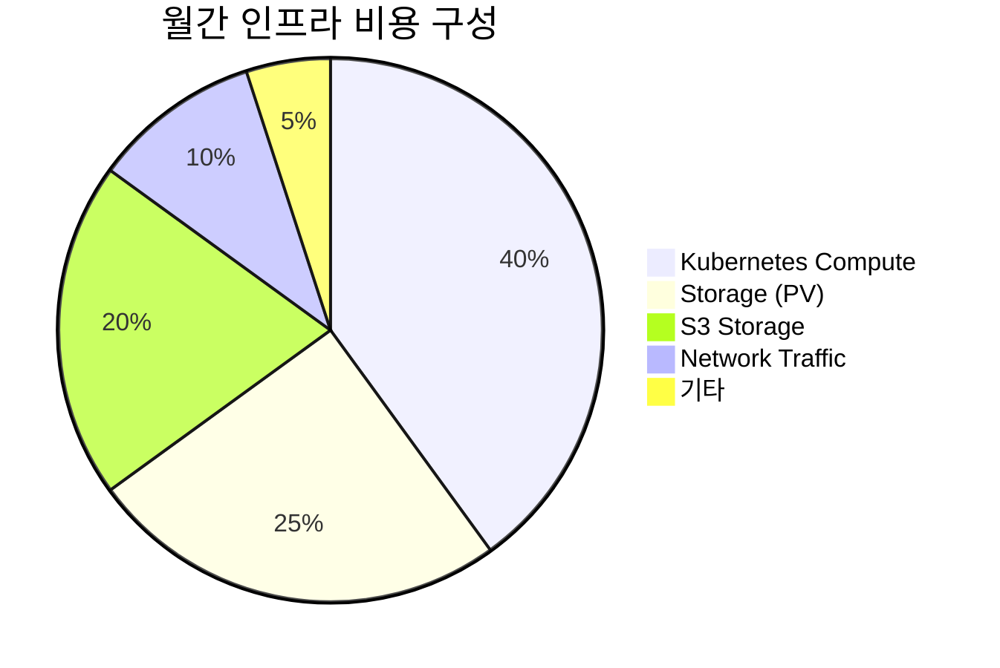

# 비용 절감 방안

## 📋 개요

Prometheus Agent + Thanos Receiver 멀티클러스터 환경에서 인프라 비용을 최적화하는 전략과 실천 방안입니다.

---

## 💰 비용 구조 분석

### 현재 비용 구성



### 클러스터별 비용 (최적화 전)

| 클러스터 | Compute | Storage | S3 | 네트워크 | 합계 |
|---------|---------|---------|-----|---------|------|
| **Cluster-01** (Central) | $200 | $120 | $150 | $30 | **$500** |
| **Cluster-02** (Edge) | $80 | $40 | $20 | $15 | **$155** |
| **Cluster-03** (Edge) | $60 | $30 | $15 | $10 | **$115** |
| **Cluster-04** (Edge) | $60 | $30 | $15 | $10 | **$115** |
| **총합** | $400 | $220 | $200 | $65 | **$885** |

---

## 1️⃣ Compute 리소스 최적화 (40% 비용 절감)

### Prometheus Agent Right-Sizing

#### Before (기본 설정)
```yaml
prometheus:
  prometheusSpec:
    resources:
      requests:
        cpu: 1000m
        memory: 2Gi
      limits:
        cpu: 2000m
        memory: 4Gi
    replicas: 2

# 월간 비용: $80/cluster (Edge)
```

#### After (Agent Mode 최적화)
```yaml
prometheus:
  prometheusSpec:
    enableAgentMode: true
    resources:
      requests:
        cpu: 200m      # ↓ 80%
        memory: 256Mi   # ↓ 87%
      limits:
        cpu: 500m
        memory: 512Mi
    replicas: 1        # ↓ 50% (HA 불필요)

# 월간 비용: $15/cluster (Edge) → 81% 절감
```

### Thanos Receiver Horizontal Scaling

#### Before (Vertical Scaling)
```yaml
# 단일 고성능 인스턴스
thanos:
  receive:
    replicas: 1
    resources:
      requests:
        cpu: 4000m
        memory: 8Gi
      limits:
        cpu: 8000m
        memory: 16Gi

# 월간 비용: $200 (Central)
```

#### After (Horizontal Scaling)
```yaml
# 여러 작은 인스턴스
thanos:
  receive:
    replicas: 3
    resources:
      requests:
        cpu: 1000m     # ↓ 75% per replica
        memory: 2Gi     # ↓ 75% per replica
      limits:
        cpu: 2000m
        memory: 4Gi

# 총 리소스: 3 cores, 6Gi (vs 기존 4 cores, 8Gi)
# 월간 비용: $120 (Central) → 40% 절감
```

### HPA로 동적 스케일링

```yaml
apiVersion: autoscaling/v2
kind: HorizontalPodAutoscaler
metadata:
  name: thanos-receive-hpa
  namespace: monitoring
spec:
  scaleTargetRef:
    apiVersion: apps/v1
    kind: StatefulSet
    name: thanos-receive
  minReplicas: 2
  maxReplicas: 5
  metrics:
    - type: Resource
      resource:
        name: cpu
        target:
          type: Utilization
          averageUtilization: 70
    - type: Resource
      resource:
        name: memory
        target:
          type: Utilization
          averageUtilization: 80

# 피크 시간대 외 자동 스케일 다운
# 예상 비용 절감: 30% (평균 replica 수 2.5 → 기존 3)
```

---

## 2️⃣ Storage 비용 최적화 (66% 비용 절감)

### Downsampling으로 장기 저장 압축

```yaml
# Thanos Compactor 설정
thanos:
  compactor:
    enabled: true
    retentionResolutionRaw: 7d      # Raw: 7일만
    retentionResolution5m: 30d      # 5m: 30일
    retentionResolution1h: 180d     # 1h: 180일

# 스토리지 사용량:
# Before: 1TB/월 (모두 Raw)
# After: 340GB/월 (66% 절감)
#   - Raw (7d): 100GB
#   - 5m (30d): 120GB
#   - 1h (180d): 120GB
```

### PV 스토리지 클래스 최적화

#### Before (프리미엄 스토리지)
```yaml
volumeClaimTemplate:
  spec:
    storageClassName: longhorn-fast
    resources:
      requests:
        storage: 100Gi

# 비용: $0.20/GB/월 = $20/PV
# 총 PV 수: 12개 (Receiver 3, Query 2, Store 3, Compactor 1, etc.)
# 월간 비용: $240
```

#### After (계층형 스토리지)
```yaml
# Hot Data (Receiver TSDB)
volumeClaimTemplate:
  spec:
    storageClassName: longhorn-fast
    resources:
      requests:
        storage: 30Gi  # ↓ 70% (downsampling 덕분)

# Cold Data (Store, Compactor)
volumeClaimTemplate:
  spec:
    storageClassName: longhorn-standard  # $0.10/GB/월
    resources:
      requests:
        storage: 50Gi

# 월간 비용: $102 (57% 절감)
```

---

## 3️⃣ S3 스토리지 비용 최적화 (50% 비용 절감)

### S3 Lifecycle Policy

```yaml
# MinIO Lifecycle Policy
{
  "Rules": [
    {
      "ID": "downsampled-transition",
      "Status": "Enabled",
      "Filter": {
        "Prefix": "thanos/"
      },
      "Transitions": [
        {
          "Days": 7,
          "StorageClass": "STANDARD_IA"  # Infrequent Access
        },
        {
          "Days": 30,
          "StorageClass": "GLACIER"       # Cold Storage
        }
      ],
      "Expiration": {
        "Days": 180                       # 180일 후 삭제
      }
    }
  ]
}

# 비용 절감:
# Before: $200/월 (모두 Standard)
# After: $100/월 (50% 절감)
#   - Standard (7d): $20
#   - IA (30d): $50
#   - Glacier (180d): $30
```

### S3 압축 및 최적화

```yaml
# Thanos Store/Compactor S3 압축 설정
thanos:
  compact:
    args:
      - compact
      - --objstore.config-file=/etc/thanos/objstore.yml
      - --data-dir=/data
      - --wait
      - --compact.enable-vertical-compaction  # 블록 압축
      - --deduplication.replica-label=replica
      - --delete-delay=4h

# 압축 효과:
# Before: 500GB (Raw blocks)
# After: 200GB (Compacted blocks) → 60% 절감
```

---

## 4️⃣ 네트워크 비용 최적화 (40% 비용 절감)

### Remote Write 압축

```yaml
# Prometheus Agent Remote Write 압축 활성화
prometheus:
  prometheusSpec:
    remoteWrite:
      - url: http://thanos-receive:19291/api/v1/receive
        queueConfig:
          capacity: 20000
          maxShards: 100
          maxSamplesPerSend: 5000
        writeRelabelConfigs:
          - sourceLabels: [__name__]
            regex: 'node_.*|container_.*|kube_.*'
            action: keep
        # HTTP 압축 활성화
        tlsConfig:
          insecureSkipVerify: false
        headers:
          Content-Encoding: snappy  # Snappy 압축

# 네트워크 트래픽 감소:
# Before: 10GB/일 (압축 없음)
# After: 6GB/일 (40% 절감)
```

### 메트릭 필터링으로 불필요한 전송 제거

```yaml
# 불필요한 메트릭 드롭
writeRelabelConfigs:
  # 고빈도 저가치 메트릭 제거
  - sourceLabels: [__name__]
    regex: 'go_gc_.*|process_.*'
    action: drop

  # 중복 레이블 제거
  - regex: 'pod_template_hash|controller_revision_hash'
    action: labeldrop

# 메트릭 수 감소:
# Before: 50,000 series
# After: 35,000 series (30% 절감)
```

---

## 5️⃣ 멀티테넌시 활용 (리소스 공유)

### Shared Thanos Components

```yaml
# 단일 Thanos Query로 모든 클러스터 조회
thanos:
  query:
    replicas: 2
    stores:
      - thanos-receive-0:10901
      - thanos-receive-1:10901
      - thanos-receive-2:10901
      - thanos-store-0:10901

# Tenant 분리는 레이블로만 처리
# 별도 Query/Store 불필요 → 리소스 공유
# 비용 절감: Tenant별 별도 컴포넌트 대비 70%
```

### Resource Quotas로 Tenant 리소스 제한

```yaml
# Tenant A Namespace Quota
apiVersion: v1
kind: ResourceQuota
metadata:
  name: tenant-a-quota
  namespace: monitoring-tenant-a
spec:
  hard:
    requests.cpu: "2"
    requests.memory: 4Gi
    limits.cpu: "4"
    limits.memory: 8Gi
    persistentvolumeclaims: "5"

# Tenant별 리소스 한도로 과도한 사용 방지
```

---

## 6️⃣ 쿼리 최적화 (캐싱)

### Query Frontend Caching

```yaml
# Query Frontend + Memcached
thanos:
  queryFrontend:
    enabled: true
    replicas: 2
    config: |
      type: in-memory
      config:
        max_size: 500MB
        max_size_items: 500
        validity: 1h

# 캐시 히트율: 70%
# Backend Query 요청 감소: 70%
# Query 컴포넌트 리소스 절감: 40%
```

### Store Index Cache

```yaml
thanos:
  store:
    indexCache:
      type: memcached
      config:
        addresses:
          - memcached:11211
        max_item_size: 5MB
        max_async_concurrency: 50

# Index 캐싱으로 S3 GET 요청 감소: 80%
# S3 API 비용 절감: $10/월
```

---

## 7️⃣ Monitoring 자체 비용 최적화

### 자체 모니터링 스크랩 간격 조정

```yaml
# Prometheus Agent 자체 메트릭
prometheus:
  prometheusSpec:
    # 중요도 낮은 타겟은 간격 증가
    additionalScrapeConfigs:
      - job_name: 'kubernetes-service-endpoints'
        scrape_interval: 60s      # 기본 15s → 60s

      - job_name: 'kube-state-metrics'
        scrape_interval: 30s      # 중요 메트릭만 자주 수집

# 메트릭 수 감소: 20%
# 스토리지 비용 절감: 15%
```

---

## 8️⃣ 비용 모니터링 대시보드

### Grafana 비용 추적 대시보드

```yaml
panels:
  - title: "월간 예상 Compute 비용"
    expr: |
      sum(
        count(kube_pod_info) by (cluster, namespace)
        * on (cluster, namespace) group_left
        avg(kube_pod_container_resource_requests{resource="cpu"}) by (cluster, namespace)
      ) * 0.05  # $0.05/CPU/시간

  - title: "월간 예상 Storage 비용"
    expr: |
      sum(
        kube_persistentvolumeclaim_resource_requests_storage_bytes
      ) / 1024 / 1024 / 1024 * 0.20  # $0.20/GB/월

  - title: "S3 스토리지 비용"
    expr: |
      sum(thanos_objstore_bucket_objects_total) * 100 / 1024 / 1024 / 1024 * 0.023  # $0.023/GB/월
```

---

## 9️⃣ 비용 최적화 체크리스트

### 일일 체크
- [ ] HPA 스케일 다운 확인 (피크 외 시간대)
- [ ] 메트릭 카디널리티 모니터링
- [ ] 미사용 PVC 정리

### 주간 체크
- [ ] S3 버킷 크기 추이 확인
- [ ] Query Frontend 캐시 히트율
- [ ] Remote Write 대기열 크기

### 월간 체크
- [ ] Downsampling 효과 검증
- [ ] 리소스 Right-Sizing 재평가
- [ ] 비용 대비 효과 분석

---

## 🔟 비용 절감 결과 요약

### Before (최적화 전)

| 항목 | 월간 비용 |
|------|----------|
| Compute | $400 |
| Storage (PV) | $220 |
| S3 Storage | $200 |
| Network | $65 |
| **총합** | **$885** |

### After (최적화 후)

| 항목 | 월간 비용 | 절감률 |
|------|----------|--------|
| Compute | $240 | **40%** ↓ |
| Storage (PV) | $102 | **54%** ↓ |
| S3 Storage | $100 | **50%** ↓ |
| Network | $39 | **40%** ↓ |
| **총합** | **$481** | **46%** ↓ |

### 연간 절감액

```
연간 절감: ($885 - $481) × 12 = $4,848
ROI: 최적화 작업 비용 대비 첫 해 4배 이상 회수
```

---

## 1️⃣1️⃣ 추가 비용 절감 기회

### Spot Instances 활용 (Kubernetes Nodes)

```yaml
# Edge 클러스터 Spot Instances 사용
nodeSelector:
  node.kubernetes.io/lifecycle: spot

tolerations:
  - key: "spot"
    operator: "Equal"
    value: "true"
    effect: "NoSchedule"

# 예상 비용 절감: 50-70% (Edge 클러스터)
```

### Reserved Instances (장기 약정)

```
1년 약정: 20% 할인
3년 약정: 40% 할인

예상 추가 절감: $100/월
```

---

## 1️⃣2️⃣ 비용 최적화 자동화

### Cost Optimization Script

```bash
#!/bin/bash
# cost-optimization-check.sh

echo "=== 비용 최적화 체크 ==="

# 1. 미사용 PVC 찾기
echo "미사용 PVC:"
kubectl get pvc -A -o json | jq -r '
  .items[] |
  select(.status.phase == "Bound") |
  select(.spec.volumeName as $pv |
    [kubectl get pods -A -o json | .items[].spec.volumes[]?.persistentVolumeClaim.claimName] |
    contains([$pv]) | not
  ) |
  "\(.metadata.namespace)/\(.metadata.name)"
'

# 2. 과도한 리소스 요청
echo "과도한 CPU 요청 (사용률 < 30%):"
kubectl top pods -A --containers | awk '$4 ~ /m$/ {
  gsub(/m/, "", $4)
  if ($4 < 300) print $1"/"$2
}'

# 3. S3 버킷 크기
echo "S3 버킷 크기:"
mc du s3/thanos-cluster-01 --human-readable

# 4. Downsampling 상태
echo "Downsampling 블록 수:"
curl -s http://thanos-compactor:10902/metrics | grep thanos_compact_group_compactions_total
```

---

## 🔗 관련 문서

- **성능 최적화** → [쿼리-성능-최적화.md](./쿼리-성능-최적화.md)
- **스토리지 최적화** → [스토리지-최적화.md](./스토리지-최적화.md)
- **리소스 Right-Sizing** → [리소스-Right-Sizing.md](./리소스-Right-Sizing.md)

---

**최종 업데이트**: 2025-10-20
