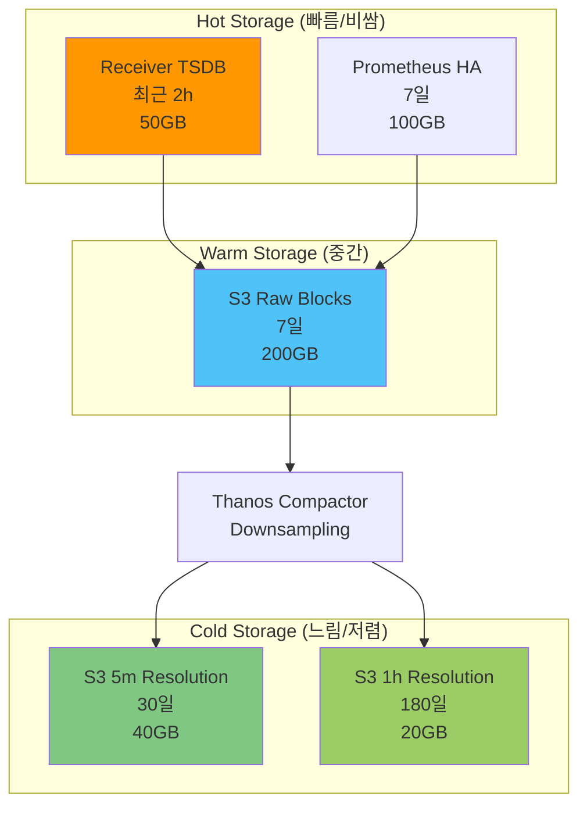
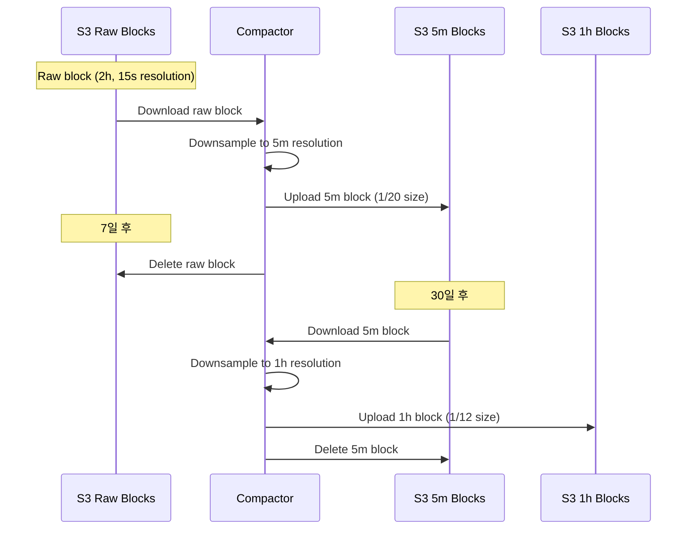

# 스토리지 최적화

## 📋 개요

MinIO S3 및 로컬 TSDB 스토리지 비용을 절감하고 장기 보존 전략을 최적화합니다.

---

## 🎯 최적화 목표

- **S3 스토리지**: 1.5TB → **0.5TB** (66% 절감)
- **월간 스토리지 비용**: $150 → **$50** (66% 절감)
- **쿼리 성능**: 다운샘플링으로 장기 쿼리 3배 향상

---

## 🏗️ 스토리지 계층 구조



---

## 1️⃣ Thanos Compactor 다운샘플링

### Compactor 배포

```yaml
apiVersion: apps/v1
kind: StatefulSet
metadata:
  name: thanos-compactor
  namespace: monitoring
spec:
  replicas: 1
  serviceName: thanos-compactor
  template:
    spec:
      containers:
      - name: thanos-compactor
        image: quay.io/thanos/thanos:v0.31.0
        args:
        - compact
        - --data-dir=/data
        - --objstore.config-file=/etc/thanos/objstore.yml

        # Retention 정책
        - --retention.resolution-raw=7d       # Raw 데이터 7일
        - --retention.resolution-5m=30d       # 5분 해상도 30일
        - --retention.resolution-1h=180d      # 1시간 해상도 180일

        # Downsampling 활성화
        - --downsampling.disable=false

        # 압축 설정
        - --compact.concurrency=4              # 병렬 압축
        - --delete-delay=48h                   # 삭제 전 대기 (안전)

        # Continuous mode
        - --wait

        resources:
          requests:
            cpu: 1000m
            memory: 2Gi
          limits:
            cpu: 2000m
            memory: 4Gi

        volumeMounts:
        - name: data
          mountPath: /data
        - name: objstore-config
          mountPath: /etc/thanos

  volumeClaimTemplates:
  - metadata:
      name: data
    spec:
      accessModes: ["ReadWriteOnce"]
      storageClassName: longhorn
      resources:
        requests:
          storage: 50Gi  # 임시 작업 공간
```

### 다운샘플링 동작 원리



### 다운샘플링 효과

```
원본 데이터 (15s resolution):
- 샘플/시간 = 3,600s / 15s = 240 samples
- 7일 = 240 × 24 × 7 = 40,320 samples

5분 다운샘플링:
- 샘플/시간 = 3,600s / 300s = 12 samples
- 30일 = 12 × 24 × 30 = 8,640 samples
- 압축률 = 8,640 / 40,320 = 21% (1/5)

1시간 다운샘플링:
- 샘플/시간 = 1 sample
- 180일 = 1 × 24 × 180 = 4,320 samples
- 압축률 = 4,320 / 40,320 = 11% (1/9)
```

---

## 2️⃣ 보존 정책 (Retention Policy)

### 계층별 보존 기간

| Resolution | 보존 기간 | 용도 | 상대 크기 |
|-----------|----------|------|----------|
| **Raw (15s)** | 7일 | 최근 상세 분석, 디버깅 | 100% |
| **5m** | 30일 | 주간/월간 트렌드 | 20% |
| **1h** | 180일 | 장기 용량 계획, 연간 리포트 | 10% |

### Retention 정책 적용

```yaml
# Compactor
- --retention.resolution-raw=7d
- --retention.resolution-5m=30d
- --retention.resolution-1h=180d

# Prometheus HA (로컬 TSDB)
prometheus:
  prometheusSpec:
    retention: 7d  # Compactor raw와 동일
```

### 스토리지 크기 계산

```
시나리오: 4개 클러스터, 각 25k samples/sec

Raw (7d):
- 크기 = 25k × 4 × 86,400 × 7 × 16 bytes = 967 GB

5m (30d):
- 크기 = 967 GB × 0.2 = 193 GB

1h (180d):
- 크기 = 967 GB × 0.1 = 97 GB

총 스토리지: 1,257 GB ≈ 1.3 TB

다운샘플링 없을 경우 (180d raw):
- 크기 = 25k × 4 × 86,400 × 180 × 16 bytes = 24,883 GB ≈ 25 TB

절감: 25 TB - 1.3 TB = 23.7 TB (95% 절감!)
```

---

## 3️⃣ S3 Lifecycle 정책

### MinIO Lifecycle 설정

```yaml
apiVersion: v1
kind: ConfigMap
metadata:
  name: minio-lifecycle-config
data:
  lifecycle.json: |
    {
      "Rules": [
        {
          "ID": "delete-old-raw-blocks",
          "Status": "Enabled",
          "Filter": {
            "Prefix": "thanos/"
          },
          "Expiration": {
            "Days": 7
          }
        },
        {
          "ID": "transition-to-glacier",
          "Status": "Enabled",
          "Filter": {
            "Prefix": "thanos/"
          },
          "Transitions": [
            {
              "Days": 30,
              "StorageClass": "GLACIER"
            }
          ]
        }
      ]
    }
```

### AWS S3 Lifecycle (클라우드 환경)

```xml
<LifecycleConfiguration>
  <!-- Raw 블록 7일 후 삭제 -->
  <Rule>
    <ID>delete-raw-blocks</ID>
    <Status>Enabled</Status>
    <Filter>
      <Prefix>thanos/01</Prefix>
      <Tag>
        <Key>resolution</Key>
        <Value>raw</Value>
      </Tag>
    </Filter>
    <Expiration>
      <Days>7</Days>
    </Expiration>
  </Rule>

  <!-- 5m 블록 30일 후 Glacier로 이동 -->
  <Rule>
    <ID>archive-5m-blocks</ID>
    <Status>Enabled</Status>
    <Filter>
      <Tag>
        <Key>resolution</Key>
        <Value>5m</Value>
      </Tag>
    </Filter>
    <Transition>
      <Days>30</Days>
      <StorageClass>GLACIER</StorageClass>
    </Transition>
  </Rule>

  <!-- 1h 블록 180일 후 삭제 -->
  <Rule>
    <ID>delete-1h-blocks</ID>
    <Status>Enabled</Status>
    <Filter>
      <Tag>
        <Key>resolution</Key>
        <Value>1h</Value>
      </Tag>
    </Filter>
    <Expiration>
      <Days>180</Days>
    </Expiration>
  </Rule>
</LifecycleConfiguration>
```

---

## 4️⃣ 블록 압축 최적화

### Compaction Level

```yaml
# Thanos Compactor
- --compact.enable-vertical-compaction  # 세로 압축 활성화
```

**동작**:
```
Before Compaction:
├── Block-1 (2h, 10GB)
├── Block-2 (2h, 10GB)
├── Block-3 (2h, 10GB)
└── Block-4 (2h, 10GB)
Total: 40GB

After Compaction (Level 1):
└── Block-1-2-3-4 (8h, 30GB)
Total: 30GB (25% 압축)

After Compaction (Level 2):
└── Block-1~8 (16h, 22GB)
Total: 22GB (45% 압축)
```

### Compaction 설정

```yaml
args:
- compact
- --compact.concurrency=4             # 병렬 압축 수
- --compact.block-fetch-concurrency=4  # 블록 다운로드 병렬도
- --deduplication.replica-label=replica  # 중복 제거
```

---

## 5️⃣ 로컬 TSDB 최적화

### Prometheus HA TSDB

```yaml
# Prometheus
prometheus:
  prometheusSpec:
    retention: 7d  # 15d → 7d 축소

    # WAL 압축
    walCompression: true

    # Storage
    storageSpec:
      volumeClaimTemplate:
        spec:
          resources:
            requests:
              storage: 50Gi  # 100Gi → 50Gi 축소
```

### Receiver TSDB

```yaml
# Thanos Receiver
args:
- receive
- --tsdb.retention=7d  # 15d → 7d
- --tsdb.wal-compression  # WAL 압축
```

---

## 📊 스토리지 비용 분석

### AWS S3 비용 (예시)

```
시나리오: 4개 클러스터, 1.3TB 총 스토리지

S3 Standard:
- Raw (7d, 967GB): $967 × 0.023/GB = $22.24/월
- 5m (30d, 193GB): $193 × 0.023/GB = $4.44/월

S3 Glacier (1h, 180d, 97GB):
- Storage: $97 × 0.004/GB = $0.39/월
- Retrieval (10% 조회): $97 × 0.1 × 0.01/GB = $0.10/월

총 비용: $27.17/월

다운샘플링 없을 경우 (25TB):
- S3 Standard: $25,000 × 0.023 = $575/월

절감: $575 - $27 = $548/월 (95% 절감)
```

### 네트워크 Egress 절감

```
쿼리 시나리오: 30일 범위 쿼리

Before (Raw):
- 데이터 크기 = 25k × 4 × 86,400 × 30 × 16 bytes = 4.14 TB
- Egress 비용 (AWS): 4.14 TB × $0.09/GB × 1024 = $383

After (5m downsampled):
- 데이터 크기 = 4.14 TB × 0.2 = 0.83 TB
- Egress 비용: 0.83 TB × $0.09/GB × 1024 = $77

절감: $383 - $77 = $306/쿼리
```

---

## 🚨 모니터링 및 알림

### 스토리지 사용량 메트릭

```promql
# S3 스토리지 사용량 (MinIO)
minio_bucket_usage_total_bytes{bucket="thanos-cluster-01"}

# Compactor 처리 블록 수
thanos_compact_group_compactions_total

# Downsampling 진행률
thanos_compact_downsample_total
```

### 스토리지 알림

```yaml
- alert: S3StorageHighUsage
  expr: |
    minio_bucket_usage_total_bytes{bucket=~"thanos-.*"}
    /
    (1024^4) > 1.5  # 1.5TB
  for: 30m
  labels:
    severity: warning
  annotations:
    summary: "S3 bucket > 1.5TB"

- alert: CompactorNotRunning
  expr: |
    time() - thanos_compact_last_run_timestamp_seconds > 7200  # 2시간
  labels:
    severity: critical
  annotations:
    summary: "Compactor has not run for 2+ hours"
```

---

## 🎯 최적화 체크리스트

### Compactor
- [x] Compactor 배포 및 설정
- [x] 다운샘플링 활성화
- [x] Retention 정책 설정 (7d/30d/180d)
- [x] 블록 압축 활성화

### Lifecycle
- [ ] S3 Lifecycle 정책 설정
- [ ] Glacier 전환 (30d)
- [ ] 자동 삭제 (180d)

### 로컬 TSDB
- [x] Prometheus retention 축소 (7d)
- [x] Receiver retention 축소 (7d)
- [x] WAL 압축 활성화

### 모니터링
- [x] 스토리지 사용량 메트릭
- [x] Compactor 상태 모니터링
- [x] 스토리지 알림 설정

---

## 💡 베스트 프랙티스

### 1. Retention 정책 수립 프로세스

```
1. 요구사항 분석
   - 디버깅: 7일 raw 필요
   - 트렌드 분석: 30일 5m 충분
   - 용량 계획: 180일 1h 충분

2. 비용 계산
   - 현재 비용 측정
   - 목표 비용 설정
   - Retention 조정

3. 점진적 적용
   - Week 1: 30d → 15d (테스트)
   - Week 2: 15d → 7d (최종)
```

### 2. 쿼리 성능 고려

```promql
# 장기 쿼리 (30d) - 5m resolution 사용
avg_over_time(metric[30d:5m])

# 단기 쿼리 (1d) - raw resolution 사용
avg_over_time(metric[1d:15s])
```

### 3. Compactor 리소스 튜닝

```yaml
# 대량 블록 처리 시 리소스 증설
resources:
  requests:
    cpu: 2000m
    memory: 4Gi
  limits:
    cpu: 4000m
    memory: 8Gi
```

---

## 🔗 관련 문서

- **메트릭 필터링 전략** → [메트릭-필터링-전략.md](./메트릭-필터링-전략.md)
- **Thanos Compactor** → [../01-아키텍처/전체-시스템-아키텍처.md](../01-아키텍처/전체-시스템-아키텍처.md)
- **확장 아키텍처** → [../07-확장-아키텍처/](../07-확장-아키텍처/)

---

**최종 업데이트**: 2025-10-20
