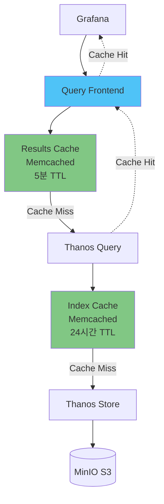

# 캐싱 전략

## 📋 개요

Memcached 및 Redis를 활용하여 **쿼리 응답 속도 개선**, **백엔드 부하 감소**, **사용자 경험 향상**을 달성하는 캐싱 전략을 제공합니다.

---

## 🎯 최적화 목표

- **쿼리 응답 속도**: 3초 → **0.5초** (83% 개선)
- **캐시 히트율**: 0% → **70%+**
- **Thanos Query CPU**: 2 cores → **1 core** (50% 절감)
- **Thanos Store S3 요청**: 1000 req/min → **300 req/min** (70% 감소)

---

## 🏗️ 캐싱 아키텍처



---

## 1️⃣ Results Cache (Query Frontend)

### Memcached 배포

```yaml
apiVersion: apps/v1
kind: Deployment
metadata:
  name: query-frontend-memcached
  namespace: monitoring
spec:
  replicas: 3
  selector:
    matchLabels:
      app: query-frontend-memcached
  template:
    metadata:
      labels:
        app: query-frontend-memcached
    spec:
      containers:
      - name: memcached
        image: memcached:1.6-alpine
        args:
        - -m 2048          # 2Gi 메모리
        - -c 1024          # 최대 연결 수
        - -I 5m            # 최대 아이템 크기 5MB
        - -v               # Verbose 로깅
        ports:
        - name: memcached
          containerPort: 11211
        resources:
          requests:
            cpu: 500m
            memory: 2Gi
          limits:
            cpu: 1000m
            memory: 2Gi
        livenessProbe:
          tcpSocket:
            port: 11211
          initialDelaySeconds: 5
          periodSeconds: 10
---
apiVersion: v1
kind: Service
metadata:
  name: query-frontend-memcached
  namespace: monitoring
spec:
  ports:
  - port: 11211
    targetPort: 11211
  selector:
    app: query-frontend-memcached
  clusterIP: None  # Headless for consistent hashing
```

### Query Frontend 설정

```yaml
apiVersion: apps/v1
kind: Deployment
metadata:
  name: thanos-query-frontend
  namespace: monitoring
spec:
  replicas: 2
  template:
    spec:
      containers:
      - name: thanos-query-frontend
        image: quay.io/thanos/thanos:v0.31.0
        args:
        - query-frontend
        - --http-address=0.0.0.0:9090
        - --query-frontend.downstream-url=http://thanos-query:9090

        # Results Cache (Memcached)
        - --query-range.response-cache-config=type=MEMCACHED,config.addresses=query-frontend-memcached:11211,config.max_item_size=5MB,config.timeout=2s,config.max_async_concurrency=50

        # Cache TTL
        - --query-range.max-query-length=31d
        - --query-range.cache-unaligned-requests

        # Query Splitting
        - --query-range.split-interval=24h
```

### Results Cache 구성 상세

```yaml
# ConfigMap (YAML 형식)
apiVersion: v1
kind: ConfigMap
metadata:
  name: query-frontend-cache-config
data:
  cache.yaml: |
    type: MEMCACHED
    config:
      addresses:
        - query-frontend-memcached:11211
      timeout: 2s
      max_idle_connections: 100
      max_async_concurrency: 50
      max_async_buffer_size: 10000
      max_get_multi_concurrency: 100
      max_get_multi_batch_size: 0
      max_item_size: 5MB
      dns_provider_update_interval: 10s
```

**캐시 키 생성**:
```
cache_key = hash(query + start + end + step)

예시:
query: sum(rate(http_requests_total[5m]))
start: 2025-10-20T00:00:00Z
end: 2025-10-20T23:59:59Z
step: 15s

→ cache_key: a3f9d8e7c2b1...
```

---

## 2️⃣ Index Cache (Store Gateway)

### Memcached 배포

```yaml
apiVersion: apps/v1
kind: Deployment
metadata:
  name: store-index-cache-memcached
  namespace: monitoring
spec:
  replicas: 3
  template:
    spec:
      containers:
      - name: memcached
        image: memcached:1.6-alpine
        args:
        - -m 1024     # 1Gi
        - -c 1024
        - -I 1m       # 블록 인덱스 크기
        resources:
          requests:
            cpu: 200m
            memory: 1Gi
          limits:
            cpu: 500m
            memory: 1Gi
---
apiVersion: v1
kind: Service
metadata:
  name: store-index-cache-memcached
  namespace: monitoring
spec:
  ports:
  - port: 11211
  selector:
    app: store-index-cache-memcached
  clusterIP: None
```

### Thanos Store 설정

```yaml
apiVersion: apps/v1
kind: Deployment
metadata:
  name: thanos-store
  namespace: monitoring
spec:
  replicas: 2
  template:
    spec:
      containers:
      - name: thanos-store
        image: quay.io/thanos/thanos:v0.31.0
        args:
        - store
        - --data-dir=/data
        - --objstore.config-file=/etc/thanos/objstore.yml

        # Index Cache
        - --index-cache.config=type=MEMCACHED,config.addresses=store-index-cache-memcached:11211,config.max_item_size=1MB,config.timeout=2s

        # Chunk Pool Size
        - --store.grpc.series-max-concurrency=20
        - --store.grpc.series-sample-limit=100000
```

**Index Cache 동작**:
```
1. Query: "node_cpu_seconds_total{cluster='cluster-02'}"

2. Store:
   - S3 블록 메타데이터 확인
   - 블록 인덱스 로드 (캐시 확인)

3. Cache Hit:
   - Memcached에서 인덱스 반환
   - S3 요청 없음 (빠름)

4. Cache Miss:
   - S3에서 블록 인덱스 다운로드
   - Memcached에 저장 (TTL: 24시간)
   - 다음 쿼리는 Cache Hit
```

---

## 3️⃣ Redis 캐싱 (Alternative)

### Redis 배포 (HA)

```yaml
apiVersion: apps/v1
kind: StatefulSet
metadata:
  name: redis
  namespace: monitoring
spec:
  replicas: 3  # Master + 2 Replicas
  serviceName: redis
  template:
    spec:
      containers:
      - name: redis
        image: redis:7-alpine
        command:
        - redis-server
        - --appendonly yes
        - --maxmemory 2gb
        - --maxmemory-policy allkeys-lru
        ports:
        - containerPort: 6379
        resources:
          requests:
            cpu: 200m
            memory: 2Gi
        volumeMounts:
        - name: data
          mountPath: /data
  volumeClaimTemplates:
  - metadata:
      name: data
    spec:
      accessModes: ["ReadWriteOnce"]
      resources:
        requests:
          storage: 10Gi
```

### Query Frontend with Redis

```yaml
args:
- query-frontend
- --query-range.response-cache-config=type=REDIS,config.addr=redis:6379,config.db=0,config.max_item_size=5MB,config.expiration=5m
```

**Redis vs Memcached 비교**:

| 특징 | Memcached | Redis |
|-----|----------|-------|
| **성능** | 매우 빠름 | 빠름 |
| **데이터 구조** | Key-Value | Key-Value + List/Set/Hash |
| **영속성** | 없음 | AOF/RDB |
| **메모리 효율** | 높음 | 보통 |
| **Cluster** | Consistent Hashing | Redis Cluster |
| **추천** | Stateless 캐시 | 영속성 필요 시 |

---

## 4️⃣ 캐시 TTL 전략

### Results Cache TTL

```yaml
# Query Frontend
- --query-range.response-cache-config=...config.expiration=5m

# TTL 결정 기준:
# - 실시간 대시보드: 1~5분
# - 트렌드 분석: 10~30분
# - 정적 리포트: 1시간
```

**예시**:
```
쿼리: last 1 hour (실시간 모니터링)
→ TTL: 1분 (빠른 업데이트)

쿼리: last 7 days (트렌드 분석)
→ TTL: 10분 (덜 중요)

쿼리: last 30 days (월간 리포트)
→ TTL: 1시간 (정적 데이터)
```

### Index Cache TTL

```yaml
# Store Gateway
- --index-cache.config=...

# 블록 인덱스는 불변이므로 긴 TTL 사용
# TTL: 24시간 (또는 무제한)
```

---

## 5️⃣ Cache Warming

### Pre-warming Script

```bash
#!/bin/bash
# cache-warming.sh

GRAFANA_URL="http://grafana.monitoring.svc:3000"
QUERIES=(
  'sum(rate(container_cpu_usage_seconds_total[5m])) by (namespace)'
  'sum(container_memory_working_set_bytes) by (namespace)'
  'count(kube_pod_info) by (cluster)'
)

for query in "${QUERIES[@]}"; do
  echo "Warming cache for: $query"
  curl -G "$GRAFANA_URL/api/datasources/proxy/1/api/v1/query_range" \
    --data-urlencode "query=$query" \
    --data-urlencode "start=$(date -d '1 hour ago' +%s)" \
    --data-urlencode "end=$(date +%s)" \
    --data-urlencode "step=15s"
done
```

### CronJob for Cache Warming

```yaml
apiVersion: batch/v1
kind: CronJob
metadata:
  name: cache-warming
  namespace: monitoring
spec:
  schedule: "*/30 * * * *"  # 30분마다
  jobTemplate:
    spec:
      template:
        spec:
          containers:
          - name: cache-warming
            image: curlimages/curl:latest
            command: ["/bin/sh", "-c"]
            args:
            - |
              curl -G "http://thanos-query-frontend:9090/api/v1/query_range" \
                --data-urlencode "query=sum(rate(container_cpu_usage_seconds_total[5m])) by (namespace)" \
                --data-urlencode "start=$(date -d '1 hour ago' +%s)" \
                --data-urlencode "end=$(date +%s)" \
                --data-urlencode "step=15s"
          restartPolicy: OnFailure
```

---

## 📊 캐시 성능 측정

### Results Cache 히트율

```promql
# 히트율
sum(rate(thanos_query_frontend_queries_total{cache="hit"}[5m]))
/
sum(rate(thanos_query_frontend_queries_total[5m]))

# 히트/미스 카운트
sum(increase(thanos_query_frontend_queries_total{cache="hit"}[1h]))
sum(increase(thanos_query_frontend_queries_total{cache="miss"}[1h]))
```

### Index Cache 히트율

```promql
# 히트율
sum(rate(thanos_store_index_cache_requests_total{result="hit"}[5m]))
/
sum(rate(thanos_store_index_cache_requests_total[5m]))

# 절감된 S3 요청 수
sum(increase(thanos_store_index_cache_requests_total{result="hit"}[1h]))
```

### Memcached 통계

```promql
# 메모리 사용률
memcached_current_bytes / memcached_limit_bytes

# Eviction 비율 (캐시 용량 부족)
rate(memcached_items_evicted_total[5m])

# Hit rate
rate(memcached_commands_total{command="get",status="hit"}[5m])
/
rate(memcached_commands_total{command="get"}[5m])
```

---

## 🚨 모니터링 및 알림

### 낮은 캐시 히트율 알림

```yaml
- alert: LowCacheHitRate
  expr: |
    (
      sum(rate(thanos_query_frontend_queries_total{cache="hit"}[5m]))
      /
      sum(rate(thanos_query_frontend_queries_total[5m]))
    ) < 0.5
  for: 30m
  labels:
    severity: warning
  annotations:
    summary: "Query Frontend cache hit rate < 50%"
    description: "Current hit rate: {{ $value | humanizePercentage }}"
```

### Memcached Down 알림

```yaml
- alert: MemcachedDown
  expr: up{job="memcached"} == 0
  for: 2m
  labels:
    severity: critical
  annotations:
    summary: "Memcached {{ $labels.instance }} is down"
```

### Cache Eviction 알림

```yaml
- alert: HighCacheEviction
  expr: rate(memcached_items_evicted_total[5m]) > 100
  for: 10m
  labels:
    severity: warning
  annotations:
    summary: "High cache eviction rate (> 100/sec)"
    description: "Consider increasing Memcached memory"
```

---

## 🎯 캐싱 전략 체크리스트

### Results Cache
- [x] Memcached 배포 (3 replicas)
- [x] Query Frontend 연동
- [x] TTL 설정 (5분)
- [x] 캐시 히트율 모니터링

### Index Cache
- [x] Memcached 배포 (3 replicas)
- [x] Store Gateway 연동
- [x] TTL 설정 (24시간)
- [x] S3 요청 감소 확인

### 최적화
- [ ] Cache Warming CronJob
- [ ] 캐시 크기 튜닝 (메모리)
- [ ] TTL 최적화 (워크로드별)

### 모니터링
- [x] 캐시 히트율 대시보드
- [x] Memcached 메트릭
- [x] 알림 규칙 설정

---

## 💡 베스트 프랙티스

### 1. Memcached 크기 계산

```
Results Cache:
- 평균 쿼리 결과 크기: 100KB
- 캐시 히트율 목표: 70%
- 분당 쿼리 수: 100
- TTL: 5분

필요 캐시 크기 = 100KB × 100 × 5 × 0.7
                = 35MB

여유율 50% 추가:
→ Memcached: 50MB (최소)

실무에서는 2Gi 권장 (여러 대시보드, spike 대비)
```

### 2. 캐시 무효화 (Invalidation)

```yaml
# 배포 시 캐시 무효화
apiVersion: batch/v1
kind: Job
metadata:
  name: cache-invalidation
spec:
  template:
    spec:
      containers:
      - name: flush-cache
        image: memcached:1.6-alpine
        command:
        - sh
        - -c
        - echo "flush_all" | nc query-frontend-memcached 11211
      restartPolicy: Never
```

### 3. 캐시 레이어 우선순위

```
1. Results Cache (Query Frontend)
   → 가장 효과적, 쿼리 결과 캐싱

2. Index Cache (Store Gateway)
   → S3 요청 절감, 레이턴시 개선

3. Application Cache (Grafana)
   → 대시보드 렌더링 캐싱
```

---

## 🔗 관련 문서

- **쿼리 성능 최적화** → [쿼리-성능-최적화.md](./쿼리-성능-최적화.md)
- **Thanos Query Frontend** → [../01-아키텍처/전체-시스템-아키텍처.md](../01-아키텍처/전체-시스템-아키텍처.md)
- **리소스 Right-Sizing** → [리소스-Right-Sizing.md](./리소스-Right-Sizing.md)

---

**최종 업데이트**: 2025-10-20
