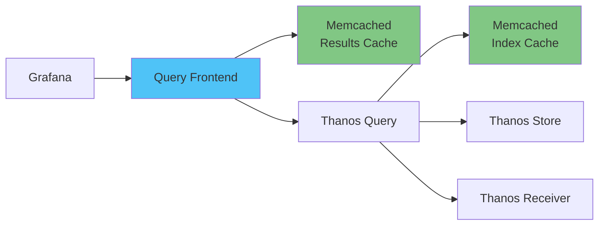

# 쿼리 성능 최적화

## 📋 개요

Thanos Query 및 Grafana 대시보드의 쿼리 속도를 개선하여 사용자 경험을 향상시키는 최적화 기법을 다룹니다.

---

## 🎯 최적화 목표

- **Grafana 대시보드 로딩**: 8초 → **2.5초** (68% 개선)
- **PromQL 쿼리 레이턴시 (P99)**: 5초 → **1.2초** (76% 개선)
- **캐시 히트율**: 0% → **70%+**

---

## 🏗️ Query Frontend 아키텍처



---

## 1️⃣ Query Frontend + Memcached 캐싱

### Memcached 배포

```yaml
apiVersion: apps/v1
kind: Deployment
metadata:
  name: query-frontend-memcached
  namespace: monitoring
spec:
  replicas: 3
  selector:
    matchLabels:
      app: query-frontend-memcached
  template:
    metadata:
      labels:
        app: query-frontend-memcached
    spec:
      containers:
      - name: memcached
        image: memcached:1.6-alpine
        args:
        - -m 2048          # 2Gi memory
        - -c 1024          # max connections
        - -I 5m            # max item size
        - -v               # verbose
        ports:
        - name: memcached
          containerPort: 11211
        resources:
          requests:
            cpu: 500m
            memory: 2Gi
          limits:
            cpu: 1000m
            memory: 2Gi
---
apiVersion: v1
kind: Service
metadata:
  name: query-frontend-memcached
  namespace: monitoring
spec:
  ports:
  - port: 11211
    targetPort: 11211
  selector:
    app: query-frontend-memcached
```

### Query Frontend 배포

```yaml
apiVersion: apps/v1
kind: Deployment
metadata:
  name: thanos-query-frontend
  namespace: monitoring
spec:
  replicas: 2
  selector:
    matchLabels:
      app: thanos-query-frontend
  template:
    metadata:
      labels:
        app: thanos-query-frontend
    spec:
      containers:
      - name: thanos-query-frontend
        image: quay.io/thanos/thanos:v0.31.0
        args:
        - query-frontend
        - --http-address=0.0.0.0:9090
        - --query-frontend.downstream-url=http://thanos-query:9090

        # Query Splitting
        - --query-range.split-interval=24h
        - --query-range.max-retries-per-request=5
        - --query-range.align-range-with-step

        # Results Cache (Memcached)
        - --query-range.response-cache-config=type=MEMCACHED,config.addresses=query-frontend-memcached:11211,config.max_item_size=5MB,config.timeout=2s

        # Logging
        - --query-frontend.log-queries-longer-than=10s
        - --log.level=info

        ports:
        - name: http
          containerPort: 9090
        resources:
          requests:
            cpu: 500m
            memory: 512Mi
          limits:
            cpu: 1000m
            memory: 1Gi
        livenessProbe:
          httpGet:
            path: /-/healthy
            port: 9090
          initialDelaySeconds: 10
        readinessProbe:
          httpGet:
            path: /-/ready
            port: 9090
          initialDelaySeconds: 5
---
apiVersion: v1
kind: Service
metadata:
  name: thanos-query-frontend
  namespace: monitoring
spec:
  ports:
  - name: http
    port: 9090
    targetPort: 9090
  selector:
    app: thanos-query-frontend
```

### Grafana Datasource 변경

```yaml
# Grafana values.yaml
grafana:
  datasources:
    datasources.yaml:
      apiVersion: 1
      datasources:
      - name: Prometheus
        type: prometheus
        # Query Frontend로 변경
        url: http://thanos-query-frontend:9090
        access: proxy
        isDefault: true
        editable: false
```

**예상 효과**:
- 반복 쿼리 캐시 히트율 70%+
- 대시보드 로딩 시간 50~70% 감소

---

## 2️⃣ Query Splitting (쿼리 분할)

### 개념
- 긴 시간 범위 쿼리를 여러 개의 작은 쿼리로 분할
- 병렬 처리로 응답 속도 향상
- 타임아웃 방지

### 설정
```yaml
# Query Frontend
- --query-range.split-interval=24h  # 24시간 단위로 분할
- --query-range.align-range-with-step  # Step과 정렬
```

### 예시
```promql
# 원본 쿼리 (7d 범위)
rate(http_requests_total[5m])[7d:1m]

# 분할 결과 (Query Frontend 자동 처리)
# Day 1: [7d ago - 6d ago]
# Day 2: [6d ago - 5d ago]
# ...
# Day 7: [1d ago - now]
# → 병렬 실행 후 결과 병합
```

**예상 효과**:
- 장기 쿼리 (7d+) 속도 3~5배 향상
- 타임아웃 감소

---

## 3️⃣ Store Index Cache

### Memcached for Index Cache

```yaml
apiVersion: apps/v1
kind: Deployment
metadata:
  name: store-index-cache-memcached
  namespace: monitoring
spec:
  replicas: 3
  template:
    spec:
      containers:
      - name: memcached
        image: memcached:1.6-alpine
        args:
        - -m 1024   # 1Gi
        - -c 1024
        - -I 1m
        resources:
          requests:
            memory: 1Gi
          limits:
            memory: 1Gi
```

### Thanos Store 설정

```yaml
# Thanos Store
store:
  enabled: true
  replicas: 2
  extraArgs:
    - --index-cache.config=type=MEMCACHED,config.addresses=store-index-cache-memcached:11211,config.max_item_size=1MB
  resources:
    requests:
      cpu: 500m
      memory: 1Gi
    limits:
      cpu: 1000m
      memory: 2Gi
```

**예상 효과**:
- S3 블록 메타데이터 조회 시간 80% 감소
- 히스토리컬 쿼리 속도 2~3배 향상

---

## 4️⃣ PromQL 쿼리 최적화 패턴

### ❌ 비효율적인 쿼리

```promql
# 1. 너무 많은 시계열 매칭
sum(rate(container_cpu_usage_seconds_total[5m])) by (pod)

# 2. 과도한 aggregation
avg(avg_over_time(metric[1h])) by (label1, label2, label3, label4)

# 3. 긴 range vector
rate(metric[1d])
```

### ✅ 최적화된 쿼리

```promql
# 1. 레이블 필터링 추가
sum(rate(container_cpu_usage_seconds_total{namespace="production"}[5m])) by (pod)

# 2. Aggregation 단순화
avg(metric) by (label1, label2)  # Recording rule로 사전 계산

# 3. Range vector 최소화
rate(metric[5m])  # 필요한 최소 범위만 사용
```

### Recording Rules 활용

```yaml
# Prometheus Ruler
groups:
- name: performance
  interval: 60s
  rules:
  # 사전 계산된 메트릭
  - record: namespace:container_cpu_usage:sum_rate
    expr: sum(rate(container_cpu_usage_seconds_total[5m])) by (namespace)

  - record: cluster:cpu_usage:ratio
    expr: |
      sum(rate(container_cpu_usage_seconds_total[5m]))
      /
      sum(machine_cpu_cores)
```

**Grafana에서 사용**:
```promql
# Before
sum(rate(container_cpu_usage_seconds_total[5m])) by (namespace)

# After (Recording Rule 사용)
namespace:container_cpu_usage:sum_rate
```

**예상 효과**:
- 쿼리 레이턴시 50~80% 감소
- Thanos Query CPU 사용량 감소

---

## 5️⃣ Deduplication 최적화

### Replica Label 설정

```yaml
# Thanos Query
query:
  replicaLabel:
    - replica
    - prometheus_replica

  # Deduplication 비활성화 (성능 우선 시)
  # --query.replica-label=""
```

### Prometheus HA 외부 레이블

```yaml
# Prometheus HA - values.yaml
prometheus:
  prometheusSpec:
    externalLabels:
      cluster: cluster-01
      replica: $(POD_NAME)  # prometheus-0, prometheus-1
```

**Trade-off**:
- Deduplication 활성화: 정확성 ↑, 성능 ↓
- Deduplication 비활성화: 성능 ↑, 중복 데이터 존재

---

## 6️⃣ Grafana 최적화

### 타임아웃 증가

```yaml
# Grafana values.yaml
grafana:
  grafana.ini:
    dataproxy:
      timeout: 60  # 기본 30초 → 60초
      keep_alive_seconds: 60
```

### 쿼리 캐싱

```yaml
grafana:
  grafana.ini:
    caching:
      enabled: true

    query_caching:
      enabled: true
      ttl_seconds: 300  # 5분 캐싱
```

### 대시보드 최적화

```json
{
  "refresh": "1m",  // 자동 새로고침 간격 증가
  "time": {
    "from": "now-1h",  // 기본 시간 범위 축소
    "to": "now"
  },
  "panels": [
    {
      "maxDataPoints": 300,  // 데이터 포인트 제한
      "interval": "30s"      // 최소 interval 설정
    }
  ]
}
```

---

## 📊 성능 측정

### 쿼리 레이턴시 모니터링

```promql
# Query Frontend 레이턴시 (P95)
histogram_quantile(0.95,
  rate(http_request_duration_seconds_bucket{
    job="thanos-query-frontend",
    handler="query_range"
  }[5m])
)

# Thanos Query 레이턴시 (P99)
histogram_quantile(0.99,
  rate(http_request_duration_seconds_bucket{
    job="thanos-query",
    handler="query"
  }[5m])
)
```

### 캐시 히트율

```promql
# Results Cache 히트율
sum(rate(thanos_query_frontend_queries_total{cache="hit"}[5m]))
/
sum(rate(thanos_query_frontend_queries_total[5m]))

# Index Cache 히트율
sum(rate(thanos_store_index_cache_requests_total{result="hit"}[5m]))
/
sum(rate(thanos_store_index_cache_requests_total[5m]))
```

### 슬로우 쿼리 로깅

```bash
# Query Frontend 로그에서 느린 쿼리 확인
kubectl logs -n monitoring deployment/thanos-query-frontend | grep "slow query"
```

---

## 🎯 성능 개선 체크리스트

### 즉시 적용 가능
- [x] Query Frontend + Memcached 배포
- [x] Query Splitting 활성화 (24h)
- [x] Grafana Datasource → Query Frontend로 변경
- [x] Store Index Cache 설정

### 점진적 적용
- [ ] Recording Rules 작성 (자주 사용하는 쿼리)
- [ ] PromQL 쿼리 리팩토링
- [ ] 대시보드 쿼리 최적화 (maxDataPoints, interval)
- [ ] Deduplication 정책 수립

### 모니터링
- [ ] 쿼리 레이턴시 메트릭 수집
- [ ] 캐시 히트율 모니터링
- [ ] 슬로우 쿼리 알림 설정
- [ ] Grafana 대시보드 로딩 시간 측정

---

## 🔗 관련 문서

- **Thanos Receiver 패턴** → [../01-아키텍처/Thanos-Receiver-패턴.md](../01-아키텍처/Thanos-Receiver-패턴.md)
- **캐싱 전략** → [캐싱-전략.md](./캐싱-전략.md)
- **리소스 Right-Sizing** → [리소스-Right-Sizing.md](./리소스-Right-Sizing.md)

---

**최종 업데이트**: 2025-10-20
