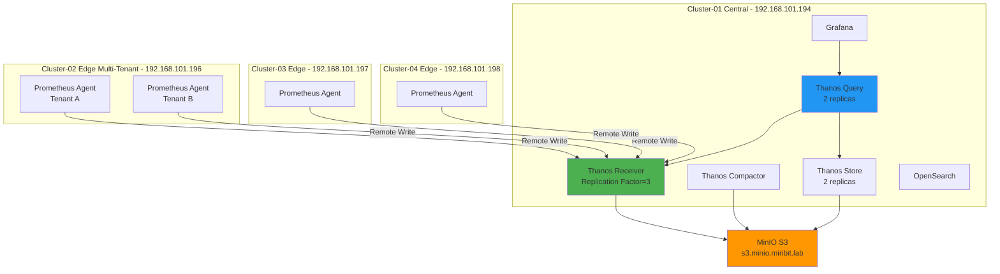

# Prometheus Agent + Thanos Receiver 배포 가이드

## 📋 개요

4개 Kubernetes 클러스터에 Prometheus Agent + Thanos Receiver 멀티클러스터 모니터링 시스템을 배포하는 종합 가이드입니다.

---

## 🏗️ 아키텍처 요약

### 클러스터 구성



---

## 🎯 배포 순서

### 1단계: 사전 준비

```bash
# 필수 도구 설치
- kubectl
- kustomize
- helm (charts 활용용, 직접 install은 금지)
- git

# 환경 변수 설정
export KUBECONFIG=~/.kube/config
export S3_ENDPOINT=s3.minio.miribit.lab:9000
export S3_ACCESS_KEY=minio
export S3_SECRET_KEY=minio123
```

### 2단계: S3 스토리지 준비

```bash
# MinIO 버킷 생성
mc alias set myminio http://s3.minio.miribit.lab:9000 minio minio123

mc mb myminio/thanos-cluster-01
mc mb myminio/opensearch-snapshots

# 버킷 정책 설정
mc anonymous set download myminio/thanos-cluster-01
```

### 3단계: Cluster-01 (중앙) 배포

```bash
# 1. Longhorn 스토리지 배포
kubectl apply -k deploy/overlays/cluster-01-central/longhorn/

# 2. Ingress Nginx 배포
kubectl apply -k deploy/overlays/cluster-01-central/ingress-nginx/

# 3. kube-prometheus-stack + Thanos 배포
kubectl apply -k deploy/overlays/cluster-01-central/kube-prometheus-stack/

# 4. OpenSearch + Fluent-Bit 배포
kubectl apply -k deploy/overlays/cluster-01-central/opensearch-cluster/
kubectl apply -k deploy/overlays/cluster-01-central/fluent-bit/

# 배포 확인
kubectl get pods -n monitoring
kubectl get pods -n logging
```

### 4단계: Cluster-02/03/04 (엣지) 배포

```bash
# Cluster-02 (Multi-Tenant)
kubectl --context cluster-02 apply -k deploy/overlays/cluster-02-edge/prometheus-agent/
kubectl --context cluster-02 apply -k deploy/overlays/cluster-02-edge/fluent-bit/

# Cluster-03
kubectl --context cluster-03 apply -k deploy/overlays/cluster-03-edge/prometheus-agent/
kubectl --context cluster-03 apply -k deploy/overlays/cluster-03-edge/fluent-bit/

# Cluster-04
kubectl --context cluster-04 apply -k deploy/overlays/cluster-04-edge/prometheus-agent/
kubectl --context cluster-04 apply -k deploy/overlays/cluster-04-edge/fluent-bit/
```

---

## ✅ 배포 검증

### 1. 컴포넌트 상태 확인

```bash
# Cluster-01 (Central)
kubectl get pods -n monitoring

# 예상 출력:
# NAME                                           READY   STATUS
# thanos-receive-0                               1/1     Running
# thanos-receive-1                               1/1     Running
# thanos-receive-2                               1/1     Running
# thanos-query-xxxxxxxxx                         1/1     Running
# thanos-store-xxxxxxxxx                         1/1     Running
# thanos-compactor-xxxxxxxxx                     1/1     Running
# grafana-xxxxxxxxx                              1/1     Running
```

### 2. Remote Write 동작 확인

```bash
# Prometheus Agent 로그 확인
kubectl --context cluster-02 logs -n monitoring prometheus-agent-0 | grep "remote_write"

# Thanos Receiver 메트릭 확인
kubectl exec -n monitoring thanos-receive-0 -- \
  curl -s http://localhost:10902/metrics | grep thanos_receive_write_timeseries_total
```

### 3. Grafana 접속 확인

```bash
# Grafana URL
echo "http://grafana.k8s-cluster-01.miribit.lab"

# 초기 비밀번호 확인
kubectl get secret -n monitoring grafana-admin-secret -o jsonpath='{.data.admin-password}' | base64 -d
```

### 4. Thanos Query 동작 확인

```bash
# Thanos Query로 멀티클러스터 메트릭 조회
curl -s "http://thanos-query.k8s-cluster-01.miribit.lab/api/v1/query?query=up" | jq '.data.result[] | {cluster: .metric.cluster, value: .value[1]}'
```

---

## 📊 주요 설정 파라미터

### Prometheus Agent (Edge Clusters)

```yaml
prometheus:
  prometheusSpec:
    enableAgentMode: true
    replicas: 1
    resources:
      requests:
        cpu: 200m
        memory: 256Mi
      limits:
        cpu: 500m
        memory: 512Mi
    externalLabels:
      cluster: cluster-02  # 클러스터별로 변경
      role: edge
      location: datacenter-a
    remoteWrite:
      - url: http://thanos-receive-lb.monitoring.svc.cluster-01.local:19291/api/v1/receive
        queueConfig:
          capacity: 20000
          maxShards: 100
          maxSamplesPerSend: 5000
```

### Thanos Receiver (Central Cluster)

```yaml
thanos:
  receive:
    replicas: 3
    replicationFactor: 3
    resources:
      requests:
        cpu: 1000m
        memory: 2Gi
      limits:
        cpu: 2000m
        memory: 4Gi
    objstoreConfig:
      type: S3
      config:
        bucket: thanos-cluster-01
        endpoint: s3.minio.miribit.lab:9000
        access_key: minio
        secret_key: minio123
```

---

## 🔧 일반적인 문제 해결

### 문제 1: Remote Write 실패

**증상**:
```bash
kubectl logs -n monitoring prometheus-agent-0 | grep "remote_write"
# 출력: failed to send samples
```

**해결**:
```bash
# 1. Thanos Receiver 상태 확인
kubectl get pods -n monitoring -l app=thanos-receive

# 2. 네트워크 연결 확인
kubectl exec -n monitoring prometheus-agent-0 -- \
  curl -v http://thanos-receive-lb:19291/api/v1/receive

# 3. Remote Write 설정 확인
kubectl get cm -n monitoring prometheus-agent-config -o yaml
```

### 문제 2: Grafana에서 메트릭이 보이지 않음

**증상**: Grafana 대시보드에서 "No data" 표시

**해결**:
```bash
# 1. Thanos Query가 Store를 인식하는지 확인
kubectl exec -n monitoring thanos-query-0 -- \
  curl -s http://localhost:10902/stores | jq .

# 2. Query로 직접 메트릭 조회
curl "http://thanos-query:9090/api/v1/query?query=up{cluster='cluster-02'}"
```

### 문제 3: OpenSearch 클러스터 초기화 실패

**증상**: OpenSearch pods가 CrashLoopBackOff

**해결**:
```bash
# 1. 로그 확인
kubectl logs -n logging opensearch-cluster-masters-0

# 2. 초기화 Job 재실행
kubectl delete job -n logging opensearch-cluster-bootstrap
kubectl apply -k deploy/overlays/cluster-01-central/opensearch-cluster/
```

---

## 📈 성능 최적화 체크리스트

### Remote Write 최적화
- [ ] Queue capacity를 20,000으로 증가
- [ ] MaxShards를 100으로 증가
- [ ] Batch size를 5,000으로 증가

### Query 최적화
- [ ] Query Frontend 배포 및 캐싱 활성화
- [ ] Memcached 배포 (Index Cache)
- [ ] Query splitting 설정 (24시간 단위)

### Storage 최적화
- [ ] Thanos Compactor Downsampling 활성화
- [ ] S3 Lifecycle Policy 설정
- [ ] Longhorn StorageClass 최적화

### 리소스 최적화
- [ ] HPA 설정 (Receiver, Query)
- [ ] VPA 권장 사항 적용
- [ ] Resource Quotas 설정 (멀티테넌시)

---

## 🔐 보안 설정

### 1. TLS 인증서 설정

```bash
# cert-manager 설치
kubectl apply -f https://github.com/cert-manager/cert-manager/releases/download/v1.13.0/cert-manager.yaml

# ClusterIssuer 생성
kubectl apply -f - <<EOF
apiVersion: cert-manager.io/v1
kind: ClusterIssuer
metadata:
  name: letsencrypt-prod
spec:
  acme:
    server: https://acme-v02.api.letsencrypt.org/directory
    email: admin@miribit.lab
    privateKeySecretRef:
      name: letsencrypt-prod
    solvers:
    - http01:
        ingress:
          class: nginx
EOF
```

### 2. Grafana Admin 비밀번호 변경

```bash
# 새 비밀번호로 Secret 업데이트
kubectl create secret generic grafana-admin-secret \
  -n monitoring \
  --from-literal=admin-password="new-secure-password" \
  --dry-run=client -o yaml | kubectl apply -f -

# Grafana Pod 재시작
kubectl rollout restart deployment -n monitoring grafana
```

---

## 📦 백업 및 복구

### Longhorn Snapshot

```bash
# 자동 스냅샷 설정 (RecurringJob)
kubectl apply -f - <<EOF
apiVersion: longhorn.io/v1beta1
kind: RecurringJob
metadata:
  name: daily-snapshot
  namespace: longhorn-system
spec:
  cron: "0 2 * * *"
  task: "snapshot"
  retain: 7
  concurrency: 2
EOF
```

### S3 버킷 백업

```bash
# S3 버킷 복제 (다른 S3로)
mc mirror myminio/thanos-cluster-01 backup-s3/thanos-cluster-01
```

---

## 🎯 다음 단계

### 1. ArgoCD GitOps 구성

```bash
# ArgoCD 설치
kubectl apply -k deploy/base/argocd/

# Application of Applications 배포
kubectl apply -f deploy/argocd-apps/
```

### 2. 알림 설정

```bash
# Alertmanager Slack Webhook 설정
kubectl create secret generic alertmanager-config \
  -n monitoring \
  --from-file=alertmanager.yaml

kubectl apply -f deploy/overlays/cluster-01-central/kube-prometheus-stack/alertmanager-config.yaml
```

### 3. 대시보드 Import

```bash
# Grafana 대시보드 자동 Import
for dashboard in dashboards/*.json; do
  curl -X POST \
    -H "Content-Type: application/json" \
    -u admin:admin123 \
    http://grafana.k8s-cluster-01.miribit.lab/api/dashboards/db \
    -d @$dashboard
done
```

---

## 📚 관련 문서

- **아키텍처** → [01-아키텍처/전체-시스템-아키텍처.md](./01-아키텍처/전체-시스템-아키텍처.md)
- **배포 상세** → [02-Kustomize-Helm-GitOps-배포/](./02-Kustomize-Helm-GitOps-배포/)
- **운영 가이드** → [03-운영-가이드/](./03-운영-가이드/)
- **모니터링** → [04-모니터링-가이드/](./04-모니터링-가이드/)
- **성능 최적화** → [09-성능-최적화/](./09-성능-최적화/)

---

## 🆘 지원 및 문의

### 문서 참조
- **빠른 참조** → [03-운영-가이드/빠른-참조.md](./03-운영-가이드/빠른-참조.md)
- **트러블슈팅** → [03-운영-가이드/일반-트러블슈팅.md](./03-운영-가이드/일반-트러블슈팅.md)
- **FAQ** → [08-참고자료/README.md](./08-참고자료/README.md)

### 커뮤니티
- **Prometheus Slack**: #prometheus
- **Thanos Slack**: #thanos
- **CNCF Slack**: cloud-native.slack.com

---

**최종 업데이트**: 2025-10-20
**작성자**: Claude (Anthropic AI)
**버전**: 1.0
