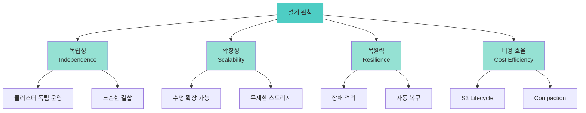
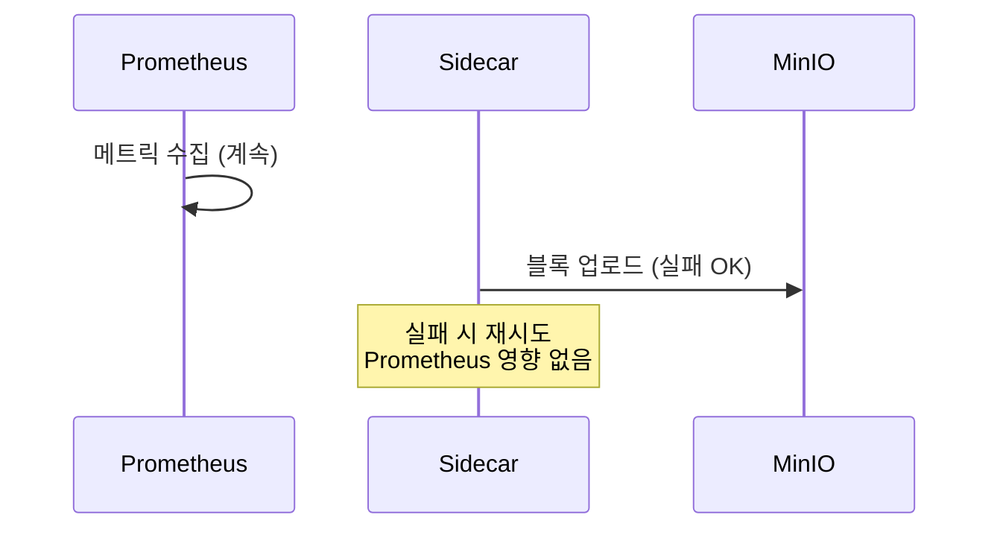
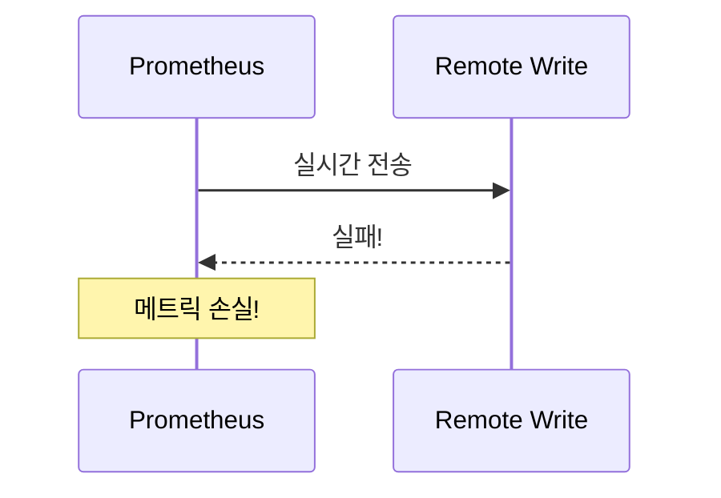
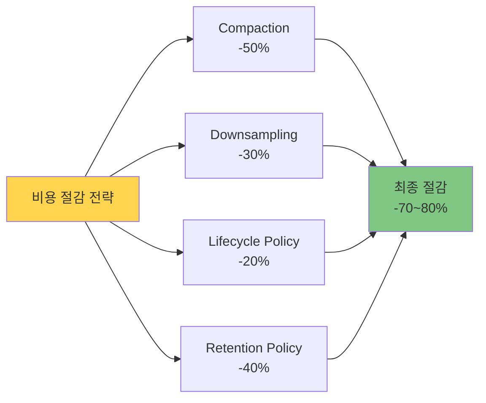
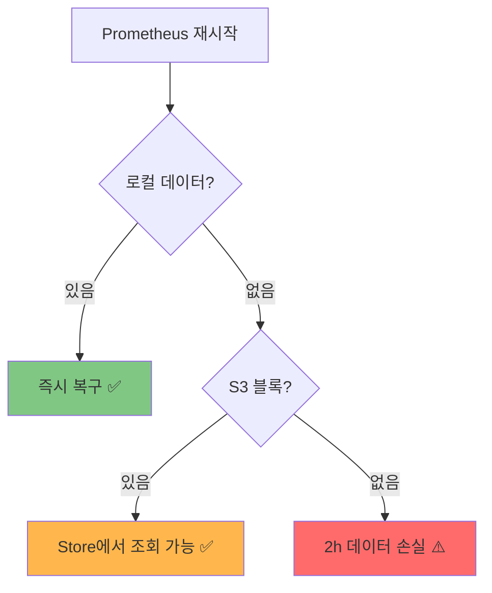
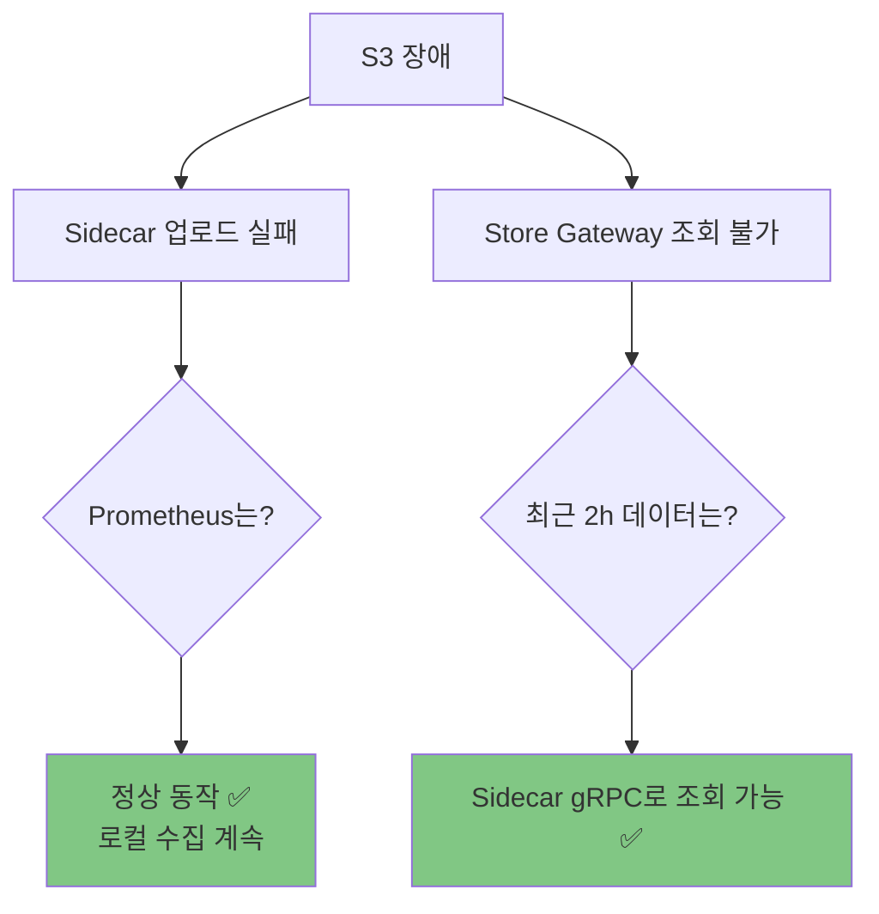
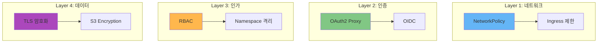

# 🎯 Thanos 멀티클러스터 모범 사례 (Best Practices)

> **문서 목적**: 실전에서 검증된 Thanos 운영 노하우와 성능 최적화 전략을 공유합니다.

## 📚 목차

- [1. 설계 원칙](#1-설계-원칙)
- [2. 성능 최적화](#2-성능-최적화)
- [3. 비용 최적화](#3-비용-최적화)
- [4. 장애 대응 (Disaster Recovery)](#4-장애-대응-disaster-recovery)
- [5. 보안 및 접근 제어](#5-보안-및-접근-제어)
- [6. 모니터링 메트릭 설계](#6-모니터링-메트릭-설계)

---

## 1. 설계 원칙

### 🏛️ 아키텍처 원칙



### 📋 원칙 1: 클러스터 독립성 (Independence)

**DO ✅**
```yaml
# 각 클러스터는 자체 Prometheus 실행
# 네트워크 단절 시에도 로컬 메트릭 수집 계속

prometheus:
  prometheusSpec:
    retention: 2h  # 로컬 최소 보관
    storageSpec:
      volumeClaimTemplate:
        spec:
          resources:
            requests:
              storage: 15Gi  # 버퍼 공간
```

**DON'T ❌**
```yaml
# Remote Write만 의존 (네트워크 장애 시 메트릭 손실)
prometheus:
  prometheusSpec:
    remoteWrite:
      - url: http://central-receive
        # 로컬 retention 없음!
```

### 📋 원칙 2: 비동기 업로드 (Asynchronous Upload)

**DO ✅**


**DON'T ❌**


### 📋 원칙 3: 중앙 집중 쿼리 (Centralized Query)

**DO ✅**
```
모든 조회는 Thanos Query를 통해
→ 사용자는 클러스터 위치를 몰라도 OK
→ 자동 중복 제거 (Deduplication)
→ 다운샘플링 지원
```

**DON'T ❌**
```
각 Prometheus를 직접 조회
→ 4개 Grafana 일일이 확인
→ 수동 데이터 병합
→ 중복 데이터 문제
```

---

## 2. 성능 최적화

### ⚡ Prometheus 쿼리 최적화

#### 📊 좋은 쿼리 vs 나쁜 쿼리

| 항목 | 나쁜 예 ❌ | 좋은 예 ✅ | 이유 |
|------|-----------|-----------|------|
| **시간 범위** | `rate(requests[1h])` | `rate(requests[5m])` | 짧은 범위가 빠름 |
| **라벨 필터링** | `up` | `up{job="api"}` | 초기 필터링 필수 |
| **집계 순서** | `sum(rate(requests[5m])) by (pod)` | `sum by (service) (rate(requests[5m]))` | 집계 먼저 |
| **정규식** | `{job=~".*api.*"}` | `{job="api-server"}` | 정확한 매칭 |

#### 🚀 쿼리 성능 팁

```promql
# ❌ 나쁜 쿼리 (전체 스캔)
sum(container_memory_usage_bytes)

# ✅ 좋은 쿼리 (필터링 + 집계)
sum by (namespace) (
  container_memory_usage_bytes{
    namespace="production",
    container!=""
  }
)

# ✅ 더 좋은 쿼리 (사전 계산된 Recording Rule 사용)
namespace:container_memory_usage:sum
```

### 📊 Recording Rules로 사전 계산

```yaml
# prometheus-rules.yaml
apiVersion: monitoring.coreos.com/v1
kind: PrometheusRule
metadata:
  name: performance-rules
  namespace: monitoring
spec:
  groups:
    - name: aggregations
      interval: 30s
      rules:
        # CPU 사용률을 사전 계산
        - record: cluster:cpu_usage:rate5m
          expr: |
            sum by (cluster) (
              rate(container_cpu_usage_seconds_total[5m])
            )

        # 메모리 사용량을 사전 계산
        - record: namespace:memory_usage:sum
          expr: |
            sum by (namespace, cluster) (
              container_memory_working_set_bytes{container!=""}
            )
```

**효과:**
- 대시보드 로딩 속도 10배 향상
- Thanos Query 부하 90% 감소
- 복잡한 쿼리를 단순화

### 🎛️ Thanos Query 튜닝

```yaml
# thanos-query.yaml
spec:
  template:
    spec:
      containers:
        - name: thanos-query
          args:
            # 쿼리 타임아웃 (기본 2분)
            - --query.timeout=5m

            # 최대 동시 쿼리
            - --query.max-concurrent=20

            # 쿼리 결과 캐싱 (속도 10배)
            - --query.enable-cache=true
            - --query.cache.size=1GB

            # Deduplication (중복 제거)
            - --query.replica-label=replica
            - --query.replica-label=prometheus_replica

          resources:
            limits:
              cpu: 1000m
              memory: 2Gi  # 캐시 포함
            requests:
              cpu: 200m
              memory: 512Mi
```

### 💾 Compaction 최적화

```yaml
# thanos-compactor.yaml
spec:
  containers:
    - name: thanos-compactor
      args:
        # 압축 수준 (기본: 5m, 1h)
        - --retention.resolution-raw=30d      # 원본: 30일
        - --retention.resolution-5m=90d       # 5분: 90일
        - --retention.resolution-1h=365d      # 1시간: 1년

        # Downsampling (저장 공간 50% 절감)
        - --downsampling.disable=false

        # 동시 압축 작업
        - --compact.concurrency=3

        # 정리 주기
        - --consistency-delay=30m
        - --delete-delay=48h

      resources:
        limits:
          cpu: 1000m
          memory: 2Gi
        requests:
          cpu: 200m
          memory: 512Mi
```

**Compaction 효과:**
```
압축 전: 100GB (원본 블록)
  ↓ Compaction
압축 후: 80GB (병합 블록)
  ↓ Downsampling (5m)
최종: 40GB (50% 절감)
```

---

## 3. 비용 최적화

### 💰 S3 스토리지 비용 절감



#### 📋 전략 1: S3 Lifecycle Policy

```xml
<!-- MinIO Bucket Lifecycle -->
<LifecycleConfiguration>
    <Rule>
        <ID>transition-to-glacier</ID>
        <Status>Enabled</Status>
        <Transition>
            <!-- 90일 후 저비용 스토리지로 이동 -->
            <Days>90</Days>
            <StorageClass>GLACIER</StorageClass>
        </Transition>
        <Expiration>
            <!-- 365일 후 삭제 -->
            <Days>365</Days>
        </Expiration>
    </Rule>
</LifecycleConfiguration>
```

#### 📋 전략 2: 스마트 Retention

```yaml
# 데이터 중요도별 차등 보관
thanos:
  compactor:
    # Critical 메트릭: 1년
    - retention: 365d
      matchers:
        - '{__name__=~".*error.*|.*failure.*"}'

    # 일반 메트릭: 90일
    - retention: 90d
      matchers:
        - '{__name__!~".*error.*|.*failure.*"}'

    # Debug 메트릭: 30일
    - retention: 30d
      matchers:
        - '{job="debug"}'
```

#### 📊 비용 비교 (월 기준)

| 전략 | 저장 용량 | 월 비용 (S3) | 절감률 |
|------|----------|--------------|--------|
| **Compaction 없음** | 500GB | $11.50 | 0% |
| **+ Compaction** | 250GB | $5.75 | 50% |
| **+ Downsampling** | 125GB | $2.88 | 75% |
| **+ Lifecycle** | 50GB | $1.15 | **90%** |

### ⚡ 컴퓨팅 비용 절감

```yaml
# 리소스 Right-sizing
prometheus:
  resources:
    # 오버프로비저닝 방지
    limits:
      cpu: 1000m        # ❌ 2000m은 과다
      memory: 2Gi       # ❌ 4Gi는 과다
    requests:
      cpu: 500m         # ✅ 실제 사용량 기준
      memory: 1Gi

# HPA (Horizontal Pod Autoscaler)
thanos-query:
  autoscaling:
    enabled: true
    minReplicas: 2
    maxReplicas: 5
    targetCPUUtilizationPercentage: 70
```

---

## 4. 장애 대응 (Disaster Recovery)

### 🚨 장애 시나리오별 대응

#### 시나리오 1: Prometheus Pod 재시작



**대응 방법:**
```bash
# 1. Pod 로그 확인
kubectl logs -n monitoring prometheus-xxx -c prometheus

# 2. PVC 상태 확인
kubectl get pvc -n monitoring

# 3. 데이터 복구 확인
curl http://prometheus:9090/api/v1/query?query=up

# 4. Sidecar 업로드 재개 확인
kubectl logs -n monitoring prometheus-xxx -c thanos-sidecar | grep "upload"
```

#### 시나리오 2: S3 (MinIO) 장애



**대응 방법:**
```bash
# 1. MinIO 상태 확인
curl http://s3.minio.miribit.lab/minio/health/live

# 2. Sidecar 재시도 확인
kubectl logs -n monitoring prometheus-xxx -c thanos-sidecar | grep "retry"

# 3. S3 복구 후 자동 재업로드 확인
# (Sidecar가 자동으로 pending 블록 업로드)
```

#### 시나리오 3: Thanos Query 장애

```
영향: 멀티클러스터 통합 조회 불가
로컬: 각 Prometheus는 정상 동작

대응:
1. Query Pod 재시작
2. HA 구성 시 자동 failover
3. 임시로 각 Prometheus 직접 조회
```

### 🔄 백업 및 복구 전략

```yaml
# Velero로 전체 백업
apiVersion: velero.io/v1
kind: Schedule
metadata:
  name: prometheus-backup
  namespace: velero
spec:
  schedule: "0 2 * * *"  # 매일 새벽 2시
  template:
    includedNamespaces:
      - monitoring
    includedResources:
      - persistentvolumeclaims
      - persistentvolumes
    storageLocation: default
    volumeSnapshotLocations:
      - default
```

---

## 5. 보안 및 접근 제어

### 🔐 보안 계층



### 🛡️ NetworkPolicy 설정

```yaml
apiVersion: networking.k8s.io/v1
kind: NetworkPolicy
metadata:
  name: prometheus-network-policy
  namespace: monitoring
spec:
  podSelector:
    matchLabels:
      app: prometheus
  policyTypes:
    - Ingress
    - Egress

  ingress:
    # Grafana만 Prometheus 접근 허용
    - from:
        - podSelector:
            matchLabels:
              app: grafana
      ports:
        - protocol: TCP
          port: 9090

    # Thanos Query만 Sidecar 접근 허용
    - from:
        - podSelector:
            matchLabels:
              app: thanos-query
      ports:
        - protocol: TCP
          port: 10901

  egress:
    # DNS만 허용
    - to:
        - namespaceSelector: {}
      ports:
        - protocol: UDP
          port: 53

    # S3 (MinIO)만 허용
    - to:
        - podSelector:
            matchLabels:
              app: minio
      ports:
        - protocol: TCP
          port: 9000
```

### 🔑 Grafana OAuth2 인증

```yaml
# grafana values.yaml
grafana:
  env:
    GF_AUTH_GENERIC_OAUTH_ENABLED: "true"
    GF_AUTH_GENERIC_OAUTH_NAME: "OAuth"
    GF_AUTH_GENERIC_OAUTH_CLIENT_ID: "grafana"
    GF_AUTH_GENERIC_OAUTH_SCOPES: "openid profile email"
    GF_AUTH_GENERIC_OAUTH_AUTH_URL: "https://auth.example.com/authorize"
    GF_AUTH_GENERIC_OAUTH_TOKEN_URL: "https://auth.example.com/token"
    GF_AUTH_GENERIC_OAUTH_API_URL: "https://auth.example.com/userinfo"

  envFromSecret: grafana-oauth-secret  # client_secret
```

---

## 6. 모니터링 메트릭 설계

### 📐 라벨 설계 원칙

#### ✅ 좋은 라벨 설계

```promql
# Cardinality가 낮고, 의미 있는 집계 가능
http_requests_total{
  method="GET",           # Cardinality: ~10
  status="200",           # Cardinality: ~50
  service="api-server",   # Cardinality: ~100
  cluster="cluster-01"    # Cardinality: ~4
}

# 총 Cardinality: 10 × 50 × 100 × 4 = 200,000 ✅
```

#### ❌ 나쁜 라벨 설계

```promql
# Cardinality가 너무 높음!
http_requests_total{
  user_id="12345",        # Cardinality: 1,000,000+
  request_id="uuid",      # Cardinality: 무한대!
  timestamp="..."         # Cardinality: 무한대!
}

# 총 Cardinality: 폭발! ❌
# → Prometheus OOM 발생
# → 쿼리 성능 저하
```

### 📊 Cardinality 관리

```yaml
# prometheus.yml
global:
  # 라벨 삭제 (Relabeling)
  metric_relabel_configs:
    # user_id 라벨 삭제
    - source_labels: [__name__]
      regex: http_requests_total
      action: labeldrop
      regex: user_id

    # request_id 라벨 삭제
    - source_labels: [__name__]
      regex: http_requests_total
      action: labeldrop
      regex: request_id
```

### 🎯 Recording Rules로 Cardinality 줄이기

```yaml
# 높은 Cardinality 메트릭을 집계
groups:
  - name: cardinality_reduction
    rules:
      # Pod별 → Namespace별로 집계
      - record: namespace:container_memory:sum
        expr: |
          sum by (namespace, cluster) (
            container_memory_working_set_bytes{container!=""}
          )

      # 개별 Pod 데이터는 5분만 보관
      # 집계 데이터는 90일 보관
```

---

## 🎓 체크리스트

### ✅ 설계 단계

- [ ] 클러스터 독립성 보장 (로컬 retention 2h+)
- [ ] S3 버킷 준비 및 Lifecycle 설정
- [ ] 네트워크 대역폭 확인 (클러스터당 10Mbps+)
- [ ] Compaction 활성화 및 Retention 정책 설정

### ✅ 배포 단계

- [ ] Prometheus Replica 설정 (HA 필요 시)
- [ ] Alertmanager HA 설정 (3 replicas)
- [ ] Thanos Query HA 설정 (2 replicas)
- [ ] Recording Rules 등록 (사전 계산)

### ✅ 운영 단계

- [ ] Cardinality 모니터링 (주간)
- [ ] S3 비용 모니터링 (월간)
- [ ] 쿼리 성능 모니터링 (일간)
- [ ] 백업 테스트 (분기)

---

## 📚 관련 문서

- [아키텍처 개요](./ARCHITECTURE.md)
- [비교 분석](./COMPARISON.md)
- [트러블슈팅](./TROUBLESHOOTING.md)

---

**Last Updated**: 2025-10-15
**Best Practices Version**: 1.0
**Document Style**: Insight-driven + Cognitive UX Writing
