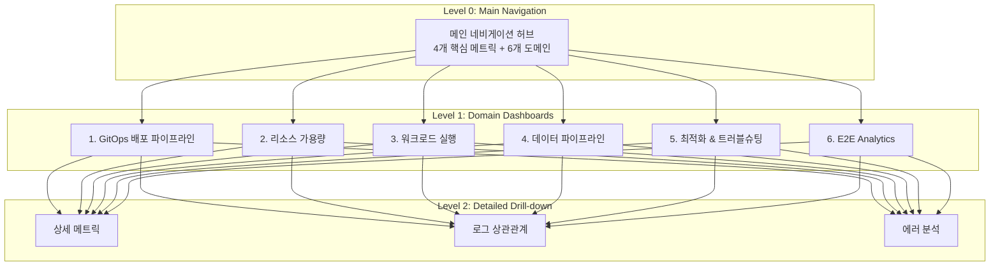

# DataOps 모니터링 시스템 - 빠른 시작 가이드

## 📋 문서 개요

빅데이터 DataOps 플랫폼의 End-to-End 모니터링 시스템 설계가 완료되었습니다.

### 완성된 문서

| 문서 | 크기 | 용도 |
|------|------|------|
| [README-DATAOPS-MONITORING.md](./README-DATAOPS-MONITORING.md) | 446 lines | 전체 개요 및 빠른 시작 |
| [dataops-monitoring-architecture.md](./dataops-monitoring-architecture.md) | 503 lines | 상세 아키텍처 설계 |
| [dataops-expert-meeting-notes.md](./dataops-expert-meeting-notes.md) | 656 lines | SRE/엔지니어 전문가 회의록 |
| [dataops-implementation-guide.md](./dataops-implementation-guide.md) | 960 lines | 구현 가이드 (코드 포함) |

**총 문서량**: 2,565 lines (약 75KB)

---

## 🎯 시스템 설계 요약

### 모니터링 대상 시스템

```
사용자 Portal
    ↓
GitOps (Bitbucket → Jenkins → ArgoCD)
    ↓
Kubernetes Cluster
    ↓
Application (Spark, Airflow, Trino)
    ↓
Data Lake (Apache Iceberg + Hive Metastore)
    ↓
Storage (S3/MinIO, Oracle DB, Isilon NAS, Ceph)
```

### 6단계 모니터링 구조

| 단계 | 목표 질문 | 주요 메트릭 |
|------|----------|------------|
| **1. GitOps 배포** | 배포가 완료되었는가? | Jenkins 빌드, ArgoCD Sync, Pod Readiness |
| **2. 배포 검증** | 애플리케이션이 작동하는가? | Pod Status, Liveness/Readiness Probe |
| **3. 리소스 가용량** | 실행 가능한 리소스가 있는가? | CPU/Memory/Storage 가용량 |
| **4. 워크로드 실행** | Job이 정상 실행되는가? | Spark/Airflow/Trino 성공률, Duration |
| **5. 데이터 파이프라인** | 데이터가 올바르게 저장/읽기되는가? | Iceberg, S3 Latency, Metastore 응답 시간 |
| **6. E2E 통합** | 전체 파이프라인이 SLO를 준수하는가? | Pipeline Completion Time, Success Rate |

---

## 🏗️ 대시보드 계층 구조



### 대시보드 목록

| UID | 제목 | 상태 |
|-----|------|------|
| `dataops-main-nav` | 🌐 DataOps Platform - Main Navigation | ✅ 생성됨 |
| `dataops-gitops-pipeline` | 🔄 GitOps 배포 파이프라인 | 📝 설계 완료 |
| `dataops-resource-capacity` | 💾 리소스 가용량 | 📝 설계 완료 |
| `dataops-workload-execution` | ⚙️ 워크로드 실행 | 📝 설계 완료 |
| `dataops-data-pipeline` | 🗄️ 데이터 파이프라인 | 📝 설계 완료 |
| `dataops-optimization` | 🔧 최적화 & 트러블슈팅 | 📝 설계 완료 |
| `dataops-e2e-analytics` | 📊 E2E Analytics | 📝 설계 완료 |

---

## 📈 메트릭 수집 전략

### Exporter 구성

| Component | Exporter | Scrape Interval | Namespace |
|-----------|----------|-----------------|-----------|
| **Jenkins** | prometheus-plugin | 1m | ci-cd |
| **ArgoCD** | built-in | 30s | argocd |
| **Spark** | JMX Exporter | 15s | spark |
| **Airflow** | StatsD Exporter | 30s | airflow |
| **Trino** | built-in | 30s | trino |
| **Iceberg** | Custom Python | 5m | data-lake |
| **Hive Metastore** | JMX Exporter | 1m | data-lake |
| **S3/MinIO** | built-in | 1m | storage |
| **Oracle DB** | oracledb_exporter | 1m | database |
| **Ceph** | ceph-exporter | 1m | storage |
| **Isilon** | Custom REST API | 5m | storage |

---

## 🎯 SLO 및 Alert 정책

### Service Level Objectives

```
Availability SLO: 99.9%
→ Error Budget: 0.1% = 43.2분/월
→ MTTD 목표: < 5분 (평균 장애 감지 시간)
→ MTTR 목표: < 30분 (평균 장애 복구 시간)
```

### Alert 우선순위

| 등급 | 대응 시간 | 채널 | 예시 |
|------|----------|------|------|
| **P1 (Critical)** | 즉시 | PagerDuty + Slack | 플랫폼 다운, 데이터 손실 |
| **P2 (High)** | 30분 | Slack + Email | 리소스 부족, Job 실패율 급증 |
| **P3 (Medium)** | 2시간 | Slack | 슬로우 쿼리, Scheduler 지연 |
| **P4 (Low)** | 24시간 | Email | 용량 예측 경고 |

### Multi-window Burn Rate Alerting

```yaml
# Fast Burn (1시간 내 5% Error Budget 소진 예상)
- alert: DataOpsErrorBudgetFastBurn
  expr: |
    (1 - (
      sum(rate(dataops_pipeline_success_total[1h]))
      /
      sum(rate(dataops_pipeline_total[1h]))
    )) > (0.1 * 5)  # 99.9% SLO의 5배
  severity: critical

# Slow Burn (6시간 내 10% Error Budget 소진 예상)
- alert: DataOpsErrorBudgetSlowBurn
  expr: |
    (1 - (
      sum(rate(dataops_pipeline_success_total[6h]))
      /
      sum(rate(dataops_pipeline_total[6h]))
    )) > (0.1 * 1.67)  # 99.9% SLO의 1.67배
  severity: warning
```

---

## 🚀 8주 구현 로드맵

### Phase 1: Foundation (Week 1-2)

**목표**: 메트릭 수집 인프라 구축

- [ ] Prometheus/Thanos 설정 검증
- [ ] ServiceMonitor 생성 (Jenkins, ArgoCD, Spark, Airflow, Trino)
- [ ] JMX Exporter 배포 (Spark, Hive Metastore)
- [ ] Custom Exporter 개발 (Iceberg, Isilon)
- [ ] Recording Rules 정의

**Deliverables**:
- 11개 ServiceMonitor YAML
- JMX Exporter ConfigMap
- Python Iceberg Exporter (Docker 이미지)
- 20개 Recording Rules

---

### Phase 2: Core Dashboards (Week 3-4)

**목표**: 핵심 대시보드 개발

- [ ] Main Navigation 대시보드 배포 (✅ 이미 생성됨)
- [ ] GitOps Pipeline 대시보드
  - Bitbucket webhook 상태
  - Jenkins 빌드 성공률/실패 추이
  - ArgoCD Sync Status
  - Pod Readiness 타임라인
- [ ] Resource Capacity 대시보드
  - CPU/Memory 가용량 (클러스터/노드/네임스페이스)
  - Storage 사용률 (Longhorn, Ceph, Isilon)
  - Network 대역폭
- [ ] Workload Execution 대시보드
  - Spark Job 성공률, Duration, GC Time
  - Airflow DAG Run 상태, Task Duration
  - Trino Query 성공률, Wall Time

**Deliverables**:
- 4개 Grafana Dashboard JSON
- ConfigMap YAML 파일
- Sidecar 자동 로딩 설정

---

### Phase 3: Advanced Features (Week 5-6)

**목표**: 고급 모니터링 및 알림

- [ ] Data Pipeline 대시보드
  - Iceberg Table Metadata Size, Snapshot Count
  - S3 GET/PUT Latency, Error Rate
  - Hive Metastore Response Time
  - Oracle Connection Pool, Query Duration
- [ ] Optimization 대시보드
  - Small Files 분석 (Iceberg)
  - GC Time Ratio (Spark)
  - Slow Query 목록 (Trino, Oracle)
  - Cost Analysis (CPU-hour, Storage GB-month)
- [ ] E2E Analytics 대시보드
  - Pipeline Completion Time (P50/P95/P99)
  - Success Rate Trend
  - SLO Dashboard (Error Budget Burn Rate)
- [ ] Alert Rules 설정
  - 40개 PrometheusRule 생성
  - AlertManager 라우팅 설정
  - Slack/Email 통합

**Deliverables**:
- 3개 Grafana Dashboard JSON
- 40개 Alert Rules (PrometheusRule)
- AlertManager Config

---

### Phase 4: Optimization & Go-Live (Week 7-8)

**목표**: 성능 최적화 및 운영 준비

- [ ] Recording Rules 최적화
  - 느린 쿼리 식별 및 Pre-computation
  - Cardinality 분석 및 Label 최적화
- [ ] 자동 리포트 생성
  - 일간/주간/월간 리포트 (Grafana Reporter)
  - SLO 달성률 리포트
- [ ] Auto-remediation 설정
  - Runbook Automation (Ansible Tower 연동)
  - PagerDuty 통합
- [ ] 운영 문서화
  - Runbook 작성 (20개 시나리오)
  - On-call Playbook
- [ ] 사용자 교육
  - 대시보드 사용법 (Data Engineer)
  - Alert 대응 절차 (SRE)
- [ ] Go-Live

**Deliverables**:
- 최적화된 Recording Rules
- Grafana Reporter 템플릿
- 20개 Runbook 문서
- On-call Playbook
- 교육 자료

---

## 💾 데이터 보관 정책

### Prometheus/Thanos Retention

| 데이터 타입 | 보관 기간 | 스토리지 | 용도 |
|------------|----------|---------|------|
| **Raw Metrics** | 15일 | Prometheus Local | 실시간 쿼리 |
| **5분 Downsampled** | 90일 | S3 (Thanos Store) | 최근 추세 분석 |
| **1시간 Downsampled** | 1년 | S3 (Thanos Store) | 장기 추세, 용량 계획 |

### Recording Rules 전략

```yaml
# 1분 집계 (1일 보관)
- record: job:spark_job_duration_seconds:p95_1m
  expr: histogram_quantile(0.95, rate(spark_job_duration_seconds_bucket[1m]))

# 5분 집계 (7일 보관)
- record: job:spark_job_duration_seconds:p95_5m
  expr: histogram_quantile(0.95, rate(spark_job_duration_seconds_bucket[5m]))

# 1시간 집계 (90일 보관)
- record: job:spark_job_duration_seconds:p95_1h
  expr: histogram_quantile(0.95, rate(spark_job_duration_seconds_bucket[1h]))
```

---

## 🔍 핵심 메트릭 예제

### Spark Job Monitoring

```promql
# Job 성공률 (최근 24시간)
sum(rate(spark_job_status{status="SUCCEEDED"}[24h]))
/
sum(rate(spark_job_status[24h]))

# Job Duration P95 (최근 1시간)
histogram_quantile(0.95, 
  sum by (le) (rate(spark_job_duration_seconds_bucket[1h]))
)

# GC Time Ratio (목표: < 10%)
sum(rate(jvm_gc_collection_seconds_sum[5m]))
/
sum(rate(jvm_gc_collection_seconds_count[5m]))
```

### Airflow DAG Monitoring

```promql
# DAG Run 성공률
sum(rate(airflow_dag_run_status{status="success"}[1h]))
/
sum(rate(airflow_dag_run_status[1h]))

# Task Duration P95
histogram_quantile(0.95,
  sum by (le, dag_id) (rate(airflow_task_duration_seconds_bucket[1h]))
)

# Scheduler Lag (목표: < 30s)
airflow_scheduler_heartbeat_seconds - time()
```

### Trino Query Monitoring

```promql
# Query 성공률
sum(rate(trino_query_completed{state="FINISHED"}[5m]))
/
sum(rate(trino_query_completed[5m]))

# Query Wall Time P95 (목표: < 10분)
histogram_quantile(0.95,
  sum by (le) (rate(trino_query_wall_time_seconds_bucket[5m]))
)

# Worker 가용성
count(up{job="trino-worker"} == 1)
/
count(up{job="trino-worker"})
```

### Iceberg Table Monitoring

```promql
# Small Files Ratio (목표: < 30%)
iceberg_table_small_files_count
/
iceberg_table_total_files_count

# Snapshot Count (목표: < 100)
iceberg_table_snapshot_count

# Table Size Growth Rate (GB/day)
rate(iceberg_table_size_bytes[24h]) / 1024 / 1024 / 1024
```

### S3/MinIO Monitoring

```promql
# GET Latency P95 (목표: < 100ms)
histogram_quantile(0.95,
  sum by (le) (rate(s3_request_duration_seconds_bucket{operation="GET"}[5m]))
)

# Error Rate (목표: < 0.1%)
sum(rate(s3_request_errors_total[5m]))
/
sum(rate(s3_requests_total[5m]))

# Bandwidth Utilization
rate(s3_bytes_sent_total[1m]) + rate(s3_bytes_received_total[1m])
```

---

## 🛠️ 구현 시작하기

### 1. 사전 요구사항 확인

```bash
# Kubernetes 클러스터 접근
kubectl cluster-info

# Prometheus Operator 설치 확인
kubectl get crd prometheuses.monitoring.coreos.com

# Thanos Query 접근 확인
kubectl port-forward -n monitoring svc/thanos-query 9090:9090
# http://localhost:9090
```

### 2. ServiceMonitor 배포

```bash
# 디렉토리 생성
mkdir -p monitoring/servicemonitors

# Spark ServiceMonitor 생성
kubectl apply -f - <<EOF
apiVersion: monitoring.coreos.com/v1
kind: ServiceMonitor
metadata:
  name: spark-jobs
  namespace: monitoring
spec:
  selector:
    matchLabels:
      app: spark
  endpoints:
  - port: metrics
    interval: 15s
    path: /metrics
