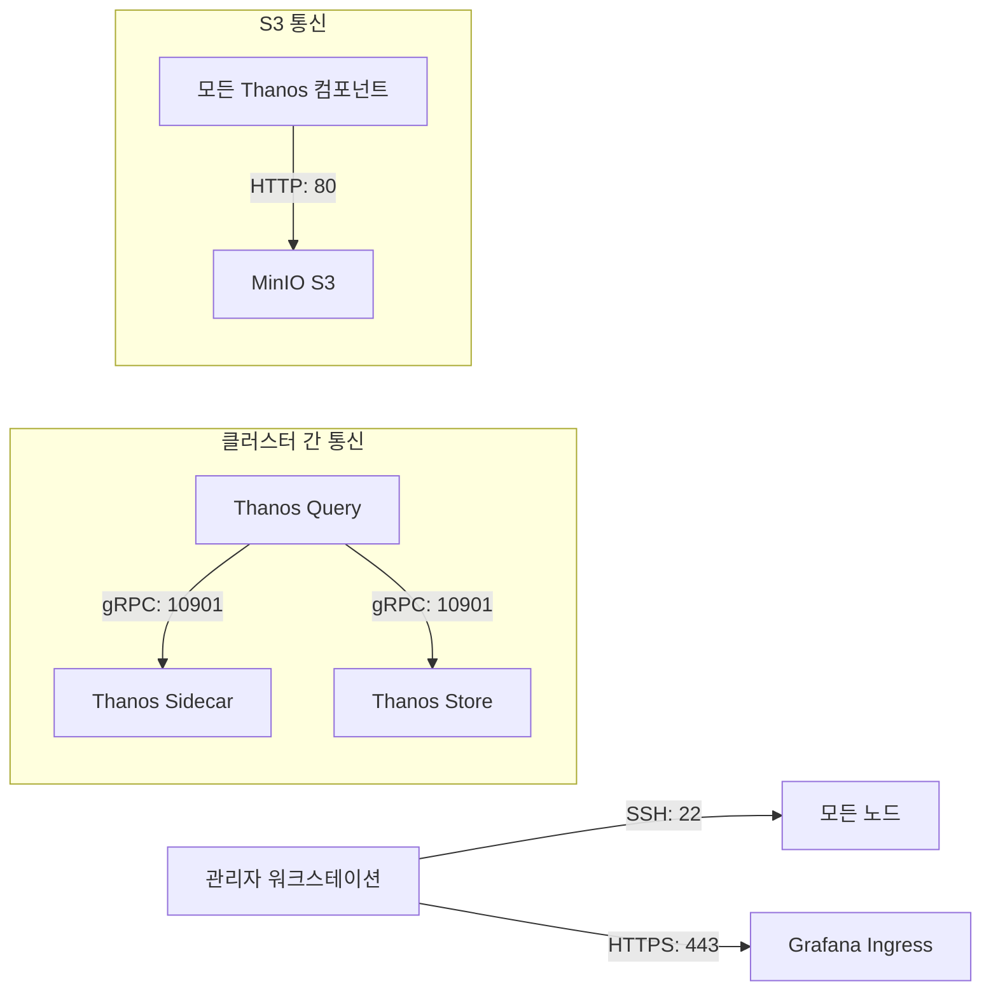
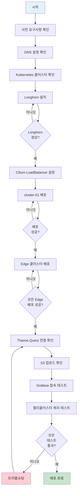

# Thanos 멀티클러스터 모니터링 배포 가이드

## 목차

1. [사전 요구사항](#사전-요구사항)
2. [클러스터 준비](#클러스터-준비)
3. [Longhorn 스토리지 설치](#longhorn-스토리지-설치)
4. [네트워크 설정](#네트워크-설정)
5. [Prometheus Stack 배포](#prometheus-stack-배포)
6. [Thanos 컴포넌트 배포](#thanos-컴포넌트-배포)
7. [검증 및 확인](#검증-및-확인)
8. [S3 버킷 정책 설정](#s3-버킷-정책-설정)

---

## 사전 요구사항

### 하드웨어

| 리소스 | 최소 사양 | 권장 사양 |
|--------|----------|----------|
| CPU | 4 cores | 8 cores |
| Memory | 8GB | 16GB |
| Disk | 100GB | 200GB |
| Network | 1Gbps | 10Gbps |

### 소프트웨어

- **Kubernetes**: v1.34.1 이상
- **kubectl**: 클러스터 버전과 호환
- **kustomize**: v5.0.0 이상
- **helm**: v3.10.0 이상 (차트 생성용)
- **sshpass**: 원격 배포를 위해 필요

### 네트워크 요구사항



### 접근 정보

| 대상 | IP/호스트 | 사용자명 | 비밀번호 |
|------|-----------|----------|----------|
| cluster-01 노드 | 192.168.101.194 | bsh | 123qwe |
| cluster-02 노드 | 192.168.101.196 | bsh | 123qwe |
| cluster-03 노드 | 192.168.101.197 | bsh | 123qwe |
| cluster-04 노드 | 192.168.101.198 | bsh | 123qwe |
| MinIO Console | console.minio.miribit.lab | minio | minio123 |

---

## 클러스터 준비

### 1. DNS 설정 확인

각 노드에서 DNS가 올바르게 설정되어 있는지 확인합니다:

```bash
# 모든 노드에서 실행
nslookup s3.minio.miribit.lab
nslookup grafana.k8s-cluster-01.miribit.lab
```

예상 결과:
```
s3.minio.miribit.lab → 172.16.203.1
grafana.k8s-cluster-01.miribit.lab → 192.168.101.210
```

### 2. Kubernetes 클러스터 확인

각 클러스터가 정상 동작하는지 확인합니다:

```bash
# cluster-01 확인
ssh bsh@192.168.101.194 "kubectl get nodes"

# cluster-02 확인
ssh bsh@192.168.101.196 "kubectl get nodes"

# cluster-03 확인
ssh bsh@192.168.101.197 "kubectl get nodes"

# cluster-04 확인
ssh bsh@192.168.101.198 "kubectl get nodes"
```

모든 노드가 `Ready` 상태여야 합니다.

### 3. kubectl 컨텍스트 설정

로컬 머신에서 모든 클러스터에 접근할 수 있도록 kubeconfig를 설정합니다:

```bash
# kubeconfig 디렉토리 생성
mkdir -p ~/.kube/configs

# 각 클러스터의 admin.conf 복사
sshpass -p "123qwe" ssh bsh@192.168.101.194 "echo '123qwe' | sudo -S cat /etc/kubernetes/admin.conf" > ~/.kube/configs/cluster-01.conf
sshpass -p "123qwe" ssh bsh@192.168.101.196 "echo '123qwe' | sudo -S cat /etc/kubernetes/admin.conf" > ~/.kube/configs/cluster-02.conf
sshpass -p "123qwe" ssh bsh@192.168.101.197 "echo '123qwe' | sudo -S cat /etc/kubernetes/admin.conf" > ~/.kube/configs/cluster-03.conf
sshpass -p "123qwe" ssh bsh@192.168.101.198 "echo '123qwe' | sudo -S cat /etc/kubernetes/admin.conf" > ~/.kube/configs/cluster-04.conf

# 각 kubeconfig에서 server 주소 수정
sed -i 's/server: https:\/\/.*:6443/server: https:\/\/192.168.101.194:6443/' ~/.kube/configs/cluster-01.conf
sed -i 's/server: https:\/\/.*:6443/server: https:\/\/192.168.101.196:6443/' ~/.kube/configs/cluster-02.conf
sed -i 's/server: https:\/\/.*:6443/server: https:\/\/192.168.101.197:6443/' ~/.kube/configs/cluster-03.conf
sed -i 's/server: https:\/\/.*:6443/server: https:\/\/192.168.101.198:6443/' ~/.kube/configs/cluster-04.conf
```

---

## Longhorn 스토리지 설치

각 클러스터에 Longhorn 분산 블록 스토리지를 설치합니다.

### 1. 사전 요구사항 설치

```bash
# 각 노드에 open-iscsi 설치
for node in 192.168.101.194 192.168.101.196 192.168.101.197 192.168.101.198; do
  echo "=== Installing prerequisites on $node ==="
  sshpass -p "123qwe" ssh bsh@$node "echo '123qwe' | sudo -S apt-get update && \
    echo '123qwe' | sudo -S apt-get install -y open-iscsi nfs-common && \
    echo '123qwe' | sudo -S systemctl enable --now iscsid"
done
```

### 2. Longhorn 배포

```bash
# cluster-01
export KUBECONFIG=~/.kube/configs/cluster-01.conf
cd /root/develop/thanos/deploy/overlays/cluster-01-central/longhorn
kustomize build . --enable-helm | kubectl apply -f -

# cluster-02
export KUBECONFIG=~/.kube/configs/cluster-02.conf
cd /root/develop/thanos/deploy/overlays/cluster-02-edge/longhorn
kustomize build . --enable-helm | kubectl apply -f -

# cluster-03
export KUBECONFIG=~/.kube/configs/cluster-03.conf
cd /root/develop/thanos/deploy/overlays/cluster-03-edge/longhorn
kustomize build . --enable-helm | kubectl apply -f -

# cluster-04
export KUBECONFIG=~/.kube/configs/cluster-04.conf
cd /root/develop/thanos/deploy/overlays/cluster-04-edge/longhorn
kustomize build . --enable-helm | kubectl apply -f -
```

### 3. Longhorn 설치 확인

```bash
# 모든 클러스터에서 확인
for config in cluster-01 cluster-02 cluster-03 cluster-04; do
  echo "=== Checking Longhorn on $config ==="
  export KUBECONFIG=~/.kube/configs/$config.conf
  kubectl get pods -n longhorn-system
  kubectl get storageclass
done
```

모든 Pod가 `Running` 상태이고 `longhorn` StorageClass가 생성되어야 합니다.

---

## 네트워크 설정

### 1. Cilium CNI 확인

Cilium이 이미 설치되어 있는지 확인합니다:

```bash
export KUBECONFIG=~/.kube/configs/cluster-01.conf
kubectl get pods -n kube-system -l app.kubernetes.io/name=cilium
```

### 2. LoadBalancer IP Pool 생성

각 클러스터에 LoadBalancer IP Pool을 생성합니다:

```bash
# cluster-01: Grafana Ingress용
export KUBECONFIG=~/.kube/configs/cluster-01.conf
cat <<EOF | kubectl apply -f -
apiVersion: "cilium.io/v2alpha1"
kind: CiliumLoadBalancerIPPool
metadata:
  name: "cluster-01-pool"
spec:
  blocks:
  - start: "192.168.101.210"
    stop: "192.168.101.210"
EOF

# cluster-02: Thanos Sidecar LB용
export KUBECONFIG=~/.kube/configs/cluster-02.conf
cat <<EOF | kubectl apply -f -
apiVersion: "cilium.io/v2alpha1"
kind: CiliumLoadBalancerIPPool
metadata:
  name: "cluster-02-pool"
spec:
  blocks:
  - start: "192.168.101.211"
    stop: "192.168.101.211"
EOF

# cluster-03
export KUBECONFIG=~/.kube/configs/cluster-03.conf
cat <<EOF | kubectl apply -f -
apiVersion: "cilium.io/v2alpha1"
kind: CiliumLoadBalancerIPPool
metadata:
  name: "cluster-03-pool"
spec:
  blocks:
  - start: "192.168.101.212"
    stop: "192.168.101.212"
EOF

# cluster-04
export KUBECONFIG=~/.kube/configs/cluster-04.conf
cat <<EOF | kubectl apply -f -
apiVersion: "cilium.io/v2alpha1"
kind: CiliumLoadBalancerIPPool
metadata:
  name: "cluster-04-pool"
spec:
  blocks:
  - start: "192.168.101.213"
    stop: "192.168.101.213"
EOF
```

### 3. L2 Announcement Policy 생성

```bash
# 모든 클러스터에 적용
for config in cluster-01 cluster-02 cluster-03 cluster-04; do
  export KUBECONFIG=~/.kube/configs/$config.conf
  cat <<EOF | kubectl apply -f -
apiVersion: "cilium.io/v2alpha1"
kind: CiliumL2AnnouncementPolicy
metadata:
  name: l2-policy
spec:
  loadBalancerIPs: true
  interfaces:
  - ^eth[0-9]+
  - ^ens[0-9]+
EOF
done
```

---

## Prometheus Stack 배포

### 1. S3 시크릿 구성

먼저 S3 접근 정보를 확인합니다:

```yaml
# deploy/base/kube-prometheus-stack/thanos-s3-secret.yaml
type: S3
config:
  bucket: thanos-bucket
  endpoint: s3.minio.miribit.lab:80
  access_key: Kl8u9VGxT4KA8TxlLEfO
  secret_key: U9KVRsMZlHJtiToriOxXfl9uPAXqFjqAI1ZdRCOz
  insecure: true
  http_config:
    insecure_skip_verify: true
```

### 2. 중앙 클러스터 (cluster-01) 배포

```bash
export KUBECONFIG=~/.kube/configs/cluster-01.conf
cd /root/develop/thanos/deploy/overlays/cluster-01-central/kube-prometheus-stack

# Kustomize로 빌드하고 배포
kustomize build . --enable-helm | kubectl apply -f -
```

배포되는 컴포넌트:
- Prometheus Operator
- Prometheus (2 replicas)
- Thanos Sidecar (각 Prometheus에 1개씩)
- Thanos Query
- Thanos Store
- Thanos Compactor
- Thanos Ruler
- Grafana
- AlertManager (2 replicas)
- Node Exporter
- Kube State Metrics

### 3. Edge 클러스터 배포

```bash
# cluster-02
export KUBECONFIG=~/.kube/configs/cluster-02.conf
cd /root/develop/thanos/deploy/overlays/cluster-02-edge/kube-prometheus-stack
kustomize build . --enable-helm | kubectl apply -f -

# cluster-03
export KUBECONFIG=~/.kube/configs/cluster-03.conf
cd /root/develop/thanos/deploy/overlays/cluster-03-edge/kube-prometheus-stack
kustomize build . --enable-helm | kubectl apply -f -

# cluster-04
export KUBECONFIG=~/.kube/configs/cluster-04.conf
cd /root/develop/thanos/deploy/overlays/cluster-04-edge/kube-prometheus-stack
kustomize build . --enable-helm | kubectl apply -f -
```

Edge 클러스터 배포 컴포넌트:
- Prometheus Operator
- Prometheus (1 replica)
- Thanos Sidecar
- Thanos Sidecar LoadBalancer (외부 접근용)
- Node Exporter
- Kube State Metrics

### 4. 배포 상태 확인

```bash
# 모든 클러스터에서 Pod 상태 확인
for config in cluster-01 cluster-02 cluster-03 cluster-04; do
  echo "=== $config ==="
  export KUBECONFIG=~/.kube/configs/$config.conf
  kubectl get pods -n monitoring
  echo ""
done
```

모든 Pod가 `Running` 상태가 될 때까지 대기합니다 (약 5-10분).

---

## Thanos 컴포넌트 배포

Thanos 컴포넌트는 kube-prometheus-stack과 함께 배포되었으나, 추가 설정이 필요할 수 있습니다.

### 1. Thanos Query 연결 확인

Thanos Query가 모든 Prometheus Sidecar에 연결되었는지 확인합니다:

```bash
export KUBECONFIG=~/.kube/configs/cluster-01.conf
kubectl logs -n monitoring deployment/thanos-query --tail=50 | grep "adding new"
```

예상 출력:
```
adding new sidecar ... address=10.0.0.124:10901 extLset="{cluster=\"cluster-01\", region=\"central\"}"
adding new sidecar ... address=10.0.0.123:10901 extLset="{cluster=\"cluster-01\", region=\"central\"}"
adding new sidecar ... address=192.168.101.211:10901 extLset="{cluster=\"cluster-02\", region=\"edge\"}"
adding new sidecar ... address=192.168.101.212:10901 extLset="{cluster=\"cluster-03\", region=\"edge\"}"
adding new sidecar ... address=192.168.101.213:10901 extLset="{cluster=\"cluster-04\", region=\"edge\"}"
adding new store ... address=thanos-store.monitoring.svc.cluster.local:10901
```

### 2. S3 업로드 확인

각 클러스터의 Thanos Sidecar가 S3에 블록을 업로드하는지 확인합니다:

```bash
# cluster-01 Prometheus-0
export KUBECONFIG=~/.kube/configs/cluster-01.conf
kubectl logs -n monitoring prometheus-kube-prometheus-stack-prometheus-0 thanos-sidecar --tail=20 | grep -E "uploaded|bucket"
```

예상 출력:
```
ts=... level=info msg="upload new block" id=01XXXXX...
```

### 3. Thanos Compactor 동작 확인

```bash
export KUBECONFIG=~/.kube/configs/cluster-01.conf
kubectl logs -n monitoring statefulset/thanos-compactor --tail=50
```

Compactor가 주기적으로 실행되고 있는지 확인합니다.

---

## 검증 및 확인

### 1. Grafana 접속

웹 브라우저에서 Grafana에 접속합니다:

```
URL: http://grafana.k8s-cluster-01.miribit.lab
Username: admin
Password: admin123
```

### 2. Thanos Query 데이터소스 확인

Grafana에서:
1. **Configuration** → **Data Sources**로 이동
2. **Thanos-Query** 데이터소스 선택
3. 하단의 **Test** 버튼 클릭
4. "Data source is working" 메시지 확인

### 3. 멀티클러스터 메트릭 쿼리 테스트

Grafana의 Explore 페이지에서 다음 쿼리를 실행합니다:

```promql
# 모든 클러스터의 노드 수
count by (cluster) (kube_node_info)

# 클러스터별 CPU 사용률
100 - (avg by (cluster) (irate(node_cpu_seconds_total{mode="idle"}[5m])) * 100)

# 클러스터별 Pod 수
sum by (cluster) (kube_pod_info)
```

모든 클러스터(cluster-01, cluster-02, cluster-03, cluster-04)의 데이터가 표시되어야 합니다.

### 4. S3 버킷 확인

MinIO Console에서 버킷을 확인합니다:

```
URL: http://console.minio.miribit.lab
Username: minio
Password: minio123
```

`thanos-bucket` 버킷에 다음과 같은 구조로 데이터가 저장되어 있어야 합니다:

```
thanos-bucket/
├── 01XXXXX/              # ULID 형식의 블록 ID
│   ├── chunks/
│   │   └── 000001
│   ├── index
│   └── meta.json
├── 01YYYYY/
│   └── ...
└── debug/
    └── metas/
```

### 5. 헬스 체크

모든 Thanos 컴포넌트의 헬스 상태를 확인합니다:

```bash
export KUBECONFIG=~/.kube/configs/cluster-01.conf

# Thanos Query
kubectl exec -n monitoring deployment/thanos-query -- wget -qO- http://localhost:10902/-/healthy

# Thanos Store
kubectl exec -n monitoring statefulset/thanos-store -- wget -qO- http://localhost:10902/-/healthy

# Thanos Compactor
kubectl exec -n monitoring statefulset/thanos-compactor -- wget -qO- http://localhost:10902/-/healthy
```

모두 "Healthy" 응답을 반환해야 합니다.

---

## S3 버킷 정책 설정

### MinIO 버킷 생명주기 정책 (선택사항)

MinIO Console에서 버킷 생명주기 정책을 설정할 수 있습니다:

1. MinIO Console 로그인
2. `thanos-bucket` 선택
3. **Lifecycle** 탭으로 이동
4. 다음 정책 추가:

```json
{
  "Rules": [
    {
      "ID": "expire-old-blocks",
      "Status": "Enabled",
      "Filter": {
        "Prefix": ""
      },
      "Expiration": {
        "Days": 100
      }
    }
  ]
}
```

이 정책은 100일이 지난 오브젝트를 자동으로 삭제합니다. Thanos Compactor가 이미 데이터 보존 정책(90일)을 관리하므로, 이 정책은 삭제되지 않은 오래된 블록을 정리하는 안전장치 역할을 합니다.

---

## 배포 플로우차트



---

## 트러블슈팅

일반적인 문제와 해결 방법은 [TROUBLESHOOTING.md](./TROUBLESHOOTING.md)를 참조하세요.

---

## 다음 단계

배포가 완료되면 다음 작업을 진행할 수 있습니다:

1. **알럿 규칙 설정**: AlertManager 알림 채널 구성
2. **대시보드 생성**: 커스텀 Grafana 대시보드 작성
3. **로그 수집**: OpenSearch + Fluent-bit 배포
4. **보안 강화**: TLS, 인증, RBAC 설정
5. **백업 설정**: etcd 및 PVC 백업 구성

상세한 운영 가이드는 [OPERATIONS.md](./OPERATIONS.md)를 참조하세요.
