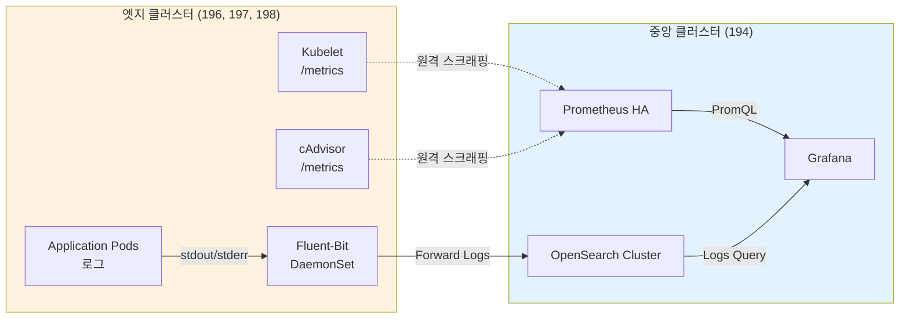

# 엣지 클러스터 구성 가이드

## 개요

엣지 클러스터는 **경량화된 구성**으로 운영되며, 모든 관측성 데이터는 중앙 클러스터(194)로 전송됩니다.

---

## 아키텍처 원칙

### 중앙 집중식 모니터링



**장점**:
- ✅ **리소스 최소화**: 엣지 클러스터에서 무거운 Prometheus, OpenSearch 제거
- ✅ **중앙 집중 관리**: 모든 데이터를 한곳에서 조회 및 분석
- ✅ **스토리지 절약**: 엣지에서 별도 스토리지 불필요
- ✅ **운영 간소화**: 업그레이드 및 관리 포인트 단일화

---

## 배포 컴포넌트

### 중앙 클러스터 (194)

| 컴포넌트 | 역할 | 리소스 |
|---------|------|--------|
| Prometheus (HA 2 replicas) | 메트릭 수집 및 저장 | CPU: 1000m, Memory: 2Gi |
| Thanos Query | 통합 쿼리 엔진 | CPU: 1000m, Memory: 1Gi |
| Thanos Store | 장기 메트릭 조회 | CPU: 500m, Memory: 1Gi |
| Thanos Compactor | 메트릭 압축/다운샘플링 | CPU: 500m, Memory: 1Gi |
| OpenSearch Master (3 replicas) | 로그 클러스터 마스터 | CPU: 500m, Memory: 1Gi |
| OpenSearch Data (3 replicas) | 로그 데이터 저장 | CPU: 1000m, Memory: 2Gi |
| Fluent-Bit | 로컬 로그 수집 | CPU: 100m, Memory: 128Mi |
| Grafana | 통합 대시보드 | CPU: 500m, Memory: 512Mi |

**총 리소스**: ~10 CPU, ~16 GB Memory

### 엣지 클러스터 (196, 197, 198)

| 컴포넌트 | 역할 | 리소스 |
|---------|------|--------|
| Fluent-Bit (DaemonSet) | 로그 수집 및 전송 | CPU: 100m, Memory: 128Mi |

**총 리소스**: ~0.1 CPU, ~128 MB Memory (노드당)

---

## Fluent-Bit 설정

### 엣지 클러스터 Output 설정

**파일**: `deploy/overlays/cluster-02-edge/fluent-bit/cluster-output.yaml`

```yaml
apiVersion: fluentbit.fluent.io/v1alpha2
kind: ClusterOutput
metadata:
  name: opensearch-central
  namespace: logging
  labels:
    fluentbit.fluent.io/enabled: "true"
spec:
  match: "*"
  opensearch:
    host: opensearch-cluster-masters.logging.svc.cluster-01-central.local
    port: 9200
    httpUser:
      valueFrom:
        secretKeyRef:
          name: opensearch-credentials
          key: username
    httpPassword:
      valueFrom:
        secretKeyRef:
          name: opensearch-credentials
          key: password
    index: fluent-bit-cluster-02
    logstashFormat: true
    logstashPrefix: fluent-bit-cluster-02
    logstashDateFormat: "%Y.%m.%d"
    timeKey: "@timestamp"
    generateID: true
    tls:
      verify: false
```

**주요 설정**:
- `host`: 중앙 클러스터의 OpenSearch 서비스 DNS
- `index`: 클러스터별 인덱스 (cluster-02, cluster-03, cluster-04)
- `logstashFormat`: 날짜별 인덱스 자동 생성
- `tls.verify: false`: 내부 통신이므로 TLS 검증 비활성화 (프로덕션에서는 true 권장)

### Secret 생성

```bash
kubectl create secret generic opensearch-credentials \
  --from-literal=username=admin \
  --from-literal=password=admin \
  -n logging
```

---

## Prometheus 원격 스크래핑 설정

### ServiceMonitor 생성 (중앙 클러스터)

**파일**: `deploy/overlays/cluster-01-central/kube-prometheus-stack/servicemonitors/remote-kubelet.yaml`

```yaml
apiVersion: monitoring.coreos.com/v1
kind: ServiceMonitor
metadata:
  name: remote-kubelet-cluster-02
  namespace: monitoring
spec:
  endpoints:
    - port: https-metrics
      scheme: https
      tlsConfig:
        caFile: /var/run/secrets/kubernetes.io/serviceaccount/ca.crt
        insecureSkipVerify: true
      bearerTokenFile: /var/run/secrets/kubernetes.io/serviceaccount/token
      relabelings:
        - sourceLabels: [__address__]
          targetLabel: __address__
          replacement: 192.168.101.196:10250
        - sourceLabels: []
          targetLabel: cluster
          replacement: cluster-02
        - sourceLabels: []
          targetLabel: job
          replacement: kubelet
  selector:
    matchLabels:
      app.kubernetes.io/name: kubelet
  namespaceSelector:
    matchNames:
      - kube-system
```

**설정 설명**:
- `relabelings[0]`: Kubelet 엔드포인트 주소를 엣지 클러스터 IP로 변경
- `relabelings[1]`: cluster 레이블 추가 (멀티클러스터 식별)
- `tlsConfig.insecureSkipVerify`: 자체 서명 인증서 허용

### 원격 스크래핑을 위한 RBAC 설정

**각 엣지 클러스터에서**:

```yaml
apiVersion: v1
kind: ServiceAccount
metadata:
  name: prometheus-remote-scraper
  namespace: kube-system
---
apiVersion: rbac.authorization.k8s.io/v1
kind: ClusterRole
metadata:
  name: prometheus-remote-scraper
rules:
  - apiGroups: [""]
    resources:
      - nodes/metrics
      - nodes/stats
      - nodes/proxy
    verbs: ["get", "list"]
---
apiVersion: rbac.authorization.k8s.io/v1
kind: ClusterRoleBinding
metadata:
  name: prometheus-remote-scraper
roleRef:
  apiGroup: rbac.authorization.k8s.io
  kind: ClusterRole
  name: prometheus-remote-scraper
subjects:
  - kind: ServiceAccount
    name: prometheus-remote-scraper
    namespace: kube-system
```

**Token 생성 및 중앙 클러스터로 복사**:

```bash
# 엣지 클러스터에서 Token 생성
kubectl create token prometheus-remote-scraper -n kube-system --duration=87600h > /tmp/cluster-02-token.txt

# 중앙 클러스터에 Secret 생성
kubectl create secret generic cluster-02-scrape-token \
  --from-file=token=/tmp/cluster-02-token.txt \
  -n monitoring
```

---

## 네트워크 요구사항

### 방화벽 규칙

**엣지 → 중앙 (194)**:
| 포트 | 프로토콜 | 용도 |
|------|---------|------|
| 9200 | HTTPS | OpenSearch (로그 전송) |

**중앙 (194) → 엣지**:
| 포트 | 프로토콜 | 용도 |
|------|---------|------|
| 10250 | HTTPS | Kubelet metrics |
| 10255 | HTTP | cAdvisor metrics (read-only port) |

### DNS 설정

**옵션 1: CoreDNS Stub Domain** (권장)

중앙 클러스터의 서비스를 엣지 클러스터에서 DNS로 조회:

```yaml
# 각 엣지 클러스터의 CoreDNS ConfigMap 수정
apiVersion: v1
kind: ConfigMap
metadata:
  name: coredns
  namespace: kube-system
data:
  Corefile: |
    .:53 {
        errors
        health
        kubernetes cluster.local in-addr.arpa ip6.arpa {
          pods insecure
          fallthrough in-addr.arpa ip6.arpa
        }
        # 중앙 클러스터 서비스 조회
        forward cluster-01-central.local 192.168.101.194
        prometheus :9153
        forward . /etc/resolv.conf
        cache 30
        loop
        reload
        loadbalance
    }
```

**옵션 2: 직접 IP 사용**

```yaml
# cluster-output.yaml
spec:
  opensearch:
    host: 192.168.101.194  # 중앙 클러스터 IP 직접 사용
    port: 9200
```

---

## 배포 프로세스

### 1. 중앙 클러스터 먼저 배포

```bash
# ArgoCD가 자동으로 배포 (sync-wave 순서)
kubectl apply -f argocd/applications/cluster-01/
```

**배포 순서**:
1. Wave 0: Operators (Prometheus Op, OpenSearch Op, Fluent Op)
2. Wave 1: Prometheus, OpenSearch Cluster
3. Wave 2: Thanos, Fluent-Bit, Grafana

### 2. 엣지 클러스터 배포

```bash
# 각 엣지 클러스터에 Fluent-Bit만 배포
kubectl apply -f argocd/applications/cluster-02/fluent-bit.yaml
kubectl apply -f argocd/applications/cluster-03/fluent-bit.yaml
kubectl apply -f argocd/applications/cluster-04/fluent-bit.yaml
```

### 3. 검증

**로그 전송 확인**:

```bash
# 중앙 클러스터에서 인덱스 확인
kubectl exec -n logging opensearch-cluster-masters-0 -- \
  curl -u admin:admin "https://localhost:9200/_cat/indices?v" | grep fluent-bit

# 예상 출력:
# green open fluent-bit-cluster-02-2025.10.16 ...
# green open fluent-bit-cluster-03-2025.10.16 ...
# green open fluent-bit-cluster-04-2025.10.16 ...
```

**메트릭 수집 확인**:

```bash
# Prometheus UI에서 쿼리
up{cluster="cluster-02",job="kubelet"}
up{cluster="cluster-03",job="kubelet"}
up{cluster="cluster-04",job="kubelet"}
```

---

## 트러블슈팅

### 문제 1: Fluent-Bit 로그가 중앙 OpenSearch에 전송되지 않음

**증상**:
```bash
kubectl logs -n logging fluent-bit-xxxxx
# [error] [output:opensearch:opensearch.0] HTTP status=503
```

**원인**:
- 네트워크 연결 문제
- OpenSearch가 준비되지 않음
- 인증 실패

**해결**:

```bash
# 1. 네트워크 테스트
kubectl exec -n logging fluent-bit-xxxxx -- \
  curl -k https://192.168.101.194:9200

# 2. OpenSearch 상태 확인
kubectl get opensearchcluster -n logging

# 3. Secret 확인
kubectl get secret opensearch-credentials -n logging -o yaml
```

### 문제 2: Prometheus가 원격 Kubelet 메트릭을 스크래핑하지 못함

**증상**:
```
Prometheus Targets 페이지에서 "context deadline exceeded" 오류
```

**원인**:
- 방화벽 규칙 미설정
- ServiceAccount Token 만료
- Kubelet TLS 인증서 문제

**해결**:

```bash
# 1. 방화벽 확인
telnet 192.168.101.196 10250

# 2. Token 재생성
kubectl create token prometheus-remote-scraper -n kube-system --duration=87600h

# 3. Kubelet 로그 확인 (엣지 클러스터)
journalctl -u kubelet -f
```

### 문제 3: 엣지 클러스터에서 중앙 OpenSearch DNS 조회 실패

**증상**:
```
[error] [net] DNS lookup failed for opensearch-cluster-masters.logging.svc.cluster-01-central.local
```

**원인**: CoreDNS Stub Domain 미설정

**해결**:

```bash
# 옵션 1: CoreDNS 설정 수정 (위 DNS 설정 참조)

# 옵션 2: IP 직접 사용
kubectl edit clusteroutput opensearch-central -n logging
# host를 192.168.101.194로 변경
```

---

## 성능 최적화

### Fluent-Bit 버퍼링

대량 로그 처리 시 버퍼링 설정:

```yaml
apiVersion: fluentbit.fluent.io/v1alpha2
kind: FluentBitConfig
metadata:
  name: fluent-bit-config
  namespace: logging
spec:
  service:
    flush: 5
    daemon: false
    logLevel: info
    parsersFile: parsers.conf
  inputSelector:
    matchLabels:
      fluentbit.fluent.io/enabled: "true"
  filterSelector:
    matchLabels:
      fluentbit.fluent.io/enabled: "true"
  outputSelector:
    matchLabels:
      fluentbit.fluent.io/enabled: "true"
```

**주요 파라미터**:
- `flush: 5`: 5초마다 버퍼 플러시 (기본값)
- 로그 폭증 시 `flush` 값을 늘려 배치 전송

### Prometheus 스크래핑 간격

원격 스크래핑의 부하를 줄이기 위해 간격 증가:

```yaml
# ServiceMonitor에서
spec:
  endpoints:
    - interval: 60s  # 기본 30s → 60s
      scrapeTimeout: 30s
```

---

## 모니터링 대시보드

### Grafana 대시보드 예제

**멀티클러스터 메트릭 조회**:

```promql
# 각 클러스터의 CPU 사용률
sum by (cluster) (
  rate(container_cpu_usage_seconds_total{cluster=~"cluster-.*"}[5m])
)

# 엣지 클러스터 노드 상태
up{job="kubelet",cluster=~"cluster-0[2-4]"}
```

**멀티클러스터 로그 조회** (OpenSearch Dashboards):

```
인덱스 패턴: fluent-bit-*
필터: _index: "fluent-bit-cluster-02-*" OR _index: "fluent-bit-cluster-03-*"
```

---

## 요약

### 엣지 클러스터 구성 체크리스트

- [ ] Fluent-Bit DaemonSet 배포
- [ ] OpenSearch 접근을 위한 Secret 생성
- [ ] ClusterOutput 설정 (중앙 OpenSearch로 전송)
- [ ] 네트워크 방화벽 규칙 설정 (9200, 10250 포트)
- [ ] 중앙 Prometheus에 ServiceMonitor 추가 (원격 스크래핑)
- [ ] ServiceAccount Token 생성 (원격 스크래핑용)
- [ ] 로그 전송 검증
- [ ] 메트릭 수집 검증

### 리소스 절감 효과

**엣지 클러스터 1개당**:
- Prometheus 제거: ~1 CPU, ~2 GB Memory 절감
- OpenSearch 제거: ~2 CPU, ~4 GB Memory 절감
- **총 절감**: ~3 CPU, ~6 GB Memory per cluster
- **4개 엣지 클러스터**: ~12 CPU, ~24 GB Memory 절감

---

**작성일**: 2025-10-16
**버전**: 1.0.0
