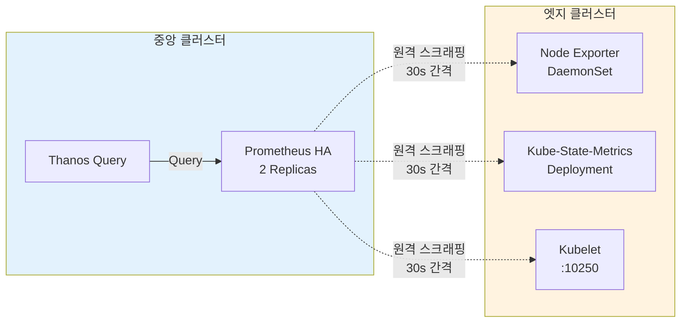
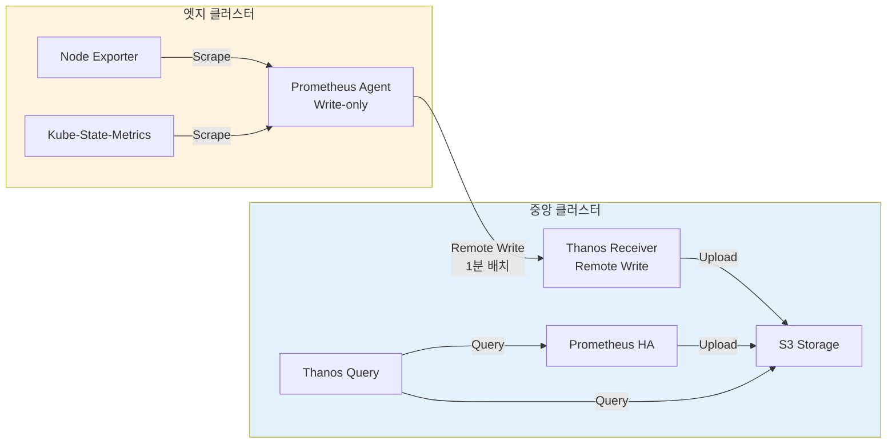
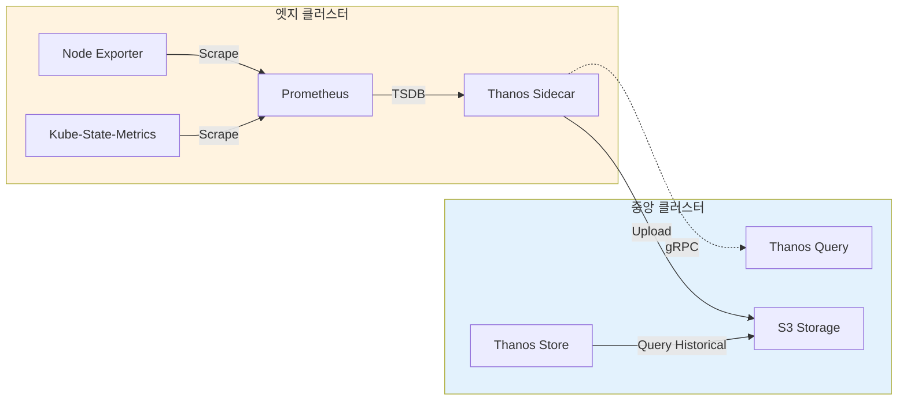

# 엣지 클러스터 메트릭 수집 방식 비교

## 개요

엣지 클러스터에서 **Prometheus 없이** 메트릭을 수집하는 3가지 주요 방식을 비교합니다.

---

## 옵션 비교표

| 옵션 | 엣지 컴포넌트 | 중앙 컴포넌트 | 리소스 (엣지) | 실시간성 | 네트워크 부하 | 복잡도 |
|------|-------------|-------------|--------------|---------|-------------|--------|
| **1. 원격 스크래핑** | 없음 (현재 v2.1) | Prometheus HA | 0 | 높음 (30s) | 낮음 | 낮음 ⭐ |
| **2. Prometheus Agent Mode** | Prometheus Agent | Prometheus HA + Thanos Receiver | 낮음 (~200MB) | 중간 (1m) | 중간 | 중간 ⭐⭐ |
| **3. Thanos Sidecar 없이** | Prometheus | Thanos Query | 높음 (~2GB) | 높음 (30s) | 높음 | 높음 |

---

## 옵션 1: 원격 스크래핑 (현재 구성)

### 아키텍처



### 장점
- ✅ **엣지 리소스 최소화**: Prometheus 불필요
- ✅ **구성 단순**: 중앙에서만 Prometheus 관리
- ✅ **실시간성 높음**: 30초 간격 스크래핑
- ✅ **네트워크 효율**: 메트릭만 전송 (압축)

### 단점
- ❌ **네트워크 의존성**: 중앙-엣지 간 연결 필수
- ❌ **스케일 제한**: 엣지 클러스터 증가 시 중앙 Prometheus 부하 증가
- ❌ **방화벽 설정 필요**: 중앙 → 엣지 방향 (10250, 10255 포트)

### 엣지 클러스터 구성

**필수 컴포넌트**:
```yaml
# Node Exporter (각 노드의 OS 메트릭)
apiVersion: apps/v1
kind: DaemonSet
metadata:
  name: node-exporter
  namespace: monitoring
spec:
  selector:
    matchLabels:
      app: node-exporter
  template:
    metadata:
      labels:
        app: node-exporter
    spec:
      hostNetwork: true
      hostPID: true
      containers:
        - name: node-exporter
          image: quay.io/prometheus/node-exporter:v1.7.0
          args:
            - '--path.procfs=/host/proc'
            - '--path.sysfs=/host/sys'
            - '--path.rootfs=/host/root'
          ports:
            - containerPort: 9100
              name: metrics
          volumeMounts:
            - name: proc
              mountPath: /host/proc
              readOnly: true
            - name: sys
              mountPath: /host/sys
              readOnly: true
            - name: root
              mountPath: /host/root
              readOnly: true
      volumes:
        - name: proc
          hostPath:
            path: /proc
        - name: sys
          hostPath:
            path: /sys
        - name: root
          hostPath:
            path: /

---
# Kube-State-Metrics (Kubernetes 리소스 메트릭)
apiVersion: apps/v1
kind: Deployment
metadata:
  name: kube-state-metrics
  namespace: monitoring
spec:
  replicas: 1
  selector:
    matchLabels:
      app: kube-state-metrics
  template:
    metadata:
      labels:
        app: kube-state-metrics
    spec:
      serviceAccountName: kube-state-metrics
      containers:
        - name: kube-state-metrics
          image: registry.k8s.io/kube-state-metrics/kube-state-metrics:v2.10.1
          ports:
            - containerPort: 8080
              name: http-metrics
          resources:
            requests:
              cpu: 100m
              memory: 128Mi
            limits:
              cpu: 200m
              memory: 256Mi
```

### 중앙 클러스터 원격 스크래핑 설정

**ServiceMonitor**:
```yaml
# 엣지 클러스터 02의 Node Exporter 스크래핑
apiVersion: monitoring.coreos.com/v1
kind: ServiceMonitor
metadata:
  name: remote-node-exporter-cluster-02
  namespace: monitoring
spec:
  endpoints:
    - port: metrics
      interval: 30s
      relabelings:
        - sourceLabels: [__address__]
          targetLabel: __address__
          replacement: 192.168.101.196:9100  # 엣지 노드 IP
        - targetLabel: cluster
          replacement: cluster-02
        - targetLabel: job
          replacement: node-exporter
  selector:
    matchLabels:
      app: node-exporter

---
# 엣지 클러스터 02의 Kube-State-Metrics 스크래핑
apiVersion: monitoring.coreos.com/v1
kind: ServiceMonitor
metadata:
  name: remote-kube-state-metrics-cluster-02
  namespace: monitoring
spec:
  endpoints:
    - port: http-metrics
      interval: 30s
      relabelings:
        - sourceLabels: [__address__]
          targetLabel: __address__
          replacement: 192.168.101.196:8080  # kube-state-metrics Service IP
        - targetLabel: cluster
          replacement: cluster-02
        - targetLabel: job
          replacement: kube-state-metrics
  selector:
    matchLabels:
      app: kube-state-metrics

---
# 엣지 클러스터 02의 Kubelet 스크래핑
apiVersion: monitoring.coreos.com/v1
kind: ServiceMonitor
metadata:
  name: remote-kubelet-cluster-02
  namespace: monitoring
spec:
  endpoints:
    - port: https-metrics
      scheme: https
      interval: 30s
      tlsConfig:
        insecureSkipVerify: true
      bearerTokenFile: /var/run/secrets/kubernetes.io/serviceaccount/token
      relabelings:
        - sourceLabels: [__address__]
          targetLabel: __address__
          replacement: 192.168.101.196:10250
        - targetLabel: cluster
          replacement: cluster-02
        - targetLabel: job
          replacement: kubelet
  selector:
    matchLabels:
      app: kubelet
```

### 리소스 사용량

**엣지 클러스터당**:
- Node Exporter: CPU 50m, Memory 50Mi (per node)
- Kube-State-Metrics: CPU 100m, Memory 128Mi
- **총 (3노드 가정)**: CPU ~250m, Memory ~278Mi

**중앙 클러스터 추가 부하**:
- Prometheus 메모리: +500MB (4개 엣지 클러스터)
- CPU: +200m (스크래핑 처리)

---

## 옵션 2: Prometheus Agent Mode (권장 ⭐⭐)

### 아키텍처



### 설명

**Prometheus Agent Mode**:
- Prometheus의 경량 모드 (v2.32.0+)
- **스크래핑만 수행**, 로컬 저장소 없음
- Remote Write로 중앙에 전송
- 리소스 사용량: 일반 Prometheus의 ~10%

### 장점
- ✅ **네트워크 효율**: 배치 전송 (1분 단위), 압축, 재시도 로직
- ✅ **네트워크 단절 대응**: 로컬 WAL 버퍼 (일시적 저장)
- ✅ **방화벽 친화적**: 엣지 → 중앙 방향 (아웃바운드만)
- ✅ **스케일 가능**: 중앙 Receiver가 부하 분산

### 단점
- ❌ **엣지 리소스 필요**: ~200MB Memory, ~200m CPU
- ❌ **추가 컴포넌트**: Thanos Receiver 필요
- ❌ **약간의 지연**: 1분 배치 전송 (실시간성 낮음)

### 엣지 클러스터 구성

**Prometheus Agent 배포**:
```yaml
apiVersion: apps/v1
kind: StatefulSet
metadata:
  name: prometheus-agent
  namespace: monitoring
spec:
  serviceName: prometheus-agent
  replicas: 1
  selector:
    matchLabels:
      app: prometheus-agent
  template:
    metadata:
      labels:
        app: prometheus-agent
    spec:
      serviceAccountName: prometheus-agent
      containers:
        - name: prometheus
          image: quay.io/prometheus/prometheus:v2.48.0
          args:
            - '--config.file=/etc/prometheus/prometheus.yml'
            - '--enable-feature=agent'  # Agent Mode 활성화
            - '--storage.agent.path=/prometheus'
            - '--web.listen-address=:9090'
          ports:
            - containerPort: 9090
              name: http
          volumeMounts:
            - name: config
              mountPath: /etc/prometheus
            - name: storage
              mountPath: /prometheus
          resources:
            requests:
              cpu: 200m
              memory: 200Mi
            limits:
              cpu: 500m
              memory: 500Mi
      volumes:
        - name: config
          configMap:
            name: prometheus-agent-config
  volumeClaimTemplates:
    - metadata:
        name: storage
      spec:
        accessModes: ["ReadWriteOnce"]
        storageClassName: longhorn
        resources:
          requests:
            storage: 5Gi  # WAL 버퍼용

---
apiVersion: v1
kind: ConfigMap
metadata:
  name: prometheus-agent-config
  namespace: monitoring
data:
  prometheus.yml: |
    global:
      scrape_interval: 30s
      external_labels:
        cluster: cluster-02
        region: edge

    remote_write:
      - url: http://thanos-receiver.monitoring.svc.cluster-01-central.local:19291/api/v1/receive
        queue_config:
          capacity: 10000
          max_shards: 10
          min_shards: 1
          max_samples_per_send: 5000
          batch_send_deadline: 5s
          min_backoff: 30ms
          max_backoff: 5s

    scrape_configs:
      # Node Exporter
      - job_name: 'node-exporter'
        kubernetes_sd_configs:
          - role: pod
            namespaces:
              names:
                - monitoring
        relabel_configs:
          - source_labels: [__meta_kubernetes_pod_label_app]
            action: keep
            regex: node-exporter
          - source_labels: [__meta_kubernetes_pod_ip]
            target_label: __address__
            replacement: $1:9100

      # Kube-State-Metrics
      - job_name: 'kube-state-metrics'
        static_configs:
          - targets: ['kube-state-metrics.monitoring.svc:8080']

      # Kubelet
      - job_name: 'kubelet'
        scheme: https
        tls_config:
          insecure_skip_verify: true
        bearer_token_file: /var/run/secrets/kubernetes.io/serviceaccount/token
        kubernetes_sd_configs:
          - role: node
        relabel_configs:
          - source_labels: [__address__]
            target_label: __address__
            regex: ([^:]+)(?::\d+)?
            replacement: $1:10250

      # cAdvisor (Kubelet에 포함)
      - job_name: 'cadvisor'
        scheme: https
        tls_config:
          insecure_skip_verify: true
        bearer_token_file: /var/run/secrets/kubernetes.io/serviceaccount/token
        kubernetes_sd_configs:
          - role: node
        relabel_configs:
          - source_labels: [__address__]
            target_label: __address__
            regex: ([^:]+)(?::\d+)?
            replacement: $1:10250
          - source_labels: [__metrics_path__]
            target_label: __metrics_path__
            replacement: /metrics/cadvisor
```

### 중앙 클러스터 Thanos Receiver 구성

**Thanos Receiver 배포**:
```yaml
apiVersion: apps/v1
kind: StatefulSet
metadata:
  name: thanos-receiver
  namespace: monitoring
spec:
  serviceName: thanos-receiver
  replicas: 3  # HA 구성
  selector:
    matchLabels:
      app: thanos-receiver
  template:
    metadata:
      labels:
        app: thanos-receiver
    spec:
      containers:
        - name: thanos
          image: quay.io/thanos/thanos:v0.37.2
          args:
            - receive
            - '--grpc-address=0.0.0.0:10901'
            - '--http-address=0.0.0.0:10902'
            - '--remote-write.address=0.0.0.0:19291'
            - '--tsdb.path=/var/thanos/receive'
            - '--label=receive_replica="$(POD_NAME)"'
            - '--objstore.config-file=/etc/thanos/objstore.yml'
            - '--tsdb.retention=2h'  # 로컬 보관 2시간
            - '--receive.replication-factor=2'  # 복제본 2개
          env:
            - name: POD_NAME
              valueFrom:
                fieldRef:
                  fieldPath: metadata.name
          ports:
            - containerPort: 10901
              name: grpc
            - containerPort: 10902
              name: http
            - containerPort: 19291
              name: remote-write
          volumeMounts:
            - name: storage
              mountPath: /var/thanos/receive
            - name: objstore-config
              mountPath: /etc/thanos
          resources:
            requests:
              cpu: 500m
              memory: 1Gi
            limits:
              cpu: 1000m
              memory: 2Gi
      volumes:
        - name: objstore-config
          secret:
            secretName: thanos-objstore-config
  volumeClaimTemplates:
    - metadata:
        name: storage
      spec:
        accessModes: ["ReadWriteOnce"]
        storageClassName: longhorn
        resources:
          requests:
            storage: 50Gi

---
apiVersion: v1
kind: Service
metadata:
  name: thanos-receiver
  namespace: monitoring
spec:
  type: LoadBalancer  # 엣지에서 접근 가능하도록
  selector:
    app: thanos-receiver
  ports:
    - port: 19291
      targetPort: 19291
      name: remote-write
    - port: 10901
      targetPort: 10901
      name: grpc
```

**Thanos Query에 Receiver 추가**:
```yaml
# Thanos Query가 Receiver에서도 데이터 조회
- '--store=dnssrv+_grpc._tcp.thanos-receiver.monitoring.svc:10901'
```

### 리소스 사용량

**엣지 클러스터당**:
- Prometheus Agent: CPU 200m, Memory 200Mi
- Node Exporter: CPU 50m, Memory 50Mi (per node)
- Kube-State-Metrics: CPU 100m, Memory 128Mi
- **총 (3노드 가정)**: CPU ~450m, Memory ~478Mi

**중앙 클러스터 추가 컴포넌트**:
- Thanos Receiver (3 replicas): CPU 1500m, Memory 3Gi

---

## 옵션 3: Thanos Sidecar (Full Prometheus)

### 아키텍처



### 장점
- ✅ **완전한 기능**: 로컬 쿼리, 알림, 레코딩 규칙
- ✅ **네트워크 독립적**: 단절되어도 로컬 메트릭 유지
- ✅ **실시간 쿼리**: Thanos Query가 직접 Sidecar 조회

### 단점
- ❌ **리소스 많이 사용**: ~1 CPU, ~2GB Memory
- ❌ **관리 복잡**: 각 엣지마다 Prometheus 운영
- ❌ **스토리지 필요**: 로컬 TSDB (15Gi+)

### 리소스 사용량

**엣지 클러스터당**:
- Prometheus: CPU 500m, Memory 1Gi
- Thanos Sidecar: CPU 200m, Memory 500Mi
- Node Exporter: CPU 50m, Memory 50Mi (per node)
- Kube-State-Metrics: CPU 100m, Memory 128Mi
- **총 (3노드 가정)**: CPU ~950m, Memory ~1.8Gi

---

## 권장 사항

### 시나리오별 최적 옵션

| 시나리오 | 권장 옵션 | 이유 |
|---------|----------|------|
| **엣지 클러스터 < 5개, 리소스 제한적** | **옵션 1: 원격 스크래핑** | 가장 경량, 구성 단순 |
| **엣지 클러스터 5-20개, 네트워크 불안정** | **옵션 2: Prometheus Agent** | 네트워크 단절 대응, 스케일 가능 |
| **엣지 클러스터 > 20개, 완전 자율 운영 필요** | **옵션 3: Full Prometheus** | 로컬 알림, 네트워크 독립적 |

### 현재 구성 (v2.1) 분석

**현재 상태**: 옵션 1 (원격 스크래핑) 일부만 구현
- ✅ Kubelet 원격 스크래핑
- ❌ Node Exporter 미배포
- ❌ Kube-State-Metrics 미배포

**완전한 옵션 1 구현을 위해 추가 필요**:
1. 각 엣지 클러스터에 Node Exporter DaemonSet 배포
2. 각 엣지 클러스터에 Kube-State-Metrics Deployment 배포
3. 중앙 Prometheus에 ServiceMonitor 추가

### 최종 권장: 옵션 2 (Prometheus Agent Mode)

**이유**:
- ✅ **리소스 효율**: 엣지당 ~450m CPU, ~500Mi Memory (옵션 3의 절반)
- ✅ **네트워크 안정성**: 배치 전송 + WAL 버퍼로 단절 대응
- ✅ **스케일 가능**: 중앙 Thanos Receiver가 부하 분산
- ✅ **방화벽 친화적**: 아웃바운드만 사용 (엣지 → 중앙)
- ✅ **완전한 메트릭**: Node Exporter, Kube-State-Metrics, Kubelet, cAdvisor 모두 수집

---

## 마이그레이션 로드맵

### Phase 1: 현재 → 완전한 원격 스크래핑 (단기)

**목표**: 옵션 1 완성

**작업**:
1. 엣지 클러스터에 Node Exporter, Kube-State-Metrics 배포
2. 중앙 Prometheus에 원격 스크래핑 ServiceMonitor 추가
3. 검증

**소요 시간**: 1일

### Phase 2: 원격 스크래핑 → Prometheus Agent Mode (중기)

**목표**: 옵션 2로 전환

**작업**:
1. 중앙 클러스터에 Thanos Receiver 배포
2. 엣지 클러스터에 Prometheus Agent 배포
3. Agent에서 Node Exporter, KSM, Kubelet 스크래핑
4. Remote Write를 Thanos Receiver로 전송
5. 원격 스크래핑 제거

**소요 시간**: 3일

**장점**:
- 네트워크 효율 개선 (배치 전송)
- 네트워크 단절 대응 (WAL 버퍼)
- 중앙 Prometheus 부하 감소

---

## 비교 요약

### 리소스 사용량 (엣지 클러스터 4개 기준)

| 옵션 | 엣지 총 CPU | 엣지 총 Memory | 중앙 추가 리소스 | 네트워크 대역폭 |
|------|------------|---------------|----------------|---------------|
| 옵션 1 | ~1 Core | ~1.1 GB | CPU 200m, Memory 500Mi | 낮음 (~10 MB/hour) |
| 옵션 2 | ~1.8 Core | ~1.9 GB | CPU 1500m, Memory 3Gi | 중간 (~50 MB/hour) |
| 옵션 3 | ~3.8 Core | ~7.2 GB | 없음 | 높음 (~200 MB/hour) |

### 기능 비교

| 기능 | 옵션 1 | 옵션 2 | 옵션 3 |
|------|--------|--------|--------|
| 실시간 메트릭 | ⭐⭐⭐ (30s) | ⭐⭐ (1m) | ⭐⭐⭐ (30s) |
| 네트워크 단절 대응 | ❌ | ⭐⭐ (WAL 버퍼) | ⭐⭐⭐ (로컬 TSDB) |
| 로컬 알림 | ❌ | ❌ | ⭐⭐⭐ |
| 로컬 쿼리 | ❌ | ❌ | ⭐⭐⭐ |
| 스케일 (엣지 증가) | ⭐ (중앙 부하 증가) | ⭐⭐⭐ (Receiver 스케일) | ⭐⭐ (개별 관리) |
| 구성 복잡도 | ⭐⭐⭐ (단순) | ⭐⭐ (중간) | ⭐ (복잡) |

---

## 결론

**현재 프로젝트 상황**:
- 엣지 클러스터: 4개 (196, 197, 198 + 추가 가능성)
- 리소스 제약: 중요 (각 16GB Memory)
- 네트워크: 안정적 (동일 데이터센터)

**최종 권장**: **옵션 2 (Prometheus Agent Mode)**

**이유**:
1. 리소스 효율과 기능의 균형
2. 향후 엣지 클러스터 확장 대비 (Receiver 스케일 가능)
3. 네트워크 단절 시 WAL 버퍼로 데이터 손실 방지
4. 방화벽 친화적 (아웃바운드만)

**단기 실행**: 옵션 1 완성 (Node Exporter + KSM 추가)
**중기 전환**: 옵션 2로 마이그레이션

---

**작성일**: 2025-10-16
**버전**: 1.0.0
