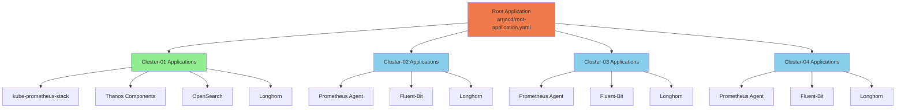
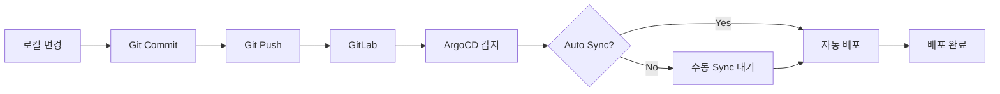

# GitOps 기반 멀티클러스터 배포 가이드

## 목차
1. [개요](#개요)
2. [아키텍처](#아키텍처)
3. [사전 요구사항](#사전-요구사항)
4. [ArgoCD 배포](#argocd-배포)
5. [GitLab 배포](#gitlab-배포)
6. [ArgoCD-GitLab 연동](#argocd-gitlab-연동)
7. [Application 배포](#application-배포)
8. [운영 가이드](#운영-가이드)
9. [트러블슈팅](#트러블슈팅)

---

## 개요

본 가이드는 ArgoCD와 GitLab을 사용하여 멀티클러스터 Observability 스택을 GitOps 방식으로 배포하고 관리하는 방법을 설명합니다.

### GitOps란?

GitOps는 Git 저장소를 인프라 및 애플리케이션 구성의 단일 소스(Single Source of Truth)로 사용하는 운영 모델입니다.

**주요 원칙:**
- 모든 구성이 Git에 선언적으로 저장됨
- Git이 변경되면 자동으로 클러스터에 반영
- 변경 이력 추적 및 롤백 가능
- 코드 리뷰를 통한 변경 승인 프로세스

### 사용 기술

- **ArgoCD**: Kubernetes용 GitOps 지속적 배포 도구
- **GitLab**: Git 저장소 및 CI/CD 플랫폼
- **Kustomize**: Kubernetes 구성 관리 도구
- **Helm**: Kubernetes 패키지 관리자

---

## 아키텍처

### 전체 아키텍처

```mermaid
graph TB
    subgraph "중앙 클러스터 (cluster-01: 192.168.101.194)"
        GitLab[GitLab<br/>Git 저장소]
        ArgoCD[ArgoCD<br/>GitOps Controller]

        subgraph "Monitoring Stack"
            Prometheus[Prometheus<br/>kube-prometheus-stack]
            Thanos[Thanos Components<br/>Query/Store/Compactor/Receiver]
            Grafana[Grafana]
        end

        subgraph "Logging Stack"
            OpenSearch[OpenSearch Cluster]
            Dashboards[OpenSearch Dashboards]
        end

        subgraph "Dependencies"
            PostgreSQL[PostgreSQL<br/>for GitLab]
            Redis[Redis<br/>for GitLab]
            MinIO[MinIO S3<br/>외부 구성]
        end
    end

    subgraph "엣지 클러스터 02 (192.168.101.196)"
        PrometheusAgent02[Prometheus Agent]
        FluentBit02[Fluent-Bit]
        NodeExporter02[Node Exporter]
        KSM02[Kube-State-Metrics]
    end

    subgraph "엣지 클러스터 03 (192.168.101.197)"
        PrometheusAgent03[Prometheus Agent]
        FluentBit03[Fluent-Bit]
        NodeExporter03[Node Exporter]
        KSM03[Kube-State-Metrics]
    end

    subgraph "엣지 클러스터 04 (192.168.101.198)"
        PrometheusAgent04[Prometheus Agent]
        FluentBit04[Fluent-Bit]
        NodeExporter04[Node Exporter]
        KSM04[Kube-State-Metrics]
    end

    %% GitOps Flow
    GitLab -->|Git Pull| ArgoCD
    ArgoCD -->|Deploy| Prometheus
    ArgoCD -->|Deploy| Thanos
    ArgoCD -->|Deploy| OpenSearch
    ArgoCD -->|Deploy| PrometheusAgent02
    ArgoCD -->|Deploy| PrometheusAgent03
    ArgoCD -->|Deploy| PrometheusAgent04
    ArgoCD -->|Deploy| FluentBit02
    ArgoCD -->|Deploy| FluentBit03
    ArgoCD -->|Deploy| FluentBit04

    %% Data Flow
    PrometheusAgent02 -->|Remote Write| Thanos
    PrometheusAgent03 -->|Remote Write| Thanos
    PrometheusAgent04 -->|Remote Write| Thanos
    FluentBit02 -->|Forward Logs| OpenSearch
    FluentBit03 -->|Forward Logs| OpenSearch
    FluentBit04 -->|Forward Logs| OpenSearch

    %% Storage
    Thanos -->|Store Metrics| MinIO
    OpenSearch -->|Store Logs| MinIO
    GitLab -->|Store Artifacts| MinIO

    %% GitLab Dependencies
    GitLab -.->|Use| PostgreSQL
    GitLab -.->|Use| Redis

    style GitLab fill:#FCA326
    style ArgoCD fill:#EF7B4D
    style Thanos fill:#6B50D7
    style OpenSearch fill:#005EB8
    style MinIO fill:#C72E49
```



### ArgoCD Application 구조 (App-of-Apps Pattern)



---

## 사전 요구사항

### 1. 클러스터 준비

모든 클러스터에 다음이 설치되어 있어야 합니다:

- Kubernetes 1.28+ (kubeadm으로 설치)
- Cilium CNI (L2 LoadBalancer 지원)
- Longhorn 스토리지 클래스

### 2. 네트워크 구성

| 클러스터 | IP | 역할 | DNS |
|---------|-----|------|-----|
| cluster-01 | 192.168.101.194 | 중앙/모니터링 | *.k8s-cluster-01.miribit.lab |
| cluster-02 | 192.168.101.196 | 엣지 | *.k8s-cluster-02.miribit.lab |
| cluster-03 | 192.168.101.197 | 엣지 | *.k8s-cluster-03.miribit.lab |
| cluster-04 | 192.168.101.198 | 엣지 | *.k8s-cluster-04.miribit.lab |

### 3. DNS 설정

`/etc/hosts` 또는 DNS 서버에 다음 레코드 추가:

```bash
192.168.101.194 argocd.k8s-cluster-01.miribit.lab
192.168.101.194 gitlab.k8s-cluster-01.miribit.lab
192.168.101.194 grafana.k8s-cluster-01.miribit.lab
192.168.101.194 prometheus.k8s-cluster-01.miribit.lab
192.168.101.194 opensearch.k8s-cluster-01.miribit.lab
```

### 4. MinIO S3 구성

외부 MinIO S3 서버가 다음 엔드포인트에 구성되어 있어야 합니다:

- 엔드포인트: `http://s3.minio.miribit.lab:9000`
- Access Key: `${S3_ACCESS_KEY}`
- Secret Key: `${S3_SECRET_KEY}`

### 5. kubectl 컨텍스트 설정

모든 클러스터에 대한 kubeconfig가 설정되어 있어야 합니다:

```bash
# 클러스터별 kubeconfig 위치
~/.kube/configs/cluster-01.conf
~/.kube/configs/cluster-02.conf
~/.kube/configs/cluster-03.conf
~/.kube/configs/cluster-04.conf

# 멀티 컨텍스트 병합
export KUBECONFIG=~/.kube/configs/cluster-01.conf:~/.kube/configs/cluster-02.conf:~/.kube/configs/cluster-03.conf:~/.kube/configs/cluster-04.conf
kubectl config view --flatten > ~/.kube/config

# 컨텍스트 확인
kubectl config get-contexts
```

---

## ArgoCD 배포

### 1. 자동 배포 (권장)

```bash
cd /root/develop/thanos
./scripts/deploy-argocd.sh
```

배포 스크립트는 다음을 수행합니다:
1. kubectl 컨텍스트 확인
2. ArgoCD 네임스페이스 및 리소스 배포
3. ArgoCD 파드 준비 대기
4. 초기 admin 비밀번호 조회 및 저장

### 2. 수동 배포

```bash
# cluster-01 컨텍스트로 전환
kubectl config use-context cluster-01

# ArgoCD 배포
cd deploy/overlays/cluster-01-central/argocd
kustomize build . | kubectl apply -f -

# 파드 준비 대기
kubectl wait --for=condition=ready pod \
  -l app.kubernetes.io/name=argocd-server \
  -n argocd \
  --timeout=300s

# 초기 admin 비밀번호 조회
kubectl -n argocd get secret argocd-initial-admin-secret \
  -o jsonpath="{.data.password}" | base64 -d
echo
```

### 3. ArgoCD 접속

```bash
# URL: http://argocd.k8s-cluster-01.miribit.lab
# Username: admin
# Password: (위에서 조회한 비밀번호)
```

### 4. ArgoCD CLI 설치 및 로그인 (선택 사항)

```bash
# ArgoCD CLI 설치
curl -sSL -o /usr/local/bin/argocd \
  https://github.com/argoproj/argo-cd/releases/latest/download/argocd-linux-amd64
chmod +x /usr/local/bin/argocd

# 로그인
ARGOCD_PASSWORD=$(kubectl -n argocd get secret argocd-initial-admin-secret \
  -o jsonpath="{.data.password}" | base64 -d)

argocd login argocd.k8s-cluster-01.miribit.lab \
  --username admin \
  --password "$ARGOCD_PASSWORD" \
  --insecure
```

---

## GitLab 배포

### 1. S3 환경변수 설정

```bash
export S3_ACCESS_KEY="your_s3_access_key"
export S3_SECRET_KEY="your_s3_secret_key"
```

### 2. 자동 배포 (권장)

```bash
cd /root/develop/thanos
./scripts/deploy-gitlab.sh
```

배포 스크립트는 다음을 수행합니다:
1. S3 자격증명 확인
2. GitLab용 S3 버킷 생성
3. Object Storage Secret 생성
4. PostgreSQL 및 Redis 배포
5. GitLab Helm Chart 배포
6. GitLab 파드 준비 대기
7. root 비밀번호 조회 및 저장

### 3. 수동 배포

```bash
# S3 버킷 생성
mc alias set minio http://s3.minio.miribit.lab:9000 $S3_ACCESS_KEY $S3_SECRET_KEY
mc mb minio/gitlab-lfs
mc mb minio/gitlab-artifacts
mc mb minio/gitlab-uploads
mc mb minio/gitlab-packages
mc mb minio/gitlab-backups
mc mb minio/gitlab-tmp

# GitLab 배포
cd deploy/overlays/cluster-01-central/gitlab

# Object Storage Secret 생성
envsubst < gitlab-object-storage-secret.yaml | kubectl apply -f -

# PostgreSQL 및 Redis 배포
kubectl apply -f postgresql.yaml
kubectl apply -f redis.yaml

# 준비 대기
kubectl wait --for=condition=ready pod -l app=postgresql -n gitlab --timeout=300s
kubectl wait --for=condition=ready pod -l app=redis -n gitlab --timeout=300s

# GitLab Helm Chart 배포
kustomize build . --enable-helm | kubectl apply -f -

# GitLab 준비 대기 (10분 정도 소요)
kubectl wait --for=condition=ready pod -l app=webservice -n gitlab --timeout=600s
```

### 4. GitLab 접속

```bash
# URL: http://gitlab.k8s-cluster-01.miribit.lab
# Username: root
# Password: (스크립트가 출력한 비밀번호 또는 수동 조회)

# 수동 비밀번호 조회
kubectl get secret -n gitlab gitlab-gitlab-initial-root-password \
  -o jsonpath="{.data.password}" | base64 -d
echo
```

### 5. GitLab 초기 설정

1. GitLab에 로그인
2. root 비밀번호 변경
3. 새 그룹 생성: `observability`
4. 새 프로젝트 생성: `observability/thanos-multi-cluster`
5. 프로젝트 URL 복사 (예: `http://gitlab.k8s-cluster-01.miribit.lab/observability/thanos-multi-cluster.git`)

---

## ArgoCD-GitLab 연동

### 1. 자동 연동 (권장)

```bash
cd /root/develop/thanos
./scripts/configure-argocd-gitlab.sh
```

스크립트는 다음을 수행합니다:
1. GitLab 접속 정보 입력 받기
2. ArgoCD에 GitLab 저장소 등록
3. 에지 클러스터 kubeconfig 정보 추출 및 등록
4. Observability 프로젝트 생성
5. Root Application 배포

### 2. 수동 연동

#### 2.1 GitLab 저장소 자격증명 생성

```bash
kubectl create secret generic gitlab-repo-creds \
  -n argocd \
  --from-literal=username="root" \
  --from-literal=password="your_gitlab_password"
```

#### 2.2 ArgoCD ConfigMap 업데이트

```bash
kubectl patch configmap argocd-cm -n argocd --type merge -p '
data:
  repositories: |
    - url: http://gitlab.k8s-cluster-01.miribit.lab/observability/thanos-multi-cluster.git
      passwordSecret:
        name: gitlab-repo-creds
        key: password
      usernameSecret:
        name: gitlab-repo-creds
        key: username
'
```

#### 2.3 에지 클러스터 등록

각 에지 클러스터의 kubeconfig에서 자격증명을 추출하여 ArgoCD Secret으로 등록:

```bash
# cluster-02 등록 예시
kubectl apply -f argocd/clusters/cluster-02-secret.yaml

# cluster-03, cluster-04도 동일하게 등록
kubectl apply -f argocd/clusters/cluster-03-secret.yaml
kubectl apply -f argocd/clusters/cluster-04-secret.yaml
```

**참고**: Secret 파일의 `${CLUSTER_XX_*}` 변수는 실제 kubeconfig 값으로 치환해야 합니다.

#### 2.4 Observability 프로젝트 생성

```bash
kubectl apply -f argocd/projects/observability-project.yaml
```

#### 2.5 Root Application 배포

```bash
kubectl apply -f argocd/root-application.yaml
```

### 3. 코드를 GitLab에 푸시

```bash
cd /root/develop/thanos

# Git 초기화
git init
git remote add origin http://gitlab.k8s-cluster-01.miribit.lab/observability/thanos-multi-cluster.git

# .gitignore 확인
cat > .gitignore <<EOF
# Credentials
*-credentials.txt
*.swp
*.swo
*~

# Temporary files
/tmp/
*.tmp
*.log

# IDE
.idea/
.vscode/
*.iml
EOF

# 커밋 및 푸시
git add .
git commit -m "Initial commit: Multi-cluster observability with Thanos

- ArgoCD and GitLab setup
- Prometheus Agent Mode for edge clusters
- Thanos multi-cluster architecture
- OpenSearch centralized logging
- Kustomize + Helm configuration management"

git branch -M main
git push -u origin main
```

---

## Application 배포

### App-of-Apps 패턴

Root Application이 배포되면 자동으로 모든 하위 Application이 생성됩니다.

### 배포 순서 (Sync Wave)

ArgoCD는 `argocd.argoproj.io/sync-wave` 어노테이션에 따라 순서대로 배포합니다:

| Wave | 컴포넌트 | 설명 |
|------|---------|------|
| 0 | Namespace, CRD | 기본 리소스 |
| 1 | Storage (Longhorn) | 스토리지 클래스 |
| 2 | Operators | Prometheus, OpenSearch, Fluent Operators |
| 3 | Monitoring Stack | kube-prometheus-stack, Thanos |
| 4 | Logging Stack | OpenSearch, Fluent-Bit |
| 5 | Dashboards | Grafana, OpenSearch Dashboards |

### ArgoCD UI에서 동기화

1. ArgoCD UI 접속: `http://argocd.k8s-cluster-01.miribit.lab`
2. Root Application 클릭
3. **SYNC** 버튼 클릭
4. 옵션 선택:
   - **Prune**: 체크 (Git에 없는 리소스 삭제)
   - **Self Heal**: 체크 (클러스터 변경 시 Git 상태로 복구)
5. **SYNCHRONIZE** 버튼 클릭

### CLI로 동기화

```bash
# Root Application 동기화
argocd app sync root-application

# 특정 Application만 동기화
argocd app sync thanos-receiver-cluster-01

# 모든 Application 동기화
argocd app sync --all
```

### 배포 상태 확인

```bash
# Application 목록 조회
argocd app list

# 특정 Application 상태 조회
argocd app get root-application

# 파드 상태 확인
kubectl get pods -n monitoring
kubectl get pods -n logging
```

---

## 운영 가이드

### 1. 구성 변경 프로세스



#### 자동 동기화 설정

```yaml
syncPolicy:
  automated:
    prune: true      # Git에서 삭제된 리소스 자동 제거
    selfHeal: true   # 클러스터 변경 시 Git 상태로 자동 복구
```

#### 수동 동기화

```bash
# 특정 Application 동기화
argocd app sync <app-name>

# Dry-run (실제 배포 없이 확인)
argocd app sync <app-name> --dry-run

# 특정 리소스만 동기화
argocd app sync <app-name> --resource <resource-kind>:<resource-name>
```

### 2. 롤백

#### Git 기반 롤백 (권장)

```bash
# 이전 커밋으로 롤백
git revert <commit-hash>
git push origin main

# ArgoCD가 자동으로 이전 상태로 배포
```

#### ArgoCD 기반 롤백

```bash
# Application 히스토리 조회
argocd app history <app-name>

# 특정 리비전으로 롤백
argocd app rollback <app-name> <revision>
```

### 3. 모니터링

#### ArgoCD 대시보드

- URL: `http://argocd.k8s-cluster-01.miribit.lab`
- Application 상태, 동기화 히스토리, 리소스 상태 확인

#### Prometheus 메트릭

ArgoCD는 다음 메트릭을 노출합니다:

```promql
# Application 동기화 상태
argocd_app_info{sync_status="Synced"}

# 동기화 실패 횟수
argocd_app_sync_total{phase="Failed"}

# 마지막 동기화 시간
argocd_app_reconcile_time_seconds
```

#### 알림 설정

ArgoCD는 다음으로 알림을 전송할 수 있습니다:
- Slack
- Email
- Webhook
- Prometheus Alertmanager

### 4. 멀티클러스터 관리

#### 클러스터 추가

```bash
# ArgoCD에 새 클러스터 등록
argocd cluster add <context-name> --name <cluster-name>

# 또는 Secret으로 수동 등록
kubectl apply -f argocd/clusters/new-cluster-secret.yaml
```

#### 클러스터별 배포

```yaml
# Application에서 destination 설정
destination:
  server: https://192.168.101.XXX:6443  # 클러스터 API 서버
  namespace: monitoring
```

### 5. 시크릿 관리

#### Sealed Secrets (권장)

민감한 정보를 Git에 안전하게 저장:

```bash
# Sealed Secrets Controller 설치
kubectl apply -f https://github.com/bitnami-labs/sealed-secrets/releases/download/v0.24.0/controller.yaml

# kubeseal CLI 설치
wget https://github.com/bitnami-labs/sealed-secrets/releases/download/v0.24.0/kubeseal-0.24.0-linux-amd64.tar.gz
tar xfz kubeseal-0.24.0-linux-amd64.tar.gz
sudo install -m 755 kubeseal /usr/local/bin/kubeseal

# Secret을 SealedSecret으로 변환
kubectl create secret generic my-secret \
  --from-literal=password=supersecret \
  --dry-run=client -o yaml | \
  kubeseal -o yaml > my-sealed-secret.yaml

# Git에 커밋 (암호화된 상태)
git add my-sealed-secret.yaml
git commit -m "Add sealed secret"
git push
```

#### External Secrets Operator (대안)

외부 시크릿 관리 시스템(Vault, AWS Secrets Manager 등)과 연동

---

## 트러블슈팅

### ArgoCD 관련

#### Application이 OutOfSync 상태

**원인**: Git 저장소와 클러스터 상태가 다름

**해결**:
```bash
# 차이점 확인
argocd app diff <app-name>

# 동기화
argocd app sync <app-name>

# 하드 리프레시 (캐시 무시)
argocd app get <app-name> --hard-refresh
```

#### Application이 Progressing 상태에서 멈춤

**원인**: 리소스 배포 실패 또는 헬스체크 실패

**해결**:
```bash
# 상세 상태 확인
argocd app get <app-name>

# 특정 리소스 상태 확인
kubectl describe <resource-kind> <resource-name> -n <namespace>

# 파드 로그 확인
kubectl logs <pod-name> -n <namespace>
```

#### Git 저장소 연결 실패

**원인**: 자격증명 오류 또는 네트워크 문제

**해결**:
```bash
# 저장소 연결 테스트
argocd repo list

# 저장소 재등록
kubectl delete secret gitlab-repo-creds -n argocd
kubectl create secret generic gitlab-repo-creds \
  -n argocd \
  --from-literal=username="root" \
  --from-literal=password="new_password"
```

### GitLab 관련

#### GitLab 파드가 시작되지 않음

**원인**: PostgreSQL 또는 Redis 연결 실패

**해결**:
```bash
# PostgreSQL 상태 확인
kubectl get pods -n gitlab -l app=postgresql
kubectl logs -n gitlab -l app=postgresql

# Redis 상태 확인
kubectl get pods -n gitlab -l app=redis
kubectl logs -n gitlab -l app=redis

# GitLab 파드 재시작
kubectl rollout restart deployment/gitlab-webservice -n gitlab
```

#### GitLab 로그인 불가

**원인**: 초기 비밀번호 만료

**해결**:
```bash
# GitLab Rails 콘솔 접속
kubectl exec -it <gitlab-toolbox-pod> -n gitlab -- gitlab-rails console

# 새 비밀번호 설정
user = User.find_by(username: 'root')
user.password = 'new_secure_password'
user.password_confirmation = 'new_secure_password'
user.save!
```

#### GitLab S3 연결 실패

**원인**: Object Storage Secret 설정 오류

**해결**:
```bash
# Secret 확인
kubectl get secret gitlab-object-storage -n gitlab -o yaml

# Secret 재생성
export S3_ACCESS_KEY="your_access_key"
export S3_SECRET_KEY="your_secret_key"
envsubst < gitlab-object-storage-secret.yaml | kubectl apply -f -

# GitLab 재시작
kubectl rollout restart deployment/gitlab-webservice -n gitlab
```

### 클러스터 연결 관련

#### ArgoCD가 에지 클러스터에 접근 불가

**원인**: 클러스터 Secret 설정 오류 또는 네트워크 문제

**해결**:
```bash
# 클러스터 목록 확인
argocd cluster list

# 클러스터 연결 테스트
kubectl cluster-info --context=cluster-02

# 클러스터 Secret 재생성
./scripts/configure-argocd-gitlab.sh
```

#### kubeconfig 자격증명 만료

**원인**: kubeadm 클러스터의 인증서 만료 (1년)

**해결**:
```bash
# 인증서 확인 (각 클러스터에서)
sudo kubeadm certs check-expiration

# 인증서 갱신
sudo kubeadm certs renew all

# kubeconfig 업데이트
sudo cp /etc/kubernetes/admin.conf ~/.kube/config
sudo chown $(id -u):$(id -g) ~/.kube/config

# ArgoCD Secret 재생성
./scripts/configure-argocd-gitlab.sh
```

### 동기화 실패

#### Kustomize 빌드 실패

**원인**: kustomization.yaml 문법 오류

**해결**:
```bash
# 로컬에서 빌드 테스트
kustomize build deploy/overlays/cluster-01-central/kube-prometheus-stack

# 오류 수정 후 Git 푸시
git add .
git commit -m "Fix kustomization error"
git push
```

#### Helm 차트 렌더링 실패

**원인**: values.yaml 설정 오류

**해결**:
```bash
# 로컬에서 Helm 템플릿 렌더링 테스트
helm template my-release prometheus-community/kube-prometheus-stack \
  -f deploy/overlays/cluster-01-central/kube-prometheus-stack/kube-prometheus-stack-values.yaml

# 오류 수정 후 Git 푸시
```

---

## 참고 자료

- [ArgoCD 공식 문서](https://argo-cd.readthedocs.io/)
- [GitLab 공식 문서](https://docs.gitlab.com/)
- [Kustomize 공식 문서](https://kustomize.io/)
- [Helm 공식 문서](https://helm.sh/docs/)
- [GitOps 원칙](https://www.weave.works/technologies/gitops/)
