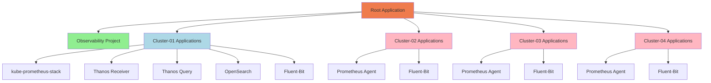
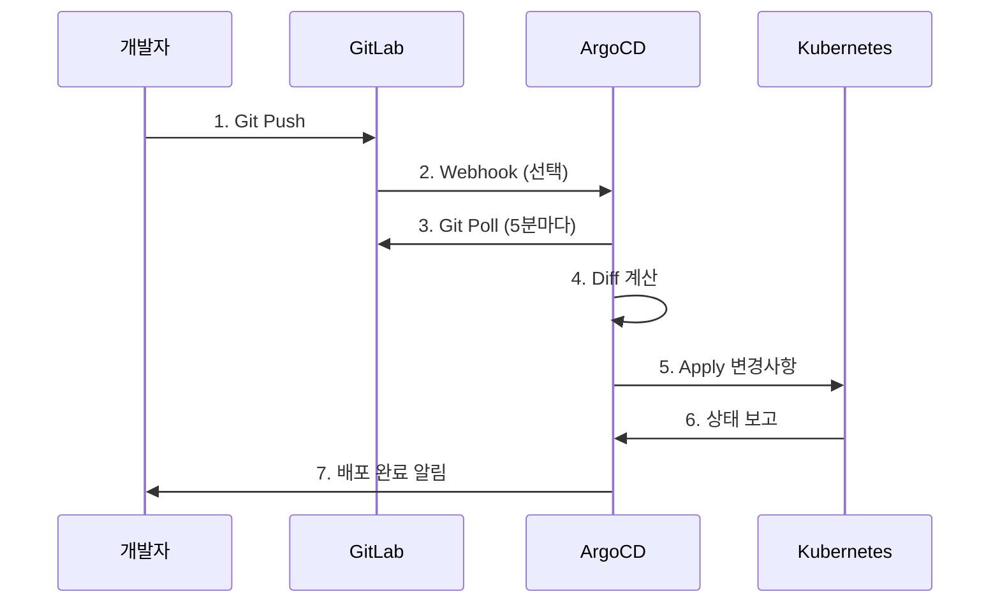

# GitOps 환경 구성 요약

## 구현 완료 내역

이 문서는 ArgoCD와 GitLab을 통한 GitOps 기반 멀티클러스터 배포 환경 구성 내역을 요약합니다.

---

## 1. 생성된 리소스

### ArgoCD 설치 매니페스트

**위치**: `deploy/overlays/cluster-01-central/argocd/`

| 파일 | 설명 |
|------|------|
| `namespace.yaml` | argocd 네임스페이스 |
| `kustomization.yaml` | ArgoCD 공식 설치 매니페스트 참조 |
| `argocd-ingress.yaml` | Nginx Ingress for ArgoCD UI |
| `argocd-server-patch.yaml` | ArgoCD 서버 insecure 모드 설정 |
| `argocd-cm.yaml` | ArgoCD ConfigMap (GitLab 저장소 설정) |

**특징**:
- ArgoCD v2.13.2 사용
- Nginx Ingress 연동
- HTTP 모드 (insecure) 설정
- GitLab 저장소 연동 준비

### GitLab 설치 매니페스트

**위치**: `deploy/overlays/cluster-01-central/gitlab/`

| 파일 | 설명 |
|------|------|
| `namespace.yaml` | gitlab 네임스페이스 |
| `kustomization.yaml` | GitLab Helm Chart 참조 |
| `gitlab-values.yaml` | GitLab Helm Chart values (상세 설정) |
| `postgresql.yaml` | PostgreSQL StatefulSet (GitLab DB) |
| `redis.yaml` | Redis StatefulSet (GitLab 캐시) |
| `gitlab-object-storage-secret.yaml` | MinIO S3 연동 설정 |

**특징**:
- GitLab CE 사용
- 외부 PostgreSQL, Redis 사용 (컨테이너 배포)
- MinIO S3를 GitLab artifacts, LFS, uploads 저장소로 사용
- Longhorn 스토리지 사용 (GitLab Gitaly 데이터)
- 리소스 최적화 설정 (단일 클러스터 환경)

**GitLab S3 버킷**:
- `gitlab-lfs`: Git LFS 객체
- `gitlab-artifacts`: CI/CD Artifacts
- `gitlab-uploads`: 이미지 업로드
- `gitlab-packages`: 패키지 레지스트리
- `gitlab-backups`: 백업
- `gitlab-tmp`: 임시 파일

### ArgoCD Application 매니페스트

**위치**: `argocd/`

```
argocd/
├── root-application.yaml              # Root Application (App-of-Apps)
├── projects/
│   └── observability-project.yaml     # Observability 프로젝트
├── clusters/
│   ├── cluster-02-secret.yaml         # 클러스터-02 연결 Secret
│   ├── cluster-03-secret.yaml         # 클러스터-03 연결 Secret
│   └── cluster-04-secret.yaml         # 클러스터-04 연결 Secret
└── applications/
    ├── cluster-01/                    # 중앙 클러스터 Applications
    │   ├── kube-prometheus-stack.yaml
    │   ├── thanos-receiver.yaml
    │   ├── thanos-query.yaml
    │   ├── opensearch.yaml
    │   └── fluent-bit.yaml
    ├── cluster-02/                    # 엣지 클러스터 Applications
    │   ├── prometheus-agent.yaml
    │   └── fluent-bit.yaml
    ├── cluster-03/
    │   ├── prometheus-agent.yaml
    │   └── fluent-bit.yaml
    └── cluster-04/
        ├── prometheus-agent.yaml
        └── fluent-bit.yaml
```

**특징**:
- App-of-Apps 패턴으로 모든 Application 자동 생성
- Sync Wave를 통한 배포 순서 제어
- 자동 동기화 (automated sync) 설정
- Prune 및 Self-Heal 활성화

### 배포 스크립트

**위치**: `scripts/`

| 스크립트 | 기능 |
|---------|------|
| `deploy-argocd.sh` | ArgoCD 자동 배포 및 초기 비밀번호 조회 |
| `deploy-gitlab.sh` | GitLab 자동 배포 (S3 버킷 생성 포함) |
| `configure-argocd-gitlab.sh` | ArgoCD-GitLab 연동 설정 |

**모든 스크립트 특징**:
- 실행 권한 설정됨 (`chmod +x`)
- 단계별 진행 상황 출력
- 에러 처리 (`set -e`)
- 자격증명 자동 저장

---

## 2. App-of-Apps 패턴

### 구조



### Sync Wave 배포 순서

| Wave | 컴포넌트 | 대상 클러스터 | 이유 |
|------|---------|-------------|------|
| 0 | Namespace, CRD | 모든 클러스터 | 기본 리소스 먼저 생성 |
| 1 | Longhorn | 모든 클러스터 | 스토리지 클래스 필요 |
| 2 | Thanos Receiver, Prometheus Agent | 중앙 + 엣지 | 메트릭 수집 인프라 |
| 3 | kube-prometheus-stack, OpenSearch | 중앙 클러스터 | 메트릭/로그 저장소 |
| 4 | Fluent-Bit | 모든 클러스터 | 로그 수집기 |
| 5 | Grafana, Dashboards | 중앙 클러스터 | 시각화 대시보드 |

---

## 3. 배포 프로세스

### Phase 1: ArgoCD 설치

```bash
./scripts/deploy-argocd.sh
```

**수행 작업**:
1. kubectl 컨텍스트 확인 (cluster-01)
2. ArgoCD 리소스 배포 (Kustomize)
3. ArgoCD 파드 준비 대기 (최대 5분)
4. 초기 admin 비밀번호 조회
5. 접속 정보 `argocd-credentials.txt`에 저장

**결과**:
- ArgoCD UI: `http://argocd.k8s-cluster-01.miribit.lab`
- Username: `admin`
- Password: 자동 생성 (파일에 저장됨)

### Phase 2: GitLab 설치

```bash
export S3_ACCESS_KEY="your_access_key"
export S3_SECRET_KEY="your_secret_key"
./scripts/deploy-gitlab.sh
```

**수행 작업**:
1. S3 자격증명 확인
2. GitLab용 S3 버킷 6개 생성
3. Object Storage Secret 생성
4. PostgreSQL StatefulSet 배포
5. Redis StatefulSet 배포
6. GitLab Helm Chart 배포
7. GitLab 파드 준비 대기 (최대 10분)
8. root 비밀번호 조회
9. 접속 정보 `gitlab-credentials.txt`에 저장

**결과**:
- GitLab UI: `http://gitlab.k8s-cluster-01.miribit.lab`
- Username: `root`
- Password: 자동 생성 (파일에 저장됨)

### Phase 3: GitLab 프로젝트 생성

**수동 단계**:
1. GitLab UI에 로그인
2. 새 그룹 생성: `observability`
3. 새 프로젝트 생성: `observability/thanos-multi-cluster`
4. 프로젝트 URL 복사

### Phase 4: ArgoCD-GitLab 연동

```bash
./scripts/configure-argocd-gitlab.sh
```

**수행 작업**:
1. GitLab 접속 정보 입력 받기
2. GitLab 저장소 자격증명 Secret 생성
3. ArgoCD ConfigMap에 저장소 URL 추가
4. 에지 클러스터 kubeconfig에서 자격증명 추출
5. 클러스터 Secret 생성 (cluster-02, 03, 04)
6. Observability 프로젝트 생성
7. Root Application 배포

**결과**:
- ArgoCD에 GitLab 저장소 등록 완료
- 모든 에지 클러스터 연결 완료
- Root Application 배포 준비 완료

### Phase 5: 코드 푸시

```bash
git init
git remote add origin http://gitlab.k8s-cluster-01.miribit.lab/observability/thanos-multi-cluster.git
git add .
git commit -m "Initial commit: Multi-cluster observability with Thanos"
git branch -M main
git push -u origin main
```

### Phase 6: ArgoCD 동기화

**ArgoCD UI에서**:
1. `http://argocd.k8s-cluster-01.miribit.lab` 접속
2. Root Application 클릭
3. **SYNC** 버튼 클릭
4. Prune, Self-Heal 옵션 체크
5. **SYNCHRONIZE** 클릭

**또는 CLI에서**:
```bash
argocd app sync root-application
argocd app wait root-application --health
```

---

## 4. 아키텍처 특징

### GitOps 워크플로우



### 멀티클러스터 배포

- **중앙 클러스터 (cluster-01)**: ArgoCD 실행, 모든 클러스터 관리
- **에지 클러스터 (cluster-02, 03, 04)**: ArgoCD가 원격으로 배포
- **클러스터 자격증명**: Kubernetes Secret으로 안전하게 저장

### 자동 동기화

모든 Application에 다음 정책 적용:

```yaml
syncPolicy:
  automated:
    prune: true      # Git에서 삭제된 리소스 자동 제거
    selfHeal: true   # 클러스터 변경 시 Git 상태로 복구
  syncOptions:
    - CreateNamespace=true  # 네임스페이스 자동 생성
```

---

## 5. 운영 시나리오

### 시나리오 1: Prometheus 설정 변경

```bash
# 1. 로컬 변경
vim deploy/overlays/cluster-01-central/kube-prometheus-stack/kube-prometheus-stack-values.yaml

# 2. Git 커밋
git add .
git commit -m "chore: increase prometheus retention to 30d"
git push origin main

# 3. ArgoCD가 5분 내 자동 감지 및 배포
# 또는 수동 동기화
argocd app sync kube-prometheus-stack-cluster-01
```

### 시나리오 2: 새 엣지 클러스터 추가

```bash
# 1. 클러스터 Secret 생성
cat > argocd/clusters/cluster-05-secret.yaml <<EOF
apiVersion: v1
kind: Secret
metadata:
  name: cluster-05-edge
  namespace: argocd
  labels:
    argocd.argoproj.io/secret-type: cluster
type: Opaque
stringData:
  name: cluster-05-edge
  server: https://192.168.101.199:6443
  config: |
    {
      "tlsClientConfig": {
        "insecure": false,
        "caData": "...",
        "certData": "...",
        "keyData": "..."
      }
    }
EOF

# 2. Application 생성
cp -r argocd/applications/cluster-02 argocd/applications/cluster-05
# cluster-05 Application 파일들의 destination 수정

# 3. Git 푸시
git add argocd/
git commit -m "feat: add cluster-05"
git push origin main

# 4. ArgoCD가 자동으로 새 클러스터에 배포
```

### 시나리오 3: 롤백

**Git 기반 롤백 (권장)**:
```bash
# 이전 커밋으로 롤백
git revert HEAD
git push origin main

# ArgoCD가 자동으로 이전 상태로 복구
```

**ArgoCD 기반 롤백**:
```bash
# Application 히스토리 조회
argocd app history kube-prometheus-stack-cluster-01

# 특정 리비전으로 롤백
argocd app rollback kube-prometheus-stack-cluster-01 5
```

### 시나리오 4: 긴급 변경 (Hot-fix)

클러스터에서 직접 변경한 경우:

```bash
# 1. ArgoCD가 Out-of-Sync 감지
# 2. Self-Heal이 활성화되어 있으면 자동으로 Git 상태로 복구
# 3. Self-Heal을 비활성화했다면 수동 Sync 필요

# 변경사항을 유지하려면 Git에 반영
kubectl get deployment prometheus -n monitoring -o yaml > /tmp/prometheus.yaml
# /tmp/prometheus.yaml 내용을 Git 저장소에 반영
```

---

## 6. 모니터링 및 알림

### ArgoCD 메트릭

ArgoCD는 Prometheus 메트릭을 노출합니다:

```promql
# Application 동기화 상태
argocd_app_info{sync_status="Synced"}

# 동기화 실패 횟수
argocd_app_sync_total{phase="Failed"}

# 마지막 동기화 시간
argocd_app_reconcile_time_seconds
```

### 알림 설정

ArgoCD는 다음으로 알림을 전송할 수 있습니다:
- Slack
- Email
- Webhook
- Prometheus Alertmanager

설정 예시 (Slack):
```yaml
apiVersion: v1
kind: ConfigMap
metadata:
  name: argocd-notifications-cm
data:
  service.slack: |
    token: $slack-token
  template.app-deployed: |
    message: Application {{.app.metadata.name}} deployed to {{.app.spec.destination.server}}
  trigger.on-deployed: |
    - when: app.status.operationState.phase in ['Succeeded']
      send: [app-deployed]
```

---

## 7. 보안 고려사항

### 시크릿 관리

**현재 구성**: 환경변수 및 kubectl create secret 사용

**프로덕션 권장사항**:

1. **Sealed Secrets** 사용:
   ```bash
   # Sealed Secrets Controller 설치
   kubectl apply -f https://github.com/bitnami-labs/sealed-secrets/releases/download/v0.24.0/controller.yaml

   # Secret을 SealedSecret으로 암호화
   kubectl create secret generic my-secret --from-literal=password=supersecret --dry-run=client -o yaml | \
     kubeseal -o yaml > my-sealed-secret.yaml

   # Git에 안전하게 커밋
   git add my-sealed-secret.yaml
   ```

2. **External Secrets Operator**:
   - HashiCorp Vault
   - AWS Secrets Manager
   - Azure Key Vault
   - Google Secret Manager

### 접근 제어

- ArgoCD RBAC 설정
- GitLab 브랜치 보호 규칙
- Code Review 프로세스

---

## 8. 추가 리소스

### 문서

- [docs/GITOPS_DEPLOYMENT_GUIDE.md](./GITOPS_DEPLOYMENT_GUIDE.md): GitOps 배포 상세 가이드
- [docs/OPERATOR_BASED_MULTI_CLUSTER_OBSERVABILITY.md](./OPERATOR_BASED_MULTI_CLUSTER_OBSERVABILITY.md): 전체 아키텍처
- [docs/EDGE_METRICS_COLLECTION_OPTIONS.md](./EDGE_METRICS_COLLECTION_OPTIONS.md): 엣지 메트릭 수집 옵션

### 외부 문서

- [ArgoCD 공식 문서](https://argo-cd.readthedocs.io/)
- [GitLab 공식 문서](https://docs.gitlab.com/)
- [GitOps 원칙](https://www.gitops.tech/)

---

## 9. 다음 단계

### 권장 개선사항

1. **Sealed Secrets 도입**
   - 민감한 정보를 Git에 안전하게 저장

2. **GitLab CI/CD 파이프라인**
   - Kustomize 빌드 테스트
   - Helm 템플릿 렌더링 검증
   - YAML 문법 검증

3. **ArgoCD Image Updater**
   - 컨테이너 이미지 자동 업데이트

4. **ArgoCD Notifications**
   - Slack/Teams 알림 설정

5. **Multi-tenancy**
   - 팀별 ArgoCD Project 분리
   - RBAC 정책 적용

6. **Disaster Recovery**
   - ArgoCD 백업 자동화
   - GitLab 백업 자동화

---

## 요약

✅ **완료된 작업**:
- ArgoCD 설치 매니페스트 및 스크립트
- GitLab 설치 매니페스트 및 스크립트 (PostgreSQL, Redis, S3 연동)
- ArgoCD-GitLab 연동 스크립트
- App-of-Apps 패턴 구현
- 멀티클러스터 Application 정의
- 상세 배포 가이드 문서

🎯 **주요 이점**:
- **자동화**: Git Push만으로 모든 클러스터 자동 배포
- **가시성**: ArgoCD UI에서 모든 배포 상태 실시간 확인
- **안정성**: 변경 이력 추적, 쉬운 롤백
- **확장성**: 새 클러스터 추가 간단
- **일관성**: 모든 환경이 Git 저장소와 동기화됨

🚀 **배포 준비 완료**: 스크립트 실행 후 바로 GitOps 기반 멀티클러스터 운영 가능
