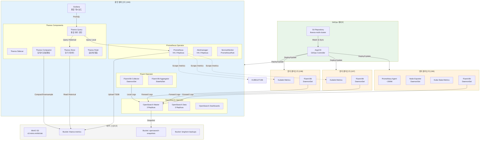
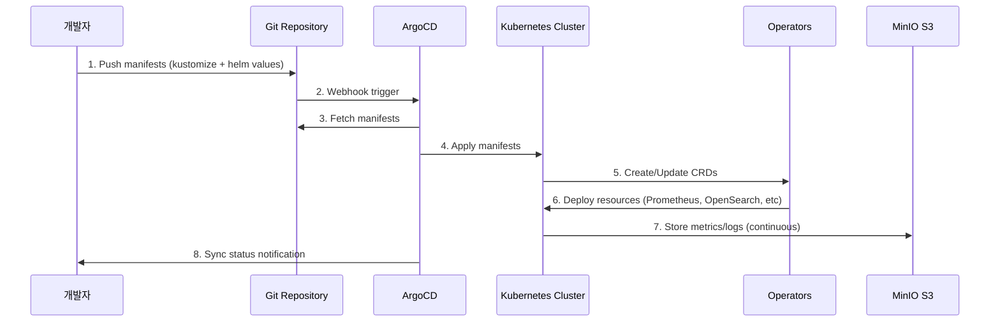

# Operator 기반 멀티클러스터 Observability 플랫폼

## 개요

이 문서는 Kubernetes Operator 패턴을 활용하여 멀티클러스터 환경에서 통합 Observability 플랫폼을 구축하고 ArgoCD를 통해 GitOps 방식으로 관리하는 전체 아키텍처를 설명합니다.

## 목차

1. [아키텍처 개요](#아키텍처-개요)
2. [Operator 기반 구성 요소](#operator-기반-구성-요소)
3. [클러스터 구성](#클러스터-구성)
4. [GitOps 배포 파이프라인](#gitops-배포-파이프라인)
5. [디렉토리 구조](#디렉토리-구조)
6. [배포 가이드](#배포-가이드)
7. [운영 가이드](#운영-가이드)

---

## 아키텍처 개요

### 전체 시스템 아키텍처



### 데이터 플로우



---

## Operator 기반 구성 요소

### 1. Prometheus Operator

**역할**: Prometheus 및 Alertmanager를 선언적으로 관리

**주요 CRD**:
- `Prometheus`: Prometheus 서버 인스턴스
- `Alertmanager`: Alertmanager 인스턴스
- `ServiceMonitor`: Service 기반 메트릭 수집 대상
- `PodMonitor`: Pod 기반 메트릭 수집 대상
- `PrometheusRule`: 알림 규칙 및 레코딩 규칙

**배포 방식**:
```yaml
# kube-prometheus-stack Helm Chart 사용
helmCharts:
  - name: kube-prometheus-stack
    repo: https://prometheus-community.github.io/helm-charts
    version: 78.2.1
```

**배포 위치**:
- **중앙 클러스터 (194)**: Prometheus HA (2 replicas), Alertmanager HA (2 replicas)
- **엣지 클러스터 (196, 197, 198)**: 배포 안 함 (중앙에서 원격 스크래핑)

### 2. OpenSearch Operator

**역할**: OpenSearch 클러스터를 선언적으로 관리

**주요 CRD**:
- `OpenSearchCluster`: OpenSearch 클러스터 정의
- `OpenSearchRole`: 역할 기반 접근 제어
- `OpenSearchUser`: 사용자 관리
- `OpenSearchISMPolicy`: Index State Management 정책

**배포 방식**:
```yaml
apiVersion: opensearch.opster.io/v1
kind: OpenSearchCluster
metadata:
  name: opensearch-cluster
  namespace: logging
spec:
  general:
    serviceName: opensearch
    version: 2.11.0
  dashboards:
    enable: true
    replicas: 1
  nodePools:
    - component: masters
      replicas: 3
      diskSize: 20Gi
    - component: data
      replicas: 3
      diskSize: 100Gi
```

**배포 위치**:
- **중앙 클러스터 (194)**: Master nodes (3 replicas), Data nodes (3 replicas), Dashboards
- **엣지 클러스터 (196, 197, 198)**: 배포 안 함 (모든 로그를 중앙으로 전송)

### 3. Fluent Operator

**역할**: Fluent Bit 및 Fluentd를 선언적으로 관리

**주요 CRD**:
- `FluentBit`: Fluent Bit DaemonSet 정의
- `ClusterFluentBitConfig`: 클러스터 레벨 설정
- `FluentBitConfig`: Namespace 레벨 설정
- `ClusterInput`: 입력 소스 정의
- `ClusterFilter`: 필터 정의
- `ClusterOutput`: 출력 대상 정의

**배포 방식**:
```yaml
apiVersion: fluentbit.fluent.io/v1alpha2
kind: FluentBit
metadata:
  name: fluent-bit
  namespace: logging
spec:
  image: fluent/fluent-bit:2.2.0
  fluentBitConfigName: fluent-bit-config
  resources:
    requests:
      cpu: 100m
      memory: 128Mi
    limits:
      cpu: 500m
      memory: 512Mi
```

### 4. Thanos (Operator 패턴 준수)

Thanos는 공식 Operator가 없지만, Prometheus Operator의 sidecar 패턴을 사용하여 통합 관리합니다.

**구성 요소**:
- **Thanos Sidecar**: Prometheus Operator가 자동 관리
- **Thanos Query**: Deployment로 배포 (중앙 클러스터)
- **Thanos Store**: StatefulSet으로 배포 (중앙 클러스터)
- **Thanos Compactor**: StatefulSet으로 배포 (중앙 클러스터)
- **Thanos Ruler**: StatefulSet으로 배포 (중앙 클러스터)

---

## 클러스터 구성

### 클러스터 역할 및 사양

| 클러스터 ID | IP | 역할 | CPU | Memory | 주요 컴포넌트 |
|------------|-------|------|-----|--------|-------------|
| cluster-01-central | 192.168.101.194 | 중앙 모니터링 허브 | 4 Core | 16 GB | Prometheus HA, Thanos Query/Store/Compactor/Ruler, OpenSearch Cluster (Master 3, Data 3), Fluent-Bit, Grafana, ArgoCD |
| cluster-02-edge | 192.168.101.196 | 엣지 워크로드 | 4 Core | 16 GB | Fluent-Bit (로그 전송 전용) |
| cluster-03-edge | 192.168.101.197 | 엣지 워크로드 | 4 Core | 16 GB | Fluent-Bit (로그 전송 전용) |
| cluster-04-edge | 192.168.101.198 | 엣지 워크로드 | 4 Core | 16 GB | Fluent-Bit (로그 전송 전용) |

**아키텍처 특징**:
- **중앙 집중식 모니터링**: 모든 메트릭과 로그는 중앙 클러스터(194)에서 수집 및 저장
- **엣지 경량화**: 엣지 클러스터는 Fluent-Bit DaemonSet만 실행하여 리소스 최소화
- **원격 메트릭 수집**: 중앙 Prometheus가 엣지 클러스터의 Kubelet/cAdvisor 메트릭을 원격 스크래핑
- **로그 중앙 전송**: 모든 엣지 클러스터의 Fluent-Bit가 중앙 OpenSearch로 직접 전송

### 네트워크 구성

**도메인 네이밍 규칙**:
```
<service>.k8s-cluster-<id>.miribit.lab
```

**예시**:
- Grafana (중앙): `grafana.k8s-cluster-01.miribit.lab`
- Prometheus (엣지 196): `prometheus.k8s-cluster-02.miribit.lab`
- Thanos Query (중앙): `thanos-query.k8s-cluster-01.miribit.lab`

**서비스 타입**:
- 외부 접근: `LoadBalancer` (Cilium L2 Announcement)
- 내부 통신: `ClusterIP`
- gRPC 통신: `Headless Service` (Thanos Sidecar)

### 스토리지 구성

**Longhorn CSI**:
- 모든 클러스터에 배포
- Persistent Volume 제공
- S3 백업 연동 (`s3.minio.miribit.lab/longhorn-backups`)

**MinIO S3 버킷**:
| 버킷 | 용도 | 보관 정책 |
|------|------|----------|
| `thanos-metrics` | Thanos 메트릭 TSDB | Raw: 2h, 5m: 14d, 1h: 30d, 6h: 90d |
| `opensearch-snapshots` | OpenSearch 스냅샷 | 14일 후 스냅샷 생성, 180일 후 삭제 |
| `longhorn-backups` | Longhorn 볼륨 백업 | 수동 관리 |

---

## GitOps 배포 파이프라인

### ArgoCD 구성

**설치 위치**: 중앙 클러스터 (cluster-01-central)

**배포 방식**:
```bash
# ArgoCD Namespace 생성
kubectl create namespace argocd

# ArgoCD 설치 (HA mode)
kubectl apply -n argocd -f https://raw.githubusercontent.com/argoproj/argo-cd/stable/manifests/ha/install.yaml

# Ingress 설정
kubectl apply -f deploy/base/argocd/ingress.yaml
```

**접근 URL**: `https://argocd.k8s-cluster-01.miribit.lab`

### Application 구조

```mermaid
graph TB
    subgraph ArgoCD["ArgoCD Applications"]
        ROOT[Root App<br/>app-of-apps]

        subgraph Infrastructure["Infrastructure Layer"]
            LONGHORN[Longhorn<br/>Storage CSI]
            CILIUM[Cilium Ingress<br/>LoadBalancer]
        end

        subgraph Operators["Operator Layer"]
            PROMOP[Prometheus Operator<br/>kube-prometheus-stack]
            OSOP[OpenSearch Operator]
            FLUENTOP[Fluent Operator]
        end

        subgraph Observability["Observability Layer"]
            THANOS[Thanos Components<br/>Query/Store/Compactor/Ruler]
            OPENSEARCH[OpenSearch Clusters]
            FLUENTBIT[Fluent-Bit Collectors]
        end

        subgraph Applications["Application Layer"]
            GRAFANA[Grafana Dashboards]
            OSDASH[OpenSearch Dashboards]
        end
    end

    ROOT --> Infrastructure
    Infrastructure --> Operators
    Operators --> Observability
    Observability --> Applications

    style ArgoCD fill:#e8f5e9
    style Infrastructure fill:#bbdefb
    style Operators fill:#c5cae9
    style Observability fill:#f8bbd0
    style Applications fill:#ffccbc
```



### Application-of-Applications 패턴

**Root Application** (`argocd/root-app.yaml`):
```yaml
apiVersion: argoproj.io/v1alpha1
kind: Application
metadata:
  name: root-app
  namespace: argocd
spec:
  project: default
  source:
    repoURL: https://github.com/<org>/thanos-multi-cluster
    targetRevision: main
    path: argocd/applications
  destination:
    server: https://kubernetes.default.svc
    namespace: argocd
  syncPolicy:
    automated:
      prune: false
      selfHeal: true
```

**Child Applications**:
- `argocd/applications/cluster-01/longhorn.yaml`
- `argocd/applications/cluster-01/prometheus-operator.yaml`
- `argocd/applications/cluster-01/opensearch-operator.yaml`
- `argocd/applications/cluster-01/fluent-operator.yaml`
- `argocd/applications/cluster-01/thanos.yaml`
- `argocd/applications/cluster-02/prometheus.yaml`
- ... (각 클러스터별 반복)

### Multi-Cluster 관리

**Cluster 등록**:
```bash
# 각 엣지 클러스터를 ArgoCD에 등록
argocd cluster add cluster-02-context --name cluster-02
argocd cluster add cluster-03-context --name cluster-03
argocd cluster add cluster-04-context --name cluster-04
```

**Application 매핑**:
```yaml
# argocd/applications/cluster-02/prometheus.yaml
apiVersion: argoproj.io/v1alpha1
kind: Application
metadata:
  name: prometheus-cluster-02
  namespace: argocd
spec:
  project: default
  source:
    repoURL: https://github.com/<org>/thanos-multi-cluster
    targetRevision: main
    path: deploy/overlays/cluster-02-edge/kube-prometheus-stack
  destination:
    server: https://192.168.101.196:6443  # cluster-02
    namespace: monitoring
  syncPolicy:
    automated:
      prune: true
      selfHeal: true
    syncOptions:
      - CreateNamespace=true
```

---

## 디렉토리 구조

```
thanos-multi-cluster/
├── argocd/                                    # ArgoCD 매니페스트
│   ├── install/
│   │   ├── namespace.yaml
│   │   ├── argocd-install.yaml
│   │   └── ingress.yaml
│   ├── root-app.yaml                          # Root Application
│   └── applications/                          # Child Applications
│       ├── cluster-01/
│       │   ├── longhorn.yaml
│       │   ├── cilium-ingress.yaml
│       │   ├── prometheus-operator.yaml
│       │   ├── opensearch-operator.yaml
│       │   ├── fluent-operator.yaml
│       │   ├── thanos.yaml
│       │   └── grafana-dashboards.yaml
│       ├── cluster-02/
│       │   ├── longhorn.yaml
│       │   ├── cilium-ingress.yaml
│       │   ├── prometheus.yaml
│       │   ├── opensearch.yaml
│       │   └── fluent-bit.yaml
│       ├── cluster-03/
│       │   └── ...
│       └── cluster-04/
│           └── ...
│
├── deploy/
│   ├── base/                                  # 기본 Helm Charts 및 공통 리소스
│   │   ├── longhorn/
│   │   │   ├── kustomization.yaml
│   │   │   └── values.yaml
│   │   ├── cilium-ingress/
│   │   │   ├── kustomization.yaml
│   │   │   └── values.yaml
│   │   ├── kube-prometheus-stack/
│   │   │   ├── kustomization.yaml
│   │   │   ├── values.yaml
│   │   │   ├── thanos-query.yaml
│   │   │   ├── thanos-store.yaml
│   │   │   ├── thanos-compactor.yaml
│   │   │   ├── thanos-ruler.yaml
│   │   │   └── thanos-s3-secret.yaml
│   │   ├── opensearch-operator/
│   │   │   ├── kustomization.yaml
│   │   │   └── operator.yaml
│   │   ├── opensearch/
│   │   │   ├── kustomization.yaml
│   │   │   ├── cluster.yaml
│   │   │   ├── ism-policy.yaml
│   │   │   └── s3-secret.yaml
│   │   ├── fluent-operator/
│   │   │   ├── kustomization.yaml
│   │   │   └── operator.yaml
│   │   └── fluent-bit/
│   │       ├── kustomization.yaml
│   │       ├── fluent-bit.yaml
│   │       ├── cluster-input.yaml
│   │       ├── cluster-filter.yaml
│   │       └── cluster-output.yaml
│   │
│   └── overlays/                              # 클러스터별 오버레이
│       ├── cluster-01-central/
│       │   ├── longhorn/
│       │   │   ├── kustomization.yaml
│       │   │   └── values-patch.yaml
│       │   ├── cilium-ingress/
│       │   │   ├── kustomization.yaml
│       │   │   ├── values-patch.yaml
│       │   │   └── lb-ippool.yaml
│       │   ├── kube-prometheus-stack/
│       │   │   ├── kustomization.yaml
│       │   │   ├── values-patch.yaml           # HA 설정 (replicas: 2)
│       │   │   ├── thanos-query.yaml           # 중앙 쿼리 엔진
│       │   │   ├── thanos-store.yaml           # 장기 저장소
│       │   │   ├── thanos-compactor.yaml       # 압축기
│       │   │   ├── thanos-ruler.yaml           # 글로벌 알림
│       │   │   └── thanos-s3-secret.yaml
│       │   ├── opensearch-operator/
│       │   │   └── kustomization.yaml
│       │   ├── opensearch/
│       │   │   ├── kustomization.yaml
│       │   │   ├── cluster-patch.yaml          # Master: 3, Data: 3
│       │   │   └── ism-policy-patch.yaml
│       │   ├── fluent-operator/
│       │   │   └── kustomization.yaml
│       │   └── fluent-bit/
│       │       ├── kustomization.yaml
│       │       └── output-patch.yaml           # 로컬 + 원격 출력
│       │
│       ├── cluster-02-edge/
│       │   ├── longhorn/
│       │   ├── cilium-ingress/
│       │   ├── kube-prometheus-stack/
│       │   │   ├── kustomization.yaml
│       │   │   ├── values-patch.yaml           # Edge 설정 (replicas: 1)
│       │   │   └── thanos-s3-secret.yaml
│       │   ├── opensearch/
│       │   │   ├── kustomization.yaml
│       │   │   └── cluster-patch.yaml          # All-in-one: 1 replica
│       │   └── fluent-bit/
│       │       ├── kustomization.yaml
│       │       └── output-patch.yaml           # 중앙 OpenSearch로 전송
│       │
│       ├── cluster-03-edge/
│       │   └── ...
│       └── cluster-04-edge/
│           └── ...
│
├── scripts/
│   ├── k8s/
│   │   ├── install-k8s-node-194.sh            # Kubernetes 설치 (194)
│   │   ├── install-k8s-node-196.sh
│   │   ├── install-k8s-node-197.sh
│   │   └── install-k8s-node-198.sh
│   ├── argocd/
│   │   ├── install-argocd.sh                  # ArgoCD 설치
│   │   ├── register-clusters.sh               # 클러스터 등록
│   │   └── bootstrap-apps.sh                  # Application 배포
│   ├── s3/
│   │   └── create-buckets.sh                  # S3 버킷 생성
│   └── validation/
│       ├── validate-prometheus.sh
│       ├── validate-thanos.sh
│       ├── validate-opensearch.sh
│       └── validate-fluent-bit.sh
│
├── dashboards/                                # Grafana 대시보드
│   ├── thanos-overview.json
│   ├── cluster-metrics.json
│   ├── opensearch-logs.json
│   └── multi-cluster-summary.json
│
└── docs/
    ├── ARCHITECTURE.md                        # 아키텍처 문서
    ├── OPERATOR_BASED_MULTI_CLUSTER_OBSERVABILITY.md  # 이 문서
    ├── DEPLOYMENT_GUIDE.md                    # 배포 가이드
    ├── OPERATIONS.md                          # 운영 가이드
    ├── TROUBLESHOOTING.md                     # 트러블슈팅
    └── BEST_PRACTICES.md                      # 모범 사례
```

---

## 배포 가이드

### Prerequisites

**필수 도구**:
- kubectl >= 1.34
- kustomize >= 5.0
- helm >= 3.12
- argocd CLI >= 2.9

**인프라 요구사항**:
- 4개의 Kubernetes 클러스터 (194, 196, 197, 198)
- MinIO S3 접근 가능 (`s3.minio.miribit.lab`)
- DNS 설정 완료

### Phase 1: 인프라 준비

#### 1.1 Kubernetes 클러스터 설치

각 노드에 Kubernetes 설치:

```bash
# 194번 노드
sshpass -p "123qwe" scp -o StrictHostKeyChecking=no \
  scripts/k8s/install-k8s-node-194.sh bsh@192.168.101.194:/tmp/
sshpass -p "123qwe" ssh -o StrictHostKeyChecking=no bsh@192.168.101.194 \
  "chmod +x /tmp/install-k8s-node-194.sh && sudo /tmp/install-k8s-node-194.sh"

# 196, 197, 198번 노드도 동일하게 실행
```

#### 1.2 kubeconfig 통합

```bash
# 각 클러스터의 kubeconfig 수집
mkdir -p ~/.kube/configs

sshpass -p "123qwe" ssh bsh@192.168.101.194 \
  "sudo cat /etc/kubernetes/admin.conf" > ~/.kube/configs/cluster-01.conf
sshpass -p "123qwe" ssh bsh@192.168.101.196 \
  "sudo cat /etc/kubernetes/admin.conf" > ~/.kube/configs/cluster-02.conf
sshpass -p "123qwe" ssh bsh@192.168.101.197 \
  "sudo cat /etc/kubernetes/admin.conf" > ~/.kube/configs/cluster-03.conf
sshpass -p "123qwe" ssh bsh@192.168.101.198 \
  "sudo cat /etc/kubernetes/admin.conf" > ~/.kube/configs/cluster-04.conf

# 통합 kubeconfig 생성
export KUBECONFIG=~/.kube/configs/cluster-01.conf:~/.kube/configs/cluster-02.conf:~/.kube/configs/cluster-03.conf:~/.kube/configs/cluster-04.conf
kubectl config view --flatten > ~/.kube/config

# Context 이름 변경
kubectl config rename-context kubernetes-admin@kubernetes cluster-01-context
kubectl config rename-context kubernetes-admin@kubernetes cluster-02-context
kubectl config rename-context kubernetes-admin@kubernetes cluster-03-context
kubectl config rename-context kubernetes-admin@kubernetes cluster-04-context
```

#### 1.3 S3 버킷 생성

```bash
# MinIO 접속 후 버킷 생성
./scripts/s3/create-buckets.sh
```

### Phase 2: ArgoCD 설치 및 설정

#### 2.1 ArgoCD 설치 (중앙 클러스터)

```bash
# cluster-01-central에 ArgoCD 설치
kubectl config use-context cluster-01-context

# Namespace 생성
kubectl create namespace argocd

# ArgoCD HA 설치
kubectl apply -n argocd -f https://raw.githubusercontent.com/argoproj/argo-cd/stable/manifests/ha/install.yaml

# Ingress 설정
kubectl apply -f argocd/install/ingress.yaml

# 초기 admin 비밀번호 확인
kubectl -n argocd get secret argocd-initial-admin-secret -o jsonpath="{.data.password}" | base64 -d
```

#### 2.2 ArgoCD CLI 로그인

```bash
# ArgoCD 접속
argocd login argocd.k8s-cluster-01.miribit.lab --username admin --password <password>

# 비밀번호 변경
argocd account update-password
```

#### 2.3 원격 클러스터 등록

```bash
# 각 엣지 클러스터를 ArgoCD에 등록
./scripts/argocd/register-clusters.sh
```

### Phase 3: Operator 레이어 배포

#### 3.1 Infrastructure 레이어 (Longhorn, Cilium Ingress)

**수동 배포** (Operator 설치를 위한 선행 조건):

```bash
# 모든 클러스터에 Longhorn 배포
for cluster in cluster-01 cluster-02 cluster-03 cluster-04; do
  kubectl config use-context ${cluster}-context
  kustomize build deploy/overlays/${cluster}-*/longhorn --enable-helm | \
    kubectl apply -f -
done

# 모든 클러스터에 Cilium Ingress 배포
for cluster in cluster-01 cluster-02 cluster-03 cluster-04; do
  kubectl config use-context ${cluster}-context
  kustomize build deploy/overlays/${cluster}-*/cilium-ingress --enable-helm | \
    kubectl apply -f -
done
```

#### 3.2 Operator 설치

**OpenSearch Operator**:
```bash
# cluster-01에만 설치 (중앙 관리)
kubectl config use-context cluster-01-context
kustomize build deploy/base/opensearch-operator | kubectl apply -f -
```

**Fluent Operator**:
```bash
# 모든 클러스터에 설치
for cluster in cluster-01 cluster-02 cluster-03 cluster-04; do
  kubectl config use-context ${cluster}-context
  kustomize build deploy/base/fluent-operator | kubectl apply -f -
done
```

**Prometheus Operator** (kube-prometheus-stack에 포함):
- Phase 4에서 자동 설치됨

### Phase 4: GitOps 기반 Observability 배포

#### 4.1 Root Application 배포

```bash
# Root App 배포 (Application-of-Applications)
kubectl apply -f argocd/root-app.yaml
```

#### 4.2 배포 확인

```bash
# ArgoCD UI에서 확인
open https://argocd.k8s-cluster-01.miribit.lab

# CLI로 확인
argocd app list
argocd app get root-app
```

#### 4.3 Sync 대기

ArgoCD가 자동으로 다음 순서로 배포합니다:

1. **Infrastructure Layer**: Longhorn, Cilium Ingress (이미 배포됨)
2. **Operator Layer**: Prometheus Operator, OpenSearch Operator, Fluent Operator
3. **Observability Layer**: Prometheus, Thanos, OpenSearch, Fluent-Bit
4. **Application Layer**: Grafana, OpenSearch Dashboards

```bash
# 모든 Application이 Healthy 될 때까지 대기
argocd app wait root-app --health
```

### Phase 5: 검증

#### 5.1 Prometheus 및 Thanos 검증

```bash
./scripts/validation/validate-prometheus.sh
./scripts/validation/validate-thanos.sh
```

**수동 검증**:
```bash
# Thanos Query에서 모든 클러스터 메트릭 조회
curl -s "http://thanos-query.k8s-cluster-01.miribit.lab/api/v1/query?query=up" | jq
```

#### 5.2 OpenSearch 검증

```bash
./scripts/validation/validate-opensearch.sh
```

**수동 검증**:
```bash
# OpenSearch 클러스터 상태 확인
curl -u admin:admin "https://opensearch.k8s-cluster-01.miribit.lab/_cluster/health?pretty"
```

#### 5.3 Fluent-Bit 검증

```bash
./scripts/validation/validate-fluent-bit.sh
```

**수동 검증**:
```bash
# OpenSearch에서 로그 인덱스 확인
curl -u admin:admin "https://opensearch.k8s-cluster-01.miribit.lab/_cat/indices?v"
```

### Phase 6: 대시보드 설정

#### 6.1 Grafana 대시보드 Import

```bash
# Grafana 접속
open http://grafana.k8s-cluster-01.miribit.lab

# 대시보드 자동 Import
for dashboard in dashboards/*.json; do
  curl -u admin:admin123 -X POST \
    "http://grafana.k8s-cluster-01.miribit.lab/api/dashboards/db" \
    -H "Content-Type: application/json" \
    -d @${dashboard}
done
```

#### 6.2 OpenSearch Dashboards 설정

```bash
# OpenSearch Dashboards 접속
open http://opensearch-dashboards.k8s-cluster-01.miribit.lab

# 인덱스 패턴 생성: fluent-bit-*
```

---

## 운영 가이드

### GitOps 워크플로우

#### 1. 설정 변경

**예시: Prometheus 보관 기간 변경**

```bash
# 1. 로컬에서 변경
vim deploy/overlays/cluster-01-central/kube-prometheus-stack/values-patch.yaml

# 변경 내용:
# prometheus:
#   prometheusSpec:
#     retention: 4h  # 2h → 4h

# 2. Git에 커밋 및 푸시
git add deploy/overlays/cluster-01-central/kube-prometheus-stack/values-patch.yaml
git commit -m "chore: increase prometheus retention to 4h"
git push origin main

# 3. ArgoCD가 자동으로 변경사항 감지 및 적용
argocd app sync prometheus-cluster-01
```

#### 2. 새로운 클러스터 추가

```bash
# 1. 새 클러스터 디렉토리 생성
mkdir -p deploy/overlays/cluster-05-edge
cp -r deploy/overlays/cluster-02-edge/* deploy/overlays/cluster-05-edge/

# 2. 클러스터별 설정 수정
# (IP, 도메인, 레이블 등)

# 3. ArgoCD Application 생성
cp argocd/applications/cluster-02/prometheus.yaml argocd/applications/cluster-05/prometheus.yaml
# (destination.server, source.path 수정)

# 4. Git에 커밋 및 푸시
git add deploy/overlays/cluster-05-edge argocd/applications/cluster-05
git commit -m "feat: add cluster-05-edge"
git push origin main

# 5. 클러스터 등록 및 Application 생성
argocd cluster add cluster-05-context --name cluster-05
kubectl apply -f argocd/applications/cluster-05/
```

### 업데이트 전략

#### 1. Helm Chart 버전 업그레이드

**예시: kube-prometheus-stack 업그레이드**

```bash
# 1. base values.yaml에서 버전 업데이트
vim deploy/base/kube-prometheus-stack/kustomization.yaml

# helmCharts:
#   - name: kube-prometheus-stack
#     version: 78.2.1  →  79.0.0

# 2. 변경사항 확인 (dry-run)
kustomize build deploy/overlays/cluster-01-central/kube-prometheus-stack \
  --enable-helm | kubectl diff -f -

# 3. Git에 커밋 및 푸시
git add deploy/base/kube-prometheus-stack/kustomization.yaml
git commit -m "chore: upgrade kube-prometheus-stack to 79.0.0"
git push origin main

# 4. ArgoCD에서 단계적 롤아웃
argocd app sync prometheus-cluster-01 --prune
```

#### 2. CRD 업데이트

```bash
# 1. CRD 수동 업데이트 (Operator가 관리하지 않는 경우)
kubectl apply --server-side -f <new-crd-url>

# 2. Operator 재시작 (필요 시)
kubectl rollout restart deployment <operator-name> -n <namespace>
```

### 모니터링 및 알림

#### 1. ArgoCD Application Health 모니터링

```bash
# 모든 Application 상태 확인
argocd app list -o wide

# 특정 Application 상세 정보
argocd app get prometheus-cluster-01

# Sync 실패 시 로그 확인
argocd app logs prometheus-cluster-01
```

#### 2. Prometheus Alerting Rules

**글로벌 알림 규칙 (Thanos Ruler)**:
```yaml
# deploy/overlays/cluster-01-central/kube-prometheus-stack/thanos-ruler-rules.yaml
apiVersion: monitoring.coreos.com/v1
kind: PrometheusRule
metadata:
  name: global-alerts
  namespace: monitoring
spec:
  groups:
    - name: multi-cluster
      interval: 30s
      rules:
        - alert: ClusterDown
          expr: up{job="prometheus"} == 0
          for: 5m
          labels:
            severity: critical
          annotations:
            summary: "Cluster {{ $labels.cluster }} is down"
```

### 백업 및 복구

#### 1. 설정 백업

**Git Repository 자체가 백업**:
- 모든 설정은 Git에 저장됨
- Git 히스토리를 통해 언제든지 롤백 가능

#### 2. 데이터 백업

**Prometheus 데이터**:
- Thanos Sidecar가 S3에 자동 업로드
- `thanos-metrics` 버킷에 저장

**OpenSearch 데이터**:
- ISM Policy를 통해 14일 후 S3 스냅샷 자동 생성
- `opensearch-snapshots` 버킷에 저장

**Longhorn 볼륨**:
```bash
# 볼륨 백업 (수동)
kubectl apply -f - <<EOF
apiVersion: longhorn.io/v1beta2
kind: Backup
metadata:
  name: backup-$(date +%Y%m%d-%H%M%S)
  namespace: longhorn-system
spec:
  snapshotName: <snapshot-name>
EOF
```

#### 3. 재해 복구

**시나리오 1: 전체 클러스터 손실**

```bash
# 1. 새 클러스터 구축
./scripts/k8s/install-k8s-node-<id>.sh

# 2. ArgoCD 재설치
./scripts/argocd/install-argocd.sh

# 3. Root Application 재배포
kubectl apply -f argocd/root-app.yaml

# 4. ArgoCD가 자동으로 모든 리소스 복구
argocd app sync root-app --prune
```

**시나리오 2: 데이터 복구**

Thanos Store가 S3에서 자동으로 히스토리컬 데이터 조회

### 스케일링

#### 1. 수평 스케일링 (Horizontal)

**Prometheus 복제본 증가**:
```yaml
# deploy/overlays/cluster-01-central/kube-prometheus-stack/values-patch.yaml
prometheus:
  prometheusSpec:
    replicas: 3  # 2 → 3
```

**OpenSearch Data 노드 증가**:
```yaml
# deploy/overlays/cluster-01-central/opensearch/cluster-patch.yaml
spec:
  nodePools:
    - component: data
      replicas: 5  # 3 → 5
```

#### 2. 수직 스케일링 (Vertical)

**Prometheus 리소스 증가**:
```yaml
# deploy/overlays/cluster-01-central/kube-prometheus-stack/values-patch.yaml
prometheus:
  prometheusSpec:
    resources:
      limits:
        cpu: 2000m     # 1000m → 2000m
        memory: 4Gi    # 2Gi → 4Gi
      requests:
        cpu: 1000m
        memory: 2Gi
```

### 트러블슈팅

#### 1. ArgoCD Application Out-of-Sync

**원인**: 수동으로 리소스를 변경함

**해결**:
```bash
# 1. Git 상태로 강제 동기화
argocd app sync <app-name> --prune --force

# 2. 또는 수동 변경사항 확인 후 Git에 반영
kubectl diff -f <manifests>
```

#### 2. Thanos Query가 일부 클러스터 메트릭을 조회하지 못함

**원인**: Thanos Sidecar의 gRPC 포트가 노출되지 않음

**해결**:
```bash
# 1. Thanos Sidecar Service 확인
kubectl get svc -n monitoring | grep thanos-sidecar

# 2. LoadBalancer IP 확인
kubectl get svc prometheus-thanos-sidecar-lb -n monitoring

# 3. Thanos Query 로그 확인
kubectl logs -n monitoring deployment/thanos-query

# 4. 엔드포인트 수동 테스트
grpcurl -plaintext <sidecar-ip>:10901 list
```

#### 3. Fluent-Bit 로그가 OpenSearch에 전송되지 않음

**원인**: Output 설정 오류 또는 OpenSearch 인증 실패

**해결**:
```bash
# 1. Fluent-Bit Pod 로그 확인
kubectl logs -n logging daemonset/fluent-bit

# 2. ClusterOutput 확인
kubectl get clusteroutput -n logging -o yaml

# 3. OpenSearch 연결 테스트
kubectl exec -n logging fluent-bit-<pod> -- \
  curl -u admin:admin "https://opensearch.logging:9200/_cluster/health"
```

---

## 부록

### A. 주요 CRD 레퍼런스

**Prometheus Operator**:
- [Prometheus CRD](https://prometheus-operator.dev/docs/operator/api/#prometheus)
- [ServiceMonitor CRD](https://prometheus-operator.dev/docs/operator/api/#servicemonitor)
- [PrometheusRule CRD](https://prometheus-operator.dev/docs/operator/api/#prometheusrule)

**OpenSearch Operator**:
- [OpenSearchCluster CRD](https://github.com/Opster/opensearch-k8s-operator/blob/main/docs/designs/opensearch-cluster.md)

**Fluent Operator**:
- [FluentBit CRD](https://github.com/fluent/fluent-operator/blob/master/docs/fluentbit.md)
- [ClusterOutput CRD](https://github.com/fluent/fluent-operator/blob/master/docs/clusteroutput.md)

### B. 유용한 명령어 모음

**ArgoCD**:
```bash
# Application 상태 확인
argocd app list

# Application 동기화
argocd app sync <app-name>

# Application 삭제 (리소스 유지)
argocd app delete <app-name> --cascade=false

# Application 히스토리 확인
argocd app history <app-name>

# Application 롤백
argocd app rollback <app-name> <revision>
```

**Prometheus**:
```bash
# Prometheus Target 확인
kubectl port-forward -n monitoring svc/kube-prometheus-stack-prometheus 9090:9090
open http://localhost:9090/targets

# Prometheus Config 확인
kubectl get prometheus -n monitoring kube-prometheus-stack-prometheus -o yaml
```

**Thanos**:
```bash
# Thanos Query UI
kubectl port-forward -n monitoring svc/thanos-query 9090:9090
open http://localhost:9090

# Thanos Store 상태 확인
kubectl port-forward -n monitoring svc/thanos-query 10901:10901
grpcurl -plaintext localhost:10901 thanos.Store/Info
```

**OpenSearch**:
```bash
# 클러스터 상태
kubectl exec -n logging opensearch-cluster-masters-0 -- \
  curl -u admin:admin "https://localhost:9200/_cluster/health?pretty"

# 인덱스 목록
kubectl exec -n logging opensearch-cluster-masters-0 -- \
  curl -u admin:admin "https://localhost:9200/_cat/indices?v"

# ISM Policy 확인
kubectl get opensearchismpolicy -n logging
```

**Fluent-Bit**:
```bash
# Fluent-Bit 로그 확인
kubectl logs -n logging daemonset/fluent-bit --tail=100 -f

# ClusterInput/Filter/Output 확인
kubectl get clusterinput,clusterfilter,clusteroutput -n logging
```

### C. 성능 튜닝 가이드

**Prometheus**:
- `retention`: 2h (Thanos 사용 시)
- `scrapeInterval`: 30s (기본 15s)
- `evaluationInterval`: 30s
- `storageSpec`: Longhorn, 15Gi per replica

**Thanos**:
- Query: CPU 1000m, Memory 1Gi
- Store: CPU 500m, Memory 1Gi
- Compactor: CPU 500m, Memory 1Gi, Disk 20Gi

**OpenSearch**:
- Master: CPU 500m, Memory 1Gi, Disk 20Gi
- Data: CPU 1000m, Memory 2Gi, Disk 100Gi
- JVM Heap: 50% of Memory

**Fluent-Bit**:
- CPU: 100m request, 500m limit
- Memory: 128Mi request, 512Mi limit

### D. 보안 권장사항

1. **Network Policies**: Pod 간 통신 제한
2. **RBAC**: 최소 권한 원칙
3. **Secrets Management**: External Secrets Operator 사용 권장
4. **TLS**: Ingress 및 내부 통신 암호화
5. **Audit Logging**: Kubernetes API Server 감사 로그 활성화

---

## 참고 문서

- [Prometheus Operator Documentation](https://prometheus-operator.dev/)
- [Thanos Documentation](https://thanos.io/)
- [OpenSearch Operator](https://github.com/Opster/opensearch-k8s-operator)
- [Fluent Operator](https://github.com/fluent/fluent-operator)
- [ArgoCD Documentation](https://argo-cd.readthedocs.io/)
- [Kustomize Documentation](https://kubectl.docs.kubernetes.io/references/kustomize/)

---

**작성일**: 2025-10-16
**버전**: 1.0.0
**작성자**: Infrastructure Team
