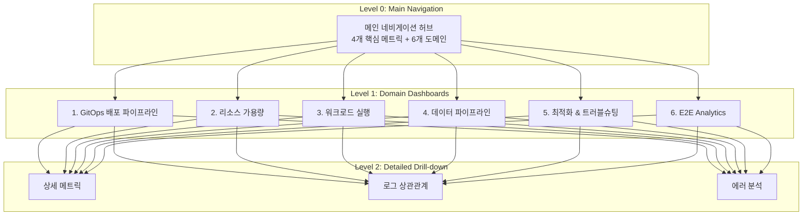

# DataOps 플랫폼 End-to-End 모니터링 시스템

## 🌐 개요

이 문서는 빅데이터 DataOps 플랫폼의 전체 생명주기를 모니터링하는 종합 시스템에 대한 설계 및 구현 가이드입니다.

### 시스템 범위

```
사용자 Portal → GitOps (Bitbucket/Jenkins/ArgoCD) →
Application (Spark/Airflow/Trino) →
Data Lake (Iceberg) →
Storage (S3/Oracle/Isilon/Ceph)
```

### 주요 목표

- ✅ **6개 계층 모니터링**: 배포부터 스토리지까지 전 구간
- ✅ **End-to-End 추적**: 사용자 요청부터 데이터 저장까지
- ✅ **99.9% 가용성**: 월 43.2분 이하 다운타임
- ✅ **MTTD < 5분**: 장애 발생 5분 내 감지
- ✅ **MTTR < 30분**: 장애 발생 30분 내 복구

---

## 📚 문서 구조

| 문서 | 설명 | 대상 |
|------|------|------|
| **[dataops-monitoring-architecture.md](./dataops-monitoring-architecture.md)** | 전체 아키텍처 및 요구사항 분석 | 전체 팀 |
| **[dataops-expert-meeting-notes.md](./dataops-expert-meeting-notes.md)** | SRE/엔지니어 전문가 회의록 | 의사결정자 |
| **[dataops-implementation-guide.md](./dataops-implementation-guide.md)** | 단계별 구현 가이드 | 구현 담당자 |

---

## 🏗️ 아키텍처 요약

### 계층별 모니터링



### 메트릭 수집 전략

| Layer | Component | Exporter | Interval |
|-------|-----------|----------|----------|
| **GitOps** | Jenkins | prometheus-plugin | 1m |
| | ArgoCD | built-in | 30s |
| **Application** | Spark | JMX Exporter | 15s |
| | Airflow | StatsD Exporter | 30s |
| | Trino | built-in | 30s |
| **Data** | Iceberg | Custom Exporter | 5m |
| | Hive Metastore | JMX Exporter | 1m |
| **Storage** | S3/MinIO | built-in | 1m |
| | Oracle | oracledb_exporter | 1m |
| | Ceph | ceph-exporter | 1m |
| | Isilon | Custom REST API | 5m |

---

## 🎯 6단계 모니터링 상세

### 1단계: GitOps 배포 파이프라인

**목표**: 배포가 정상적으로 완료되었는가?

**주요 메트릭**:
- Jenkins 빌드 성공률 (목표: > 95%)
- ArgoCD Sync 상태 (목표: Healthy)
- Pod Readiness (목표: 100%)
- 배포 소요 시간 (목표: < 10분)

**알림 조건**:
- 🔴 빌드 실패 3회 연속
- 🔴 ArgoCD Out of Sync > 5분
- 🔴 Pod CrashLoopBackOff

---

### 2단계: 배포 검증

**목표**: 배포된 애플리케이션이 정상 작동하는가?

**주요 메트릭**:
- Pod Running/Pending/Failed 상태
- Liveness/Readiness Probe
- Container 재시작 횟수
- Pod 시작 소요 시간

**알림 조건**:
- 🔴 Pod Phase != Running
- 🔴 Restart > 3회
- 🟡 Init Time > 5분

---

### 3단계: 리소스 가용량

**목표**: 워크로드 실행에 충분한 리소스가 있는가?

**주요 메트릭**:
- CPU 가용량 (목표: > 20% 여유)
- 메모리 가용량 (목표: > 15% 여유)
- 스토리지 용량 (목표: < 80% 사용)
- 네트워크 대역폭 (목표: < 70% 사용)

**알림 조건**:
- 🔴 CPU > 85%
- 🔴 Memory > 90%
- 🔴 Storage > 85%
- 🔴 OOM Kill 발생

---

### 4단계: 워크로드 실행

**목표**: Job이 정상적으로 실행되고 완료되는가?

#### Spark
- Active Jobs
- Failed Jobs (목표: < 2% in 24h)
- Stage Duration (P95 < SLA)
- GC Time Ratio (목표: < 10%)

#### Airflow
- DAG Run Success Rate (목표: > 95%)
- Task Duration (P95 < SLA)
- Scheduler Lag (목표: < 30s)

#### Trino
- Query Success Rate (목표: > 99%)
- Query Wall Time (P95 < 10m)
- Worker Availability

**알림 조건**:
- 🔴 Job 실패율 > 5%
- 🟡 실행 시간 > SLA + 50%
- 🟡 GC Time > 20%

---

### 5단계: 데이터 파이프라인

**목표**: 데이터가 올바르게 저장/읽기되는가?

**주요 메트릭**:

#### Iceberg
- Table Metadata Size
- Snapshot Count (목표: < 100)
- Small Files Ratio (목표: < 30%)

#### S3/MinIO
- GET/PUT Latency (목표: < 100ms)
- Error Rate (목표: < 0.1%)

#### Hive Metastore
- Response Time (목표: < 1s)
- Connection Pool (목표: < 80%)

#### Oracle DB
- Connection Pool (목표: < 90%)
- Query Duration (목표: < 5s)
- Tablespace Usage (목표: < 85%)

**알림 조건**:
- 🔴 S3 Error Rate > 1%
- 🟡 Metastore Response > 3s
- 🔴 Oracle Tablespace > 90%

---

### 6단계: End-to-End 통합

**목표**: 전체 파이프라인이 SLO를 준수하는가?

**주요 메트릭**:
- Pipeline Completion Time (Portal → Data)
- Data Processing Latency (P50/P95/P99)
- Overall Success Rate
- Data Volume Processed

**SLI/SLO**:
- Availability: 99.9% (43분 downtime/month)
- Latency: P95 < 1 hour
- Success Rate: > 98%
- Error Budget: 0.1%

---

## 🚀 빠른 시작

### 1. 사전 요구사항 확인

```bash
# Kubernetes 클러스터 접근
kubectl cluster-info

# Prometheus Operator 설치 확인
kubectl get crd prometheuses.monitoring.coreos.com

# Grafana 설치 확인
kubectl get deployment -n monitoring kube-prometheus-stack-grafana
```

### 2. 메트릭 수집 인프라 배포

```bash
# ServiceMonitor 배포
kubectl apply -f monitoring/servicemonitors/

# Recording Rules 배포
kubectl apply -f monitoring/recording-rules/

# Alert Rules 배포
kubectl apply -f monitoring/alert-rules/
```

### 3. 대시보드 배포

```bash
# ConfigMap 생성
kubectl apply -k deploy-new/overlays/cluster-01-central/kube-prometheus-stack/

# Grafana 재시작
kubectl rollout restart deployment -n monitoring kube-prometheus-stack-grafana

# 접속
# http://grafana.k8s-cluster-01.miribit.lab
# Username: admin / Password: admin123
```

### 4. 검증

```bash
# Prometheus Targets 확인
kubectl port-forward -n monitoring svc/kube-prometheus-stack-prometheus 9090:9090
# http://localhost:9090/targets

# 대시보드 확인
kubectl logs -n monitoring -l app.kubernetes.io/name=grafana -c grafana-sc-dashboard

# Alert 확인
kubectl port-forward -n monitoring svc/kube-prometheus-stack-alertmanager 9093:9093
# http://localhost:9093
```

---

## 📊 대시보드 목록

| 대시보드 | UID | 설명 |
|---------|-----|------|
| **Main Navigation** | `dataops-main-nav` | 전체 플랫폼 개요 및 네비게이션 |
| **GitOps Pipeline** | `dataops-gitops-pipeline` | Bitbucket → Jenkins → ArgoCD |
| **Resource Capacity** | `dataops-resource-capacity` | CPU/Memory/Storage/Network |
| **Workload Execution** | `dataops-workload-execution` | Spark/Airflow/Trino |
| **Data Pipeline** | `dataops-data-pipeline` | Iceberg/S3/Hive/Oracle |
| **Optimization** | `dataops-optimization` | 성능 분석, 에러 추적, 비용 |
| **E2E Analytics** | `dataops-e2e-analytics` | SLI/SLO, 비즈니스 메트릭 |

---

## 🚨 알림 정책

### 우선순위

| 등급 | 대응 시간 | 채널 | 예시 |
|------|----------|------|------|
| **P1 (Critical)** | 즉시 | PagerDuty + Slack | 플랫폼 다운, 데이터 손실 |
| **P2 (High)** | 30분 | Slack + Email | 리소스 부족, Job 실패율 급증 |
| **P3 (Medium)** | 2시간 | Slack | 슬로우 쿼리, Scheduler 지연 |
| **P4 (Low)** | 24시간 | Email | 용량 예측 경고 |

### SLO 및 Error Budget

```
SLO: 99.9% 가용성
→ Error Budget: 0.1% = 43.2분/월

Burn Rate 알림:
- Fast Burn (1h): 5% Error Budget 소진 예상 → P1
- Slow Burn (6h): 10% Error Budget 소진 예상 → P2
```

---

## 📈 예상 효과

### 기술 지표

| 지표 | 현재 | 목표 | 개선 |
|------|------|------|------|
| **MTTD** | 30분 | 5분 | -83% |
| **MTTR** | 2시간 | 30분 | -75% |
| **장애 빈도** | 10회/월 | 5회/월 | -50% |
| **알림 정확도** | 60% | 95% | +58% |

### 비즈니스 효과

- **운영 효율성**: +30% (On-call 시간 감소)
- **비용 절감**: 15% (리소스 최적화)
- **사용자 만족도**: 4.0/5.0 목표
- **플랫폼 활용도**: +25%

---

## 🛠️ 트러블슈팅

### 자주 발생하는 문제

1. **메트릭이 수집되지 않을 때**
   ```bash
   # Prometheus Targets 확인
   kubectl get servicemonitor -n monitoring
   kubectl get prometheus -n monitoring
   ```

2. **대시보드가 로드되지 않을 때**
   ```bash
   # ConfigMap 확인
   kubectl get cm -n monitoring -l grafana_dashboard=1

   # Sidecar 로그
   kubectl logs -n monitoring -l app.kubernetes.io/name=grafana -c grafana-sc-dashboard
   ```

3. **알림이 발송되지 않을 때**
   ```bash
   # AlertManager 상태
   kubectl get alertmanager -n monitoring

   # Alert Rule 확인
   kubectl get prometheusrule -n monitoring
   ```

자세한 내용은 **[dataops-implementation-guide.md](./dataops-implementation-guide.md#트러블슈팅)** 참조

---

## 📅 구현 로드맵

### Phase 1: Foundation (Week 1-2)
- [ ] Prometheus/Thanos 설정
- [ ] ServiceMonitor 생성
- [ ] JMX Exporter 배포
- [ ] Recording Rules 정의

### Phase 2: Core Dashboards (Week 3-4)
- [ ] Main Navigation 개발
- [ ] GitOps Pipeline 대시보드
- [ ] Resource Capacity 대시보드
- [ ] Workload Execution 대시보드

### Phase 3: Advanced Features (Week 5-6)
- [ ] Data Pipeline 대시보드
- [ ] Optimization 대시보드
- [ ] E2E Analytics 대시보드
- [ ] Alert Rules 설정
- [ ] SLO Dashboard

### Phase 4: Optimization (Week 7-8)
- [ ] 성능 최적화
- [ ] 자동 리포트
- [ ] Auto-remediation
- [ ] Go-Live

---

## 👥 담당자

| 역할 | 담당자 | 책임 |
|------|--------|------|
| **프로젝트 리더** | SRE Lead | 전체 프로젝트 관리 |
| **아키텍트** | Platform Engineer | 아키텍처 설계 |
| **구현** | DevOps Team | 인프라 구축 |
| **대시보드** | Data Visualization Team | Grafana 대시보드 개발 |
| **테스트** | QA Team | 사용자 테스트 |

---

## 📖 참고 자료

### 내부 문서
- [전체 아키텍처](./dataops-monitoring-architecture.md)
- [전문가 회의록](./dataops-expert-meeting-notes.md)
- [구현 가이드](./dataops-implementation-guide.md)

### 외부 참고
- [Google SRE Workbook](https://sre.google/workbook/)
- [Prometheus Best Practices](https://prometheus.io/docs/practices/)
- [Grafana Dashboard Guide](https://grafana.com/docs/grafana/latest/best-practices/)
- [Thanos Architecture](https://thanos.io/tip/thanos/design.md/)

---

## 🎉 시작하기

```bash
# 1. 문서 읽기
cat docs/dataops-monitoring-architecture.md
cat docs/dataops-expert-meeting-notes.md
cat docs/dataops-implementation-guide.md

# 2. Phase 1 시작
kubectl apply -f monitoring/servicemonitors/
kubectl apply -f monitoring/recording-rules/

# 3. 대시보드 배포
kubectl apply -k deploy-new/overlays/cluster-01-central/kube-prometheus-stack/

# 4. Grafana 접속
echo "http://grafana.k8s-cluster-01.miribit.lab"
echo "Username: admin / Password: admin123"
```

**Good Luck! 🚀**

---

**문서 버전**: v1.0
**마지막 업데이트**: 2025-11-05
**프로젝트**: DataOps Platform Monitoring
**Team**: Platform Engineering & SRE
