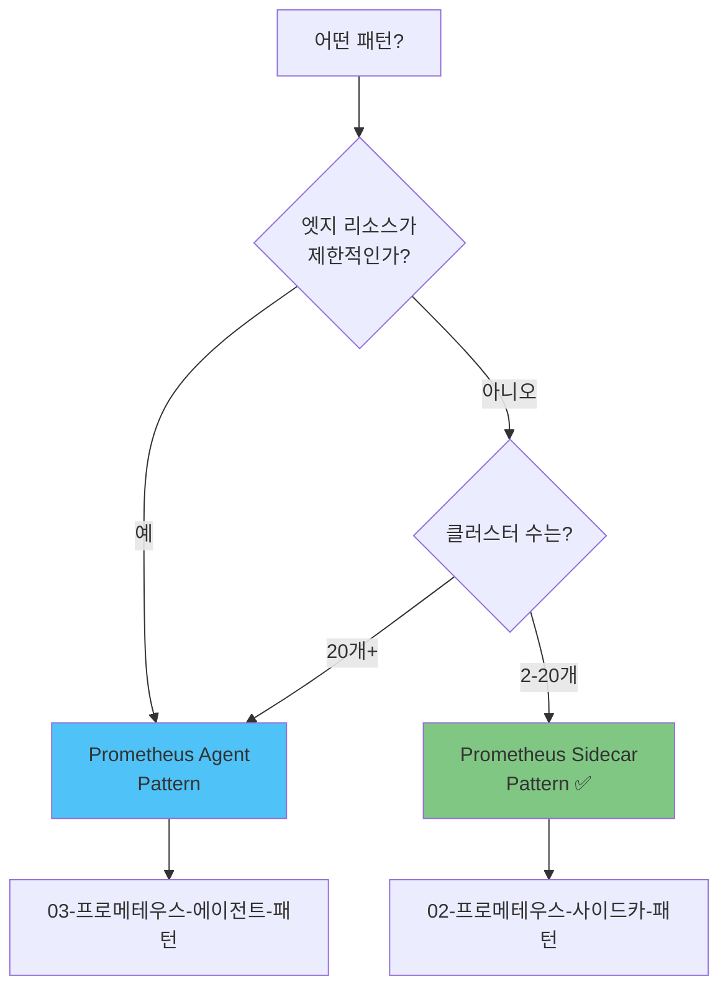

# 📚 Thanos 멀티클러스터 Observability 플랫폼 문서

> **Prometheus의 한계를 극복하는 확장 가능한 멀티클러스터 통합 관측성 솔루션**

[](../LICENSE)
[](https://kubernetes.io/)
[](https://prometheus-operator.dev/)
[](https://thanos.io/)

---

## 🎯 문서 목적

이 문서는 **4개의 Kubernetes 클러스터**에서 Prometheus + Thanos를 활용한 멀티클러스터 Observability 플랫폼을 구축, 배포, 운영하는 전체 과정을 설명합니다.

### 핵심 질문에 대한 답변

| 질문 | 해당 문서 |
|------|----------|
| "어떤 아키텍처를 선택해야 하나요?" | [01-아키텍처-개요/패턴-비교-가이드.md](./01-아키텍처-개요/패턴-비교-가이드.md) |
| "Prometheus Sidecar 패턴은 어떻게 배포하나요?" | [02-프로메테우스-사이드카-패턴](./02-프로메테우스-사이드카-패턴/) |
| "Prometheus Agent 패턴이란?" | [03-프로메테우스-에이전트-패턴](./03-프로메테우스-에이전트-패턴/) |
| "GitOps로 어떻게 배포하나요?" | [04-GitOps-배포](./04-GitOps-배포/) |
| "일상 운영은 어떻게 하나요?" | [05-운영-가이드](./05-운영-가이드/) |
| "대규모 환경으로 확장하려면?" | [06-확장-아키텍처](./06-확장-아키텍처/) |

---

## 📂 문서 구조

```
docs/
├── README.md (이 문서)
├── 빠른-시작-가이드.md                    ⭐ 5분 안에 시작하기
│
├── 01-아키텍처-개요/                      📐 시스템 이해하기
│   ├── 전체-시스템-아키텍처.md
│   ├── 패턴-비교-가이드.md
│   └── 패턴-선택-가이드.md
│
├── 02-프로메테우스-사이드카-패턴/          🔧 Sidecar 패턴 배포
│   └── 배포-가이드.md
│
├── 03-프로메테우스-에이전트-패턴/          🚀 Agent 패턴 배포
│   ├── 아키텍처-설명.md
│   └── 엣지-클러스터-구성.md
│
├── 04-GitOps-배포/                        🔄 자동화 배포
│   ├── ArgoCD-배포-가이드.md
│   ├── GitOps-설정-요약.md
│   └── GitOps-마이그레이션.md
│
├── 05-운영-가이드/                        🛠️ 일상 운영
│   ├── 일상-운영.md
│   ├── 모범-사례.md
│   ├── 빠른-참조.md
│   └── 트러블슈팅.md
│
├── 06-확장-아키텍처/                      📈 대규모 확장
│   ├── 대규모-아키텍처.md
│   ├── 7노드-220클러스터.md
│   └── 단일-180노드-리전분리.md
│
└── 07-참고자료/                           📖 추가 자료
    ├── 구현-요약.md
    ├── 노드-배포-요약.md
    ├── Operator-배포-가이드.md
    ├── Operator-배포-요약.md
    ├── Operator-멀티클러스터.md
    └── 상세-설명.md
```

---

## 🚀 빠른 시작

### 1️⃣ 처음 시작하는 경우

```bash
# 1. 빠른 시작 가이드 읽기
cat 빠른-시작-가이드.md

# 2. 아키텍처 이해하기
cat 01-아키텍처-개요/전체-시스템-아키텍처.md

# 3. 패턴 선택하기
cat 01-아키텍처-개요/패턴-비교-가이드.md
```

**권장 순서**:
1. [빠른-시작-가이드.md](./빠른-시작-가이드.md) - 5분
2. [01-아키텍처-개요/전체-시스템-아키텍처.md](./01-아키텍처-개요/전체-시스템-아키텍처.md) - 15분
3. [02-프로메테우스-사이드카-패턴/배포-가이드.md](./02-프로메테우스-사이드카-패턴/배포-가이드.md) - 30분

---

### 2️⃣ 패턴 선택 중인 경우

**Prometheus + Thanos Sidecar** vs **Prometheus Agent + Receiver**?



**상세 비교**: [01-아키텍처-개요/패턴-비교-가이드.md](./01-아키텍처-개요/패턴-비교-가이드.md)

---

### 3️⃣ 배포 중인 경우

**GitOps (ArgoCD) 사용**:
- [04-GitOps-배포/ArgoCD-배포-가이드.md](./04-GitOps-배포/ArgoCD-배포-가이드.md)

**수동 배포**:
- [02-프로메테우스-사이드카-패턴/배포-가이드.md](./02-프로메테우스-사이드카-패턴/배포-가이드.md)

---

### 4️⃣ 운영 중인 경우

**일상 운영**:
- [05-운영-가이드/일상-운영.md](./05-운영-가이드/일상-운영.md)

**문제 해결**:
- [05-운영-가이드/트러블슈팅.md](./05-운영-가이드/트러블슈팅.md)

**빠른 명령어 참조**:
- [05-운영-가이드/빠른-참조.md](./05-운영-가이드/빠른-참조.md)

---

## 📊 아키텍처 패턴 요약

### Pattern 1: Prometheus + Thanos Sidecar (중앙 클러스터)

```
Prometheus HA → Thanos Sidecar → S3 MinIO
                     ↓
                Thanos Query → Grafana
```

**특징**:
- ✅ 클러스터 독립성 유지
- ✅ 비동기 S3 업로드
- ✅ 무제한 저장소

**문서**: [02-프로메테우스-사이드카-패턴](./02-프로메테우스-사이드카-패턴/)

---

### Pattern 2: Prometheus Agent + Thanos Receiver (엣지 클러스터)

```
Prometheus Agent (경량) → Remote Write → Thanos Receiver
                                             ↓
                                        Prometheus HA
                                             ↓
                                        Thanos Query
```

**특징**:
- ✅ 엣지 리소스 최소화 (~200MB)
- ✅ 실시간 Remote Write
- ✅ 완전한 메트릭 수집

**문서**: [03-프로메테우스-에이전트-패턴](./03-프로메테우스-에이전트-패턴/)

---

## 🎓 학습 경로

### 초급 (0-3개월 경험)

1. **기본 개념 이해**
   - Prometheus 기초
   - Thanos 개요
   - Kubernetes 기본

2. **문서 읽기**
   - [빠른-시작-가이드.md](./빠른-시작-가이드.md)
   - [01-아키텍처-개요/전체-시스템-아키텍처.md](./01-아키텍처-개요/전체-시스템-아키텍처.md)

3. **실습**
   - 단일 클러스터에 Prometheus 배포
   - Grafana 대시보드 구성

---

### 중급 (3-12개월 경험)

1. **멀티클러스터 배포**
   - [02-프로메테우스-사이드카-패턴/배포-가이드.md](./02-프로메테우스-사이드카-패턴/배포-가이드.md)
   - [04-GitOps-배포/ArgoCD-배포-가이드.md](./04-GitOps-배포/ArgoCD-배포-가이드.md)

2. **운영 숙달**
   - [05-운영-가이드/일상-운영.md](./05-운영-가이드/일상-운영.md)
   - [05-운영-가이드/모범-사례.md](./05-운영-가이드/모범-사례.md)

---

### 고급 (12개월+ 경험)

1. **아키텍처 설계**
   - [01-아키텍처-개요/패턴-비교-가이드.md](./01-아키텍처-개요/패턴-비교-가이드.md)
   - [06-확장-아키텍처](./06-확장-아키텍처/)

2. **대규모 확장**
   - [06-확장-아키텍처/대규모-아키텍처.md](./06-확장-아키텍처/대규모-아키텍처.md)

3. **커스터마이징**
   - [07-참고자료/상세-설명.md](./07-참고자료/상세-설명.md)

---

## 🔗 외부 리소스

### 공식 문서
- [Prometheus Documentation](https://prometheus.io/docs/)
- [Thanos Documentation](https://thanos.io/)
- [Grafana Documentation](https://grafana.com/docs/)
- [ArgoCD Documentation](https://argo-cd.readthedocs.io/)

### 커뮤니티
- [CNCF Slack - #thanos](https://cloud-native.slack.com/)
- [Prometheus Users Google Group](https://groups.google.com/g/prometheus-users)

---

## 📞 지원

### 이슈 보고
GitHub Issues를 통해 버그 리포트 및 기능 요청

### 문서 기여
Pull Request 환영! 문서 개선에 참여해주세요.

### 긴급 지원
Infrastructure Team에 문의

---

## 📋 체크리스트

### 배포 전
- [ ] Kubernetes 클러스터 준비 (v1.34+)
- [ ] MinIO S3 접근 가능
- [ ] DNS 설정 완료
- [ ] 필수 도구 설치 (kubectl, kustomize, helm)

### 배포 중
- [ ] [빠른-시작-가이드.md](./빠른-시작-가이드.md) 따라하기
- [ ] 패턴 선택 ([패턴-비교-가이드.md](./01-아키텍처-개요/패턴-비교-가이드.md))
- [ ] 배포 가이드 실행
- [ ] 검증 스크립트 실행

### 배포 후
- [ ] Grafana 접속 확인
- [ ] Thanos Query 테스트
- [ ] 로그 수집 확인
- [ ] 알림 규칙 설정

---

## 📈 버전 히스토리

| 버전 | 날짜 | 주요 변경사항 |
|------|------|--------------|
| 2.0.0 | 2025-10-20 | 📁 문서 재구조화 (패턴별 분리) |
| 1.1.0 | 2025-10-16 | 🔄 GitOps 배포 가이드 추가 |
| 1.0.0 | 2025-10-15 | 🎉 초기 릴리스 |

---

## 🙏 감사의 글

이 프로젝트는 다음 오픈소스 프로젝트를 기반으로 합니다:
- Prometheus & Prometheus Operator
- Thanos
- Grafana
- ArgoCD
- OpenSearch
- Fluent Bit

---

**최종 업데이트**: 2025-10-20
**문서 버전**: 2.0.0
**작성자**: Infrastructure Team

---

## 🎯 다음 단계

**새로운 사용자**: [빠른-시작-가이드.md](./빠른-시작-가이드.md)
**아키텍처 이해**: [01-아키텍처-개요](./01-아키텍처-개요/)
**바로 배포**: [02-프로메테우스-사이드카-패턴](./02-프로메테우스-사이드카-패턴/)
**운영 시작**: [05-운영-가이드](./05-운영-가이드/)
