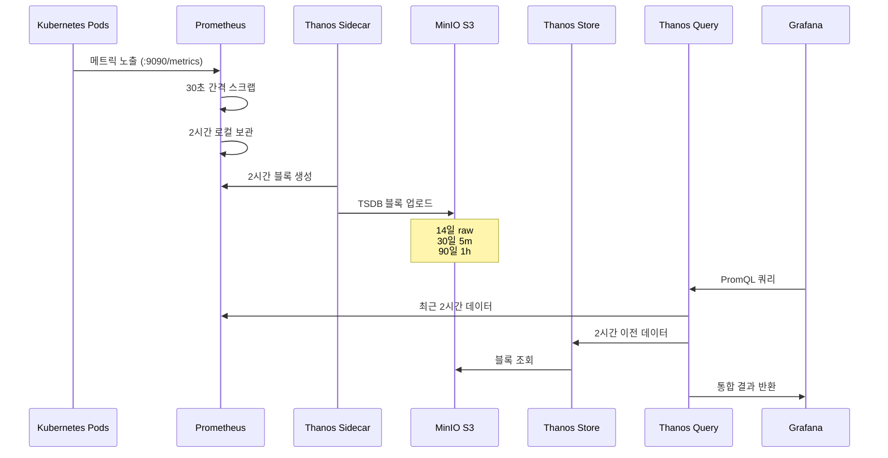
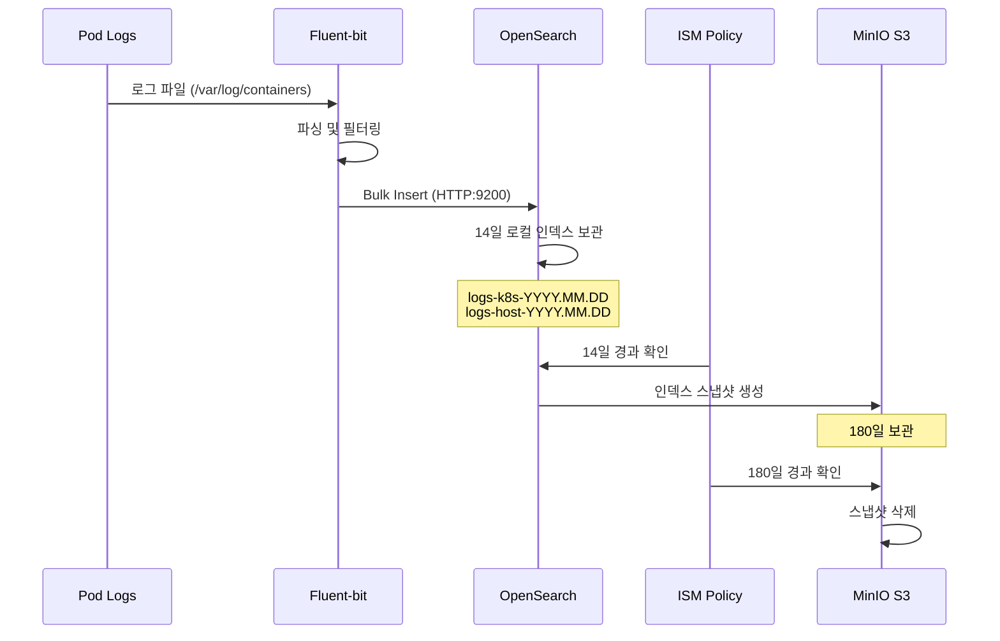

# Thanos Multi-Cluster Architecture

## 개요

본 프로젝트는 3개의 Minikube 클러스터에서 Thanos를 사용하여 멀티클러스터 모니터링 및 로깅 인프라를 구축합니다.

## 아키텍처 다이어그램

### 전체 아키텍처

```mermaid
graph TB
    subgraph Users["사용자"]
        U1[운영자]
    end

    subgraph Central["중앙 클러스터 (196)"]
        direction TB
        TQ[Thanos Query<br/>통합 쿼리 레이어]
        TS[Thanos Store<br/>S3 데이터 조회]
        TC[Thanos Compactor<br/>압축/다운샘플링]
        TR[Thanos Ruler<br/>글로벌 알림]
        P196[Prometheus<br/>+ Thanos Sidecar]
        G196[Grafana<br/>통합 대시보드]
        A196[Alertmanager]
        OS196[OpenSearch]
        FB196[Fluent-bit]
    end

    subgraph Edge197["엣지 클러스터 (197)"]
        direction TB
        P197[Prometheus<br/>+ Thanos Sidecar]
        G197[Grafana<br/>로컬 대시보드]
        A197[Alertmanager]
        OS197[OpenSearch]
        FB197[Fluent-bit]
    end

    subgraph Edge198["엣지 클러스터 (198)"]
        direction TB
        P198[Prometheus<br/>+ Thanos Sidecar]
        G198[Grafana<br/>로컬 대시보드]
        A198[Alertmanager]
        OS198[OpenSearch]
        FB198[Fluent-bit]
    end

    subgraph Storage["외부 스토리지 (MinIO S3)"]
        direction TB
        B1[thanos 버킷<br/>메트릭 블록]
        B2[opensearch-logs 버킷<br/>로그 스냅샷]
        B3[longhorn-backups 버킷<br/>볼륨 백업]
    end

    subgraph Network["네트워크"]
        DNS[DNS: *.mkube-{196,197,198}.miribit.lab]
    end

    %% 메트릭 흐름
    P196 -->|메트릭 블록 업로드| B1
    P197 -->|메트릭 블록 업로드| B1
    P198 -->|메트릭 블록 업로드| B1

    %% Thanos 쿼리 흐름
    TQ -->|실시간 메트릭| P196
    TQ -->|장기 메트릭| TS
    TQ -.->|원격 gRPC:30901| P197
    TQ -.->|원격 gRPC:30901| P198

    TS -->|S3 블록 조회| B1
    TC -->|압축/다운샘플링| B1
    TR -->|알림 규칙 평가| TQ

    %% 사용자 접근
    U1 -->|HTTP:30080| DNS
    DNS --> G196
    DNS --> TQ

    %% 로그 흐름
    OS196 -->|스냅샷| B2
    OS197 -->|스냅샷| B2
    OS198 -->|스냅샷| B2

    FB196 -->|로그 전송| OS196
    FB197 -->|로그 전송| OS197
    FB198 -->|로그 전송| OS198

    style Central fill:#e1f5ff
    style Edge197 fill:#fff4e1
    style Edge198 fill:#fff4e1
    style Storage fill:#f0f0f0
    style Network fill:#e8f5e9
```

### 메트릭 데이터 흐름



### 로그 데이터 흐름



## 컴포넌트 상세

### 1. 중앙 클러스터 (192.168.101.196)

#### Prometheus + Thanos Sidecar
- **네임스페이스**: `monitoring`
- **용도**: 로컬 메트릭 수집 및 S3 업로드
- **보존 기간**: 2시간 (로컬)
- **스크랩 간격**: 30초
- **리소스**: 1 CPU, 2GB RAM

#### Thanos Query
- **네임스페이스**: `monitoring`
- **포트**: 9090 (HTTP), 10901 (gRPC)
- **용도**: 멀티클러스터 메트릭 통합 쿼리
- **엔드포인트**:
  - 로컬 Prometheus (Sidecar)
  - Thanos Store (S3 데이터)
  - 엣지 클러스터 Sidecar (192.168.101.197:30901, 192.168.101.198:30901)
- **Ingress**: http://thanos.mkube-196.miribit.lab:30080

#### Thanos Store
- **네임스페이스**: `monitoring`
- **포트**: 10902 (HTTP), 10901 (gRPC)
- **용도**: S3 블록 조회 및 캐싱
- **캐시**: 500MB index, 500MB chunk
- **스토리지**: 10Gi (Longhorn)

#### Thanos Compactor
- **네임스페이스**: `monitoring`
- **용도**: S3 블록 압축 및 다운샘플링
- **다운샘플링**:
  - Raw: 14일
  - 5분 해상도: 30일
  - 1시간 해상도: 90일
- **실행 간격**: 3분

#### Thanos Ruler
- **네임스페이스**: `monitoring`
- **용도**: 글로벌 알림 규칙 평가
- **알림 대상**: Alertmanager (http://kube-prometheus-stack-alertmanager:9093)
- **쿼리 소스**: Thanos Query (http://thanos-query:9090)

#### Grafana
- **네임스페이스**: `monitoring`
- **용도**: 통합 대시보드
- **데이터 소스**: Thanos Query (멀티클러스터 통합)
- **Ingress**: http://grafana.mkube-196.miribit.lab:30080
- **스토리지**: 5Gi (Longhorn)

#### OpenSearch
- **네임스페이스**: `logging`
- **용도**: 로그 인덱싱 및 검색
- **복제본**: 1 (단일 노드)
- **스토리지**: 30Gi (Longhorn)
- **ISM 정책**: 14일 로컬 → 180일 S3
- **Ingress**: http://opensearch.mkube-196.miribit.lab:30080

### 2. 엣지 클러스터 (192.168.101.197, 198)

#### Prometheus + Thanos Sidecar
- **네임스페이스**: `monitoring`
- **용도**: 로컬 메트릭 수집 및 S3 업로드
- **Sidecar NodePort**: 30901 (gRPC)
- **외부 레이블**:
  - cluster: cluster-197-edge / cluster-198-edge
  - region: miribit-lab

#### 로컬 컴포넌트
- Grafana (로컬 조회용)
- Alertmanager (로컬 알림)
- OpenSearch (로컬 로그 저장)
- Fluent-bit (로그 수집)

## 네트워크 구성

### DNS 패턴
- 중앙 클러스터: `*.mkube-196.miribit.lab`
- 엣지 197: `*.mkube-197.miribit.lab`
- 엣지 198: `*.mkube-198.miribit.lab`

### NodePort 서비스
- **HTTP/HTTPS**: 30080 (Ingress)
- **HTTPS**: 30443 (Ingress)
- **Thanos Sidecar gRPC**: 30901 (엣지 클러스터만)

### 클러스터 간 통신
- 중앙 → 엣지: Thanos Query가 엣지 Sidecar로 gRPC 연결 (30901)
- 모든 클러스터 → S3: HTTPS (172.20.40.21:30001)

## 스토리지 구성

### Longhorn CSI
- **용도**: PersistentVolume 제공
- **복제**: 2 (기본)
- **백업 대상**: s3://longhorn-backups@us-east-1/
- **스토리지 클래스**: `longhorn` (기본)

### MinIO S3 버킷

| 버킷 | 용도 | 보존 기간 | 예상 크기 |
|------|------|-----------|----------|
| thanos | Prometheus 메트릭 블록 | 14일 raw + 30일 5m + 90일 1h | ~50GB |
| opensearch-logs | 로그 스냅샷 | 180일 | ~100GB |
| longhorn-backups | 볼륨 백업 | 수동 관리 | 가변 |

## 보안 구성

### 인증/인가
- **Grafana**: 기본 admin 계정 (초기 비밀번호: prom-operator)
- **Longhorn UI**: Basic Auth (별도 설정 필요)
- **OpenSearch**: 보안 플러그인 비활성화 (내부 네트워크)

### 네트워크 정책
- 현재 구성: 모든 트래픽 허용 (Minikube 기본값)
- 프로덕션 권장: NetworkPolicy 적용

### Secret 관리
- Thanos S3 자격 증명: `thanos-s3-config` (monitoring 네임스페이스)
- OpenSearch S3 자격 증명: `opensearch-s3-config` (logging 네임스페이스)
- Longhorn S3 자격 증명: `longhorn-s3-secret` (longhorn-system 네임스페이스)

## 모니터링 메트릭

### ServiceMonitor
각 컴포넌트는 Prometheus ServiceMonitor를 통해 자체 메트릭을 수집합니다:

- kube-prometheus-stack (자동 생성)
- thanos-query, thanos-store, thanos-compactor, thanos-ruler
- opensearch
- fluent-bit
- ingress-nginx

### 주요 메트릭
- `prometheus_tsdb_storage_blocks_bytes`: Prometheus 로컬 스토리지 사용량
- `thanos_objstore_bucket_operations_total`: S3 버킷 작업 횟수
- `thanos_query_concurrent_queries`: 동시 쿼리 수
- `opensearch_cluster_health_status`: OpenSearch 클러스터 상태

## 알림 규칙

### Thanos 알림
- **ThanosCompactHalted**: Compactor 중단 (5분 이상)
- **ThanosQueryGrpcErrorRate**: Query gRPC 오류율 증가 (>1%)

### Prometheus 알림 (기본)
- KubePodCrashLooping
- KubeNodeNotReady
- PrometheusTSDBWALCorrupted
- 기타 kube-prometheus-stack 기본 알림 규칙

## 확장성

### 수평 확장
- Thanos Query: replicas 증가 가능 (로드 밸런싱)
- Thanos Store: StatefulSet replicas 증가 (샤딩)
- OpenSearch: 노드 추가 (클러스터 구성)

### 수직 확장
- 각 컴포넌트의 resources.requests/limits 조정
- Longhorn 볼륨 크기 증가 (PVC resize)

### 추가 클러스터 연결
1. 새 엣지 클러스터에 Prometheus + Thanos Sidecar 배포
2. Sidecar NodePort 30901 노출
3. 중앙 클러스터 Thanos Query에 `--store=<new-cluster-ip>:30901` 추가

## 장애 복구

### 시나리오별 복구 절차

#### 1. Prometheus 장애
- Prometheus Pod 재시작: StatefulSet이 자동 복구
- 데이터 손실: Thanos가 S3에서 복구 (2시간 이전 데이터)

#### 2. Thanos 컴포넌트 장애
- Query: Pod 재시작, 쿼리 임시 중단
- Store: Pod 재시작, S3 캐시 재구성
- Compactor: Pod 재시작, 다음 실행 시 작업 재개

#### 3. OpenSearch 장애
- Pod 재시작: StatefulSet이 자동 복구
- 인덱스 손실: S3 스냅샷에서 복구 (14일 이전 데이터)

#### 4. S3 연결 장애
- Prometheus: 2시간 동안 로컬 데이터 보관
- Thanos Sidecar: 재연결 시 블록 업로드 재시도
- OpenSearch: 로컬 인덱스 유지

## 성능 튜닝

### Prometheus
- 스크랩 대상이 많을 경우 `scrapeTimeout` 조정
- 메모리 부족 시 `retention` 단축 (최소 1시간)

### Thanos Query
- 동시 쿼리 제한: `--query.max-concurrent`
- 쿼리 타임아웃: `--query.timeout`

### OpenSearch
- JVM 힙: 메모리 요청의 50% (현재 1GB)
- 샤드 수 최적화: 인덱스당 1-2개 (단일 노드)

## 참고 자료

- [Thanos 공식 문서](https://thanos.io/tip/thanos/quick-tutorial.md/)
- [kube-prometheus-stack](https://github.com/prometheus-community/helm-charts/tree/main/charts/kube-prometheus-stack)
- [OpenSearch 문서](https://opensearch.org/docs/latest/)
- [Longhorn 문서](https://longhorn.io/docs/)
