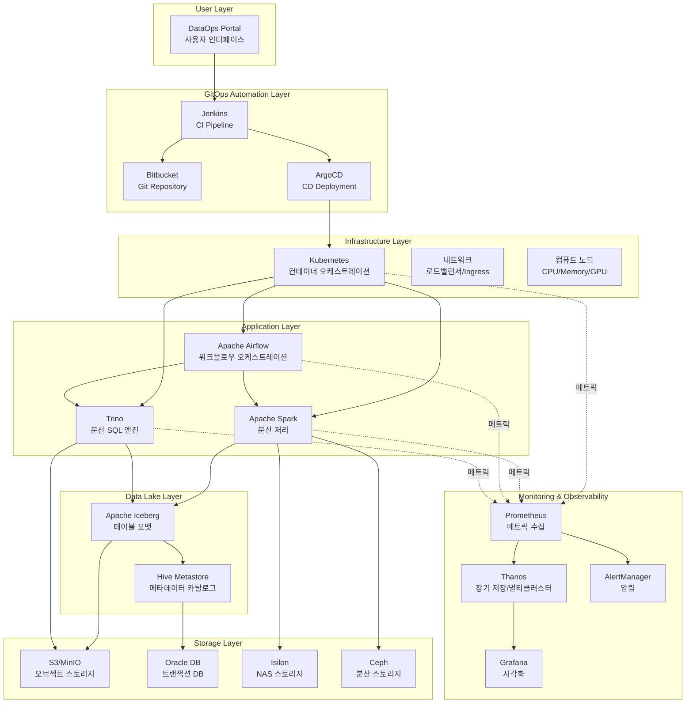
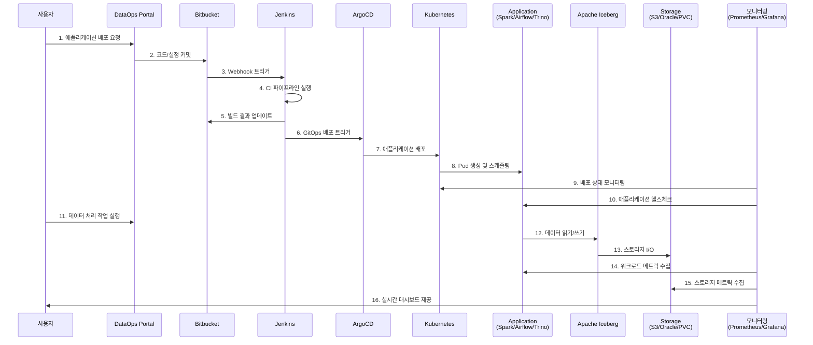

# 빅데이터 DataOps 플랫폼 End-to-End 모니터링 시스템 설계

## 📋 목차

1. [플랫폼 아키텍처 개요](#플랫폼-아키텍처-개요)
2. [모니터링 요구사항 분석](#모니터링-요구사항-분석)
3. [대시보드 계층 구조](#대시보드-계층-구조)
4. [각 계층별 상세 설계](#각-계층별-상세-설계)
5. [메트릭 수집 전략](#메트릭-수집-전략)
6. [알림 및 SLO 정의](#알림-및-slo-정의)
7. [구현 가이드](#구현-가이드)

---

## 🏗️ 플랫폼 아키텍처 개요

### 전체 시스템 구성도



### 주요 데이터 흐름



---

## 🎯 모니터링 요구사항 분석

### 1단계: GitOps 배포 파이프라인 모니터링

| 구분 | 모니터링 항목 | 메트릭 | 임계값 | 알림 |
|------|--------------|--------|--------|------|
| **Git 저장소** | - 커밋 빈도<br/>- PR/MR 상태<br/>- 브랜치 동기화 | `git_commits_total`<br/>`git_pull_requests_open` | - | Low |
| **Jenkins CI** | - 빌드 성공률<br/>- 빌드 시간<br/>- 큐 대기 시간<br/>- 실행 중인 Job | `jenkins_job_success_rate`<br/>`jenkins_job_duration_seconds`<br/>`jenkins_queue_size` | Success < 95%<br/>Duration > 10m<br/>Queue > 10 | High |
| **ArgoCD** | - Sync 상태<br/>- Health 상태<br/>- Sync 소요시간<br/>- Out of Sync 리소스 | `argocd_app_sync_status`<br/>`argocd_app_health_status`<br/>`argocd_app_sync_duration` | Health != Healthy<br/>Duration > 5m | Critical |
| **배포 검증** | - Pod Readiness<br/>- Container 재시작<br/>- Image Pull 상태 | `kube_pod_status_ready`<br/>`kube_pod_container_restarts` | Ready != true<br/>Restarts > 3 | High |

### 2단계: 배포 검증 모니터링

| 구분 | 모니터링 항목 | 메트릭 | 임계값 | 알림 |
|------|--------------|--------|--------|------|
| **Pod 상태** | - Running/Pending/Failed<br/>- Eviction<br/>- CrashLoopBackOff | `kube_pod_status_phase`<br/>`kube_pod_status_reason` | Phase != Running<br/>Reason = Evicted | Critical |
| **서비스 헬스** | - Liveness/Readiness Probe<br/>- Endpoint 가용성<br/>- Service Mesh 연결 | `kube_pod_status_ready`<br/>`up{job="service"}` | Ready != 1<br/>up != 1 | High |
| **초기화 시간** | - Pod 시작 시간<br/>- 애플리케이션 초기화<br/>- 데이터 로딩 시간 | `kube_pod_start_time`<br/>`application_init_duration` | Duration > 5m | Medium |

### 3단계: 리소스 가용량 모니터링

| 구분 | 모니터링 항목 | 메트릭 | 임계값 | 알림 |
|------|--------------|--------|--------|------|
| **CPU** | - Request/Limit<br/>- 실제 사용률<br/>- Throttling<br/>- 가용 노드 CPU | `container_cpu_usage_seconds_total`<br/>`kube_pod_container_resource_requests`<br/>`container_cpu_cfs_throttled_seconds_total` | Usage > 80%<br/>Throttling > 10% | High |
| **메모리** | - Request/Limit<br/>- 실제 사용량<br/>- OOM Kill<br/>- 가용 노드 메모리 | `container_memory_working_set_bytes`<br/>`kube_pod_container_status_last_terminated_reason` | Usage > 85%<br/>Reason = OOMKilled | Critical |
| **스토리지** | - PVC 사용률<br/>- IOPS<br/>- Throughput<br/>- S3 Quota | `kubelet_volume_stats_used_bytes`<br/>`ceph_osd_utilization`<br/>`isilon_quota_used` | Usage > 80% | High |
| **네트워크** | - 대역폭 사용률<br/>- 패킷 드롭<br/>- 레이턴시 | `container_network_transmit_bytes_total`<br/>`node_network_receive_drop_total` | Bandwidth > 80%<br/>Drop > 1% | Medium |

### 4단계: 워크로드 실행 모니터링

| 구분 | 모니터링 항목 | 메트릭 | 임계값 | 알림 |
|------|--------------|--------|--------|------|
| **Spark** | - Job 성공/실패<br/>- Stage 실행 시간<br/>- Executor 사용률<br/>- Shuffle 성능<br/>- GC 시간 | `spark_job_status`<br/>`spark_stage_duration_seconds`<br/>`spark_executor_memory_used`<br/>`spark_shuffle_read_bytes`<br/>`jvm_gc_collection_seconds` | Failure > 0<br/>Duration > SLA<br/>Memory > 90%<br/>GC > 10% | High |
| **Airflow** | - DAG 성공/실패<br/>- Task 실행 시간<br/>- Scheduler 지연<br/>- Worker 가용성 | `airflow_dag_run_status`<br/>`airflow_task_duration`<br/>`airflow_scheduler_heartbeat`<br/>`airflow_pool_slots_available` | Status = failed<br/>Duration > SLA<br/>Heartbeat > 30s | High |
| **Trino** | - Query 성공/실패<br/>- Query 실행 시간<br/>- Worker 노드 상태<br/>- 메모리 사용률<br/>- CPU 시간 | `trino_execution_query_total`<br/>`trino_execution_query_wall_time`<br/>`trino_cluster_active_workers`<br/>`trino_memory_pool_max_bytes` | Failure > 5%<br/>Wall Time > 10m<br/>Workers < 80% | High |

### 5단계: 데이터 파이프라인 최적화 모니터링

| 구분 | 모니터링 항목 | 메트릭 | 임계값 | 알림 |
|------|--------------|--------|--------|------|
| **Iceberg** | - 테이블 메타데이터 크기<br/>- Snapshot 개수<br/>- 파일 개수<br/>- Compaction 상태 | `iceberg_table_metadata_size`<br/>`iceberg_table_snapshots`<br/>`iceberg_table_files` | Files > 10000<br/>Snapshots > 100 | Medium |
| **Hive Metastore** | - 응답 시간<br/>- 연결 풀 사용률<br/>- 락 대기 시간 | `hive_metastore_response_time`<br/>`hive_metastore_connection_pool` | Response > 1s<br/>Pool > 80% | High |
| **S3/MinIO** | - GET/PUT 레이턴시<br/>- 4xx/5xx 에러율<br/>- Bucket 크기<br/>- Object 개수 | `s3_request_duration_seconds`<br/>`s3_errors_total`<br/>`s3_bucket_size_bytes` | Latency > 100ms<br/>Error > 1% | Medium |
| **Oracle DB** | - 커넥션 풀<br/>- 쿼리 실행 시간<br/>- Tablespace 사용률<br/>- Lock 대기 | `oracle_connection_pool`<br/>`oracle_query_duration`<br/>`oracle_tablespace_usage` | Pool > 90%<br/>Duration > 5s<br/>Usage > 85% | High |
| **Ceph/Isilon** | - IOPS<br/>- Throughput<br/>- 레이턴시<br/>- 디스크 사용률 | `ceph_osd_op_latency`<br/>`isilon_throughput_bytes`<br/>`storage_disk_usage` | Latency > 10ms<br/>Usage > 80% | Medium |

### 6단계: End-to-End 통합 모니터링

| 구분 | 모니터링 항목 | 메트릭 | SLI/SLO |
|------|--------------|--------|---------|
| **전체 파이프라인** | - End-to-End 실행 시간<br/>- 각 단계별 소요 시간<br/>- 병목 구간 식별 | `pipeline_duration_seconds{stage="*"}`<br/>`pipeline_bottleneck_duration` | 99.9% < 1h |
| **데이터 품질** | - 데이터 정합성<br/>- 스키마 변경 감지<br/>- Null/중복 비율 | `data_quality_score`<br/>`data_schema_changes`<br/>`data_null_ratio` | Quality > 95% |
| **비용 효율성** | - 컴퓨트 비용<br/>- 스토리지 비용<br/>- 리소스 유휴율 | `cost_compute_total`<br/>`cost_storage_total`<br/>`resource_idle_ratio` | Idle < 20% |

---

## 🎨 대시보드 계층 구조

### Level 0: 메인 네비게이션 (Main Navigation)

```
┌─────────────────────────────────────────────────────────────────┐
│                🌐 DataOps Platform Overview                     │
├─────────────────────────────────────────────────────────────────┤
│                                                                 │
│  ┌───────────────┐  ┌───────────────┐  ┌───────────────┐     │
│  │  🚀 GitOps    │  │  📊 Resource  │  │  ⚙️ Workload   │     │
│  │  Deployment   │  │  Capacity     │  │  Execution    │     │
│  │               │  │               │  │               │     │
│  │ Click to view │  │ Click to view │  │ Click to view │     │
│  └───────────────┘  └───────────────┘  └───────────────┘     │
│                                                                 │
│  ┌───────────────┐  ┌───────────────┐  ┌───────────────┐     │
│  │  🔍 Data      │  │  🛠️ Optimize   │  │  📈 E2E        │     │
│  │  Pipeline     │  │  & Troubl...  │  │  Analytics    │     │
│  │               │  │               │  │               │     │
│  │ Click to view │  │ Click to view │  │ Click to view │     │
│  └───────────────┘  └───────────────┘  └───────────────┘     │
│                                                                 │
└─────────────────────────────────────────────────────────────────┘
```

### Level 1: 도메인별 대시보드

#### 1.1 GitOps Deployment Pipeline
```
GitOps 배포 파이프라인
├── Bitbucket Activity
│   ├── 커밋 빈도 (시간별)
│   ├── PR 상태 (Open/Merged/Declined)
│   └── 브랜치별 활동
├── Jenkins CI Status
│   ├── 빌드 성공률 (시간대별)
│   ├── 실행 중인 Job
│   ├── 큐 대기 시간
│   └── 빌드 소요 시간 (Job별)
├── ArgoCD Deployment
│   ├── Application Sync 상태
│   ├── Health Status
│   ├── Out of Sync Resources
│   └── Sync Duration
└── Deployment Verification
    ├── Pod Status by Namespace
    ├── Container Restart Count
    ├── Image Pull Status
    └── Rollout History
```

#### 1.2 Resource Capacity Planning
```
리소스 가용량 모니터링
├── Compute Resources
│   ├── 클러스터별 CPU 사용률
│   ├── 클러스터별 메모리 사용률
│   ├── 노드별 리소스 현황
│   └── GPU 가용량 (있는 경우)
├── Storage Resources
│   ├── PVC 사용률 Top 10
│   ├── S3 Bucket 크기 추이
│   ├── Ceph 클러스터 상태
│   ├── Isilon 용량 현황
│   └── Oracle Tablespace 사용률
├── Network Resources
│   ├── 네트워크 대역폭 사용률
│   ├── Ingress 트래픽
│   └── Service Mesh 메트릭
└── Capacity Forecast
    ├── CPU 예상 고갈 시점
    ├── 메모리 예상 고갈 시점
    └── 스토리지 예상 고갈 시점
```

#### 1.3 Workload Execution Monitoring
```
워크로드 실행 모니터링
├── Apache Spark
│   ├── Active Jobs
│   ├── Job 실행 시간 분포
│   ├── Executor 사용률
│   ├── Shuffle Read/Write
│   └── GC 시간 비율
├── Apache Airflow
│   ├── DAG Run 성공률
│   ├── Task Duration Heatmap
│   ├── Scheduler 지연
│   └── Worker Pool 사용률
├── Trino
│   ├── Running Queries
│   ├── Query Wall Time
│   ├── Worker Node 상태
│   └── 메모리 풀 사용률
└── Cross-Application Metrics
    ├── 전체 Job 성공률
    ├── 리소스 사용량 비교
    └── 실행 시간 추이
```

#### 1.4 Data Pipeline Health
```
데이터 파이프라인 헬스
├── Apache Iceberg
│   ├── 테이블 메타데이터 크기
│   ├── Snapshot 개수 추이
│   ├── 파일 개수 (작은 파일 비율)
│   └── Compaction 필요 테이블
├── Hive Metastore
│   ├── 응답 시간
│   ├── 커넥션 풀 사용률
│   ├── 락 대기 시간
│   └── 에러율
├── S3/MinIO
│   ├── GET/PUT 레이턴시
│   ├── 4xx/5xx 에러율
│   ├── Bucket 크기 추이
│   └── Object 개수
├── Oracle DB
│   ├── 커넥션 풀 사용률
│   ├── 쿼리 실행 시간
│   ├── Tablespace 사용률
│   └── Lock 대기 이벤트
└── Storage (Ceph/Isilon)
    ├── IOPS 추이
    ├── Throughput
    ├── 레이턴시
    └── 디스크 사용률
```

#### 1.5 Optimization & Troubleshooting
```
최적화 및 트러블슈팅
├── Performance Analysis
│   ├── Slow Queries (Trino)
│   ├── Long Running Jobs (Spark)
│   ├── Failed Tasks (Airflow)
│   └── 병목 구간 분석
├── Error Analysis
│   ├── 에러 발생 빈도 (카테고리별)
│   ├── 에러 메시지 Top 10
│   ├── Failed Pod 분석
│   └── OOM Kill 이벤트
├── Cost Optimization
│   ├── 리소스 유휴율
│   ├── Over-provisioned Workloads
│   ├── 비용 추이 (컴퓨트/스토리지)
│   └── 비용 절감 권장사항
└── Recommendations
    ├── 스케일링 권장사항
    ├── 리소스 Right-sizing
    └── 설정 최적화 제안
```

#### 1.6 End-to-End Analytics
```
E2E 통합 분석
├── Pipeline Overview
│   ├── 전체 파이프라인 맵
│   ├── 단계별 소요 시간
│   ├── 병목 구간 하이라이트
│   └── SLA 준수율
├── Data Journey
│   ├── Portal → Git → Jenkins → ArgoCD → K8s
│   ├── Application → Iceberg → Storage
│   └── 각 구간별 레이턴시
├── Service Level Indicators
│   ├── Availability (99.9% 목표)
│   ├── Latency (P50/P95/P99)
│   ├── Error Rate
│   └── Throughput
└── Business Metrics
    ├── 처리된 데이터 볼륨
    ├── 완료된 Job 수
    ├── 사용자 요청 처리 시간
    └── 플랫폼 활용도
```

### Level 2: 상세 드릴다운 대시보드

각 메트릭에서 클릭하면 상세 정보로 이동:

```
예시: Spark Job 클릭 → 상세 페이지
├── Job Stages Breakdown
├── Task Timeline (Gantt Chart)
├── Executor Metrics (개별)
├── Input/Output 데이터 크기
├── Shuffle 상세 메트릭
└── 로그 및 이벤트 타임라인
```

---

## 🔧 메트릭 수집 전략

### 메트릭 소스 매핑

| 컴포넌트 | Exporter | 메트릭 접두사 | 수집 주기 |
|----------|----------|--------------|-----------|
| Kubernetes | kube-state-metrics | `kube_*` | 30s |
| Jenkins | prometheus-plugin | `jenkins_*` | 1m |
| ArgoCD | built-in metrics | `argocd_*` | 30s |
| Spark | JMX Exporter | `spark_*`, `jvm_*` | 15s |
| Airflow | StatsD Exporter | `airflow_*` | 30s |
| Trino | built-in metrics | `trino_*` | 30s |
| Iceberg | custom exporter | `iceberg_*` | 5m |
| Hive Metastore | JMX Exporter | `hive_*` | 1m |
| S3/MinIO | built-in metrics | `s3_*`, `minio_*` | 1m |
| Oracle | Oracle Exporter | `oracledb_*` | 1m |
| Ceph | ceph-exporter | `ceph_*` | 1m |
| Isilon | custom exporter | `isilon_*` | 5m |

### ServiceMonitor 설정 예시

```yaml
apiVersion: monitoring.coreos.com/v1
kind: ServiceMonitor
metadata:
  name: spark-applications
  namespace: monitoring
spec:
  selector:
    matchLabels:
      app: spark
  endpoints:
  - port: metrics
    interval: 15s
    path: /metrics
    relabelings:
    - sourceLabels: [__meta_kubernetes_pod_label_spark_app_id]
      targetLabel: spark_app_id
    - sourceLabels: [__meta_kubernetes_pod_label_spark_executor_id]
      targetLabel: executor_id
```

---

## 🚨 알림 및 SLO 정의

### SLO (Service Level Objectives)

| 서비스 | SLO | 측정 기간 | Error Budget |
|--------|-----|-----------|--------------|
| **전체 플랫폼 가용성** | 99.9% | 30일 | 43.2분 |
| **배포 성공률** | 95% | 7일 | 5% |
| **Spark Job 성공률** | 98% | 24시간 | 2% |
| **Trino Query 성공률** | 99% | 24시간 | 1% |
| **Airflow DAG 성공률** | 95% | 24시간 | 5% |
| **데이터 파이프라인 레이턴시** | P95 < 1시간 | 24시간 | - |

### Alert Rules 우선순위

#### Critical (P1) - 즉시 대응 필요
```yaml
- alert: PlatformDown
  expr: up{job="platform-critical"} == 0
  for: 1m

- alert: DataLoss
  expr: iceberg_table_files_deleted_unexpectedly > 0
  for: 0m

- alert: OOMKillFrequent
  expr: rate(kube_pod_container_status_terminated_reason{reason="OOMKilled"}[5m]) > 0.1
  for: 2m
```

#### High (P2) - 30분 내 대응
```yaml
- alert: SparkJobFailureHigh
  expr: rate(spark_job_status{status="failed"}[10m]) > 0.1
  for: 5m

- alert: StorageCapacityLow
  expr: (storage_capacity_used / storage_capacity_total) > 0.85
  for: 10m
```

#### Medium (P3) - 2시간 내 대응
```yaml
- alert: SlowQueries
  expr: histogram_quantile(0.95, trino_query_duration_seconds) > 600
  for: 15m
```

---

## 📊 구현 가이드

### Phase 1: 기반 구축 (Week 1-2)

1. **Prometheus/Thanos 설정**
   - ServiceMonitor 생성
   - Recording Rules 정의
   - Alert Rules 설정

2. **Exporter 배포**
   - JMX Exporter (Spark, Hive)
   - Custom Exporter (Iceberg, Isilon)
   - Oracle Exporter

### Phase 2: 대시보드 개발 (Week 3-4)

1. **Level 0: Main Navigation**
2. **Level 1: 6개 도메인 대시보드**
3. **Level 2: 상세 드릴다운**

### Phase 3: 통합 및 최적화 (Week 5-6)

1. **알림 통합**
2. **SLO 대시보드**
3. **성능 최적화**

---

이어서 실제 Grafana 대시보드 JSON 파일을 생성하겠습니다.
