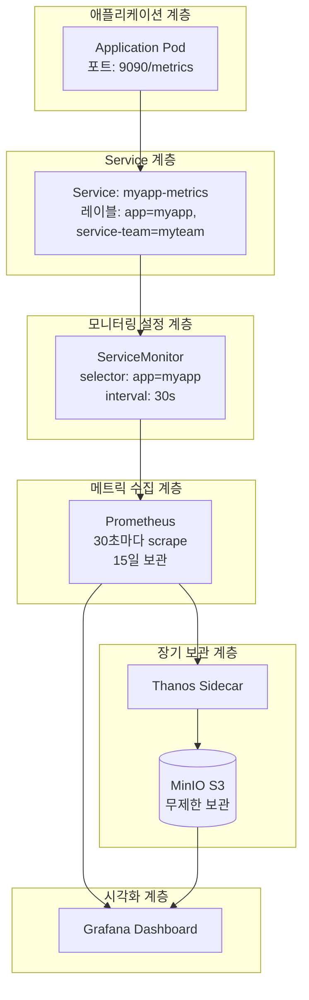
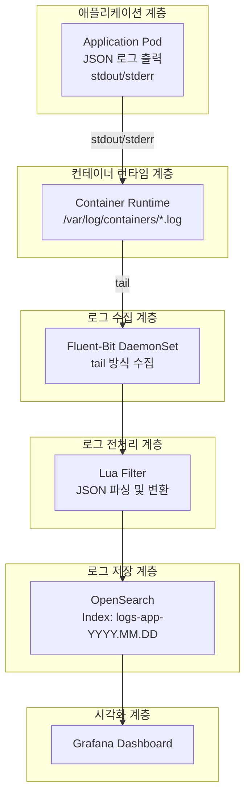

# Observability Platform 사용자 가이드

> **버전**: 1.0.0
> **최종 업데이트**: 2025-01-15
> **대상 독자**: 애플리케이션 개발자 (Kubernetes 초급)
> **예상 소요 시간**: 30분

## 목차

1. [개요](#1-개요)
2. [아키텍처 이해](#2-아키텍처-이해)
3. [배포 전 설정](#3-배포-전-설정)
4. [배포 방법](#4-배포-방법)
5. [배포 후 검증](#5-배포-후-검증)
6. [트러블슈팅](#6-트러블슈팅)
7. [FAQ 및 Best Practices](#7-faq-및-best-practices)

---

## 1. 개요

### 1.1 사전 요구사항

이 가이드를 진행하기 전에 다음 사항을 숙지해야 합니다:

- ✅ 기본적인 YAML 문법 이해
- ✅ 애플리케이션 로깅 라이브러리 사용 경험 (SLF4J, Python logging 등)
- ✅ kubectl 기본 명령어 숙지 (`get`, `describe`, `logs`)

### 1.2 Observability 플랫폼이란?

본 플랫폼은 베어메탈 Kubernetes 환경에서 운영되는 **통합 모니터링 시스템**입니다.

**주요 구성요소:**

| 구분 | 스택 | 목적 |
|-----|------|-----|
| **메트릭 수집** | kube-prometheus-stack + Thanos | 애플리케이션 성능 지표 수집 및 장기 보관 |
| **로그 수집** | OpenSearch + Fluent-Bit | 애플리케이션 로그 수집 및 검색 |
| **시각화** | Grafana | 통합 대시보드 및 알림 |

**왜 Observability가 필요한가?**

- 애플리케이션의 **성능 문제**를 실시간으로 파악
- 에러 발생 시 **원인 분석**을 위한 로그 추적
- 사용자 행동 패턴 분석 및 **비즈니스 인사이트** 도출
- **SLA 준수** 및 장애 대응 시간 단축

---

## 2. 아키텍처 이해

### 2.1 Metric 수집 아키텍처

**전체 흐름:**



> 📌 **참고**: 전체 다이어그램은 [diagrams/metric-architecture.mmd](diagrams/metric-architecture.mmd) 참조

**동작 원리:**

1. **애플리케이션**이 `/metrics` 엔드포인트에서 메트릭 노출
2. **ServiceMonitor** (Kubernetes Custom Resource)가 수집 대상 정의
3. **Prometheus Operator**가 ServiceMonitor를 감지하고 Prometheus 설정 자동 생성
4. **Prometheus**가 30초마다 메트릭 수집 (scrape)
5. **Thanos**가 메트릭을 S3에 업로드하여 장기 보관
6. **Grafana**에서 PromQL로 메트릭 조회 및 시각화

**핵심 용어:**

- **ServiceMonitor**: Prometheus가 메트릭을 수집할 Service를 정의하는 Kubernetes 리소스
- **PodMonitor**: Service 없이 Pod에서 직접 메트릭을 수집할 때 사용
- **PromQL**: Prometheus Query Language (메트릭 조회 언어)
- **Scrape**: Prometheus가 메트릭 엔드포인트에서 데이터를 가져오는 행위
- **Thanos**: Prometheus의 장기 보관 및 고가용성을 위한 확장 시스템

### 2.2 Log 수집 아키텍처

**전체 흐름:**



> 📌 **참고**: 전체 다이어그램은 [diagrams/log-architecture.mmd](diagrams/log-architecture.mmd) 참조

**동작 원리:**

1. **애플리케이션**이 JSON 형식으로 `stdout/stderr`에 로그 출력
2. **Container Runtime**이 로그를 `/var/log/containers/` 디렉토리에 파일로 저장
3. **Fluent-Bit** (DaemonSet)이 tail 방식으로 실시간 수집
4. **Lua Filter**로 JSON 파싱, 필드 추출/변환, 불필요한 필드 제거
5. **OpenSearch**에 인덱싱 (Index Pattern: `logs-app-YYYY.MM.DD`)
6. **Grafana**에서 로그 검색 및 시각화

**핵심 용어:**

- **Fluent-Bit**: 경량 로그 수집기 (각 노드에서 DaemonSet으로 실행)
- **Lua Filter**: 로그 전처리를 위한 스크립트 (필드 변환, 파싱 등)
- **OpenSearch**: Elasticsearch 호환 검색 엔진
- **Index Pattern**: 로그가 저장되는 인덱스 명명 규칙 (날짜별 분리)
- **Multiline**: 여러 줄에 걸친 로그 (Java Exception 등)를 하나의 이벤트로 처리

---

## 3. 배포 전 설정

### 3.1 Metric 수집을 위한 설정

#### 3.1.1 메트릭 엔드포인트 노출

애플리케이션이 Prometheus 포맷의 메트릭을 노출해야 합니다.

**Java (Spring Boot) 예제:**

```yaml
# application.yml
management:
  endpoints:
    web:
      exposure:
        include: health,info,prometheus
  metrics:
    export:
      prometheus:
        enabled: true
```

**Python (FastAPI) 예제:**

```python
from prometheus_client import Counter, Histogram, generate_latest
from fastapi import FastAPI

app = FastAPI()

# 메트릭 정의
request_count = Counter('http_requests_total', 'Total HTTP requests', ['method', 'endpoint'])
request_duration = Histogram('http_request_duration_seconds', 'HTTP request duration')

@app.get("/metrics")
def metrics():
    return Response(generate_latest(), media_type="text/plain")
```

**검증:**

```bash
# 로컬에서 메트릭 엔드포인트 확인
curl http://localhost:9090/metrics

# 출력 예제:
# http_requests_total{method="GET",endpoint="/api/users"} 1234
# http_request_duration_seconds_bucket{le="0.1"} 456
```

#### 3.1.2 ServiceMonitor 작성

**기본 템플릿:**

```yaml
apiVersion: monitoring.coreos.com/v1
kind: ServiceMonitor
metadata:
  name: myapp-metrics
  namespace: myteam-prod
  labels:
    # 필수: Prometheus Operator가 감지하기 위한 레이블
    release: kube-prometheus-stack
    # 필수: 애플리케이션 식별
    app: myapp
    # 필수: 팀 식별 (메트릭 필터링에 사용)
    service-team: myteam
spec:
  selector:
    matchLabels:
      app: myapp
      service-team: myteam
  endpoints:
    - port: metrics          # Service의 포트 이름
      path: /metrics         # 메트릭 경로
      interval: 30s          # 수집 간격
      scrapeTimeout: 10s     # 타임아웃
```

> 📌 **전체 예제**: [examples/servicemonitor-example.yaml](examples/servicemonitor-example.yaml)

**PodMonitor 사용 시나리오:**

ServiceMonitor 대신 PodMonitor를 사용하는 경우:

- StatefulSet, DaemonSet 등 Service를 거치지 않는 경우
- Pod마다 다른 메트릭을 수집해야 하는 경우

> 📌 **PodMonitor 예제**: [examples/podmonitor-example.yaml](examples/podmonitor-example.yaml)

#### 3.1.3 Deployment + Service 설정

**필수 레이블 설정:**

```yaml
apiVersion: apps/v1
kind: Deployment
metadata:
  name: myapp
  namespace: myteam-prod
  labels:
    app: myapp              # 필수
    service-team: myteam    # 필수
spec:
  template:
    metadata:
      labels:
        app: myapp          # 필수 (Service selector와 일치)
        service-team: myteam # 필수
    spec:
      containers:
        - name: myapp
          ports:
            - name: metrics  # ServiceMonitor의 port와 일치
              containerPort: 9090
---
apiVersion: v1
kind: Service
metadata:
  name: myapp-metrics
  namespace: myteam-prod
  labels:
    app: myapp              # 필수 (ServiceMonitor selector와 일치)
    service-team: myteam    # 필수
spec:
  selector:
    app: myapp
    service-team: myteam
  ports:
    - name: metrics         # ServiceMonitor의 endpoints.port와 일치
      port: 9090
      targetPort: metrics
```

> 📌 **전체 예제**: [examples/deployment-with-metrics.yaml](examples/deployment-with-metrics.yaml)

**레이블 네이밍 규칙:**

| 레이블 | 형식 | 예시 | 설명 |
|--------|------|------|------|
| `app` | `<애플리케이션명>` | `user-service` | 애플리케이션 식별자 (소문자, 하이픈) |
| `service-team` | `<팀명>` | `platform-team` | 서비스 팀 식별자 (소문자, 하이픈) |
| `environment` | `prod\|staging\|dev` | `prod` | 환경 구분 (선택사항) |

#### 3.1.4 표준 Metric Exporter 활용 (Spark, Trino, Airflow 등)

많은 데이터 처리 프레임워크는 **기본 제공 Metric Exporter**를 통해 Prometheus 포맷의 메트릭을 자동으로 노출합니다. 별도의 애플리케이션 코드 수정 없이 설정만으로 메트릭 수집이 가능합니다.

##### Apache Spark Metrics

**Spark 3.x 기본 제공 메트릭:**

Spark는 `spark.metrics.conf`를 통해 Prometheus Pushgateway 또는 Servlet 방식으로 메트릭을 노출할 수 있습니다.

**방법 1: Prometheus Servlet (권장)**

```properties
# conf/metrics.properties
*.sink.prometheusServlet.class=org.apache.spark.metrics.sink.PrometheusServlet
*.sink.prometheusServlet.path=/metrics
*.source.jvm.class=org.apache.spark.metrics.source.JvmSource

# Driver 메트릭
spark.metrics.conf.*.sink.prometheusServlet.class=org.apache.spark.metrics.sink.PrometheusServlet
spark.metrics.conf.*.sink.prometheusServlet.path=/metrics/driver/prometheus

# Executor 메트릭
spark.metrics.conf.executor.sink.prometheusServlet.class=org.apache.spark.metrics.sink.PrometheusServlet
spark.metrics.conf.executor.sink.prometheusServlet.path=/metrics/executors/prometheus
```

**Spark on Kubernetes 설정:**

```yaml
apiVersion: v1
kind: Pod
metadata:
  name: spark-driver
  labels:
    app: spark
    service-team: data-team
    spark-role: driver
spec:
  containers:
    - name: spark
      image: apache/spark:3.5.0
      ports:
        # Spark UI
        - name: ui
          containerPort: 4040
        # Prometheus 메트릭
        - name: metrics
          containerPort: 4040
      env:
        - name: SPARK_METRICS_CONF
          value: /opt/spark/conf/metrics.properties
---
apiVersion: v1
kind: Service
metadata:
  name: spark-driver-metrics
  namespace: data-team
  labels:
    app: spark
    service-team: data-team
spec:
  selector:
    app: spark
    spark-role: driver
  ports:
    - name: metrics
      port: 4040
      targetPort: 4040
---
apiVersion: monitoring.coreos.com/v1
kind: ServiceMonitor
metadata:
  name: spark-driver-metrics
  namespace: data-team
  labels:
    release: kube-prometheus-stack
    app: spark
    service-team: data-team
spec:
  selector:
    matchLabels:
      app: spark
      service-team: data-team
  endpoints:
    - port: metrics
      path: /metrics/driver/prometheus
      interval: 30s
```

> 📌 **전체 예제**: [examples/spark-metrics.yaml](examples/spark-metrics.yaml)

**주요 Spark 메트릭:**

| 메트릭 이름 | 설명 | 활용 |
|-----------|------|------|
| `metrics_executor_runTime` | Executor 실행 시간 | 작업 성능 모니터링 |
| `metrics_executor_shuffleRead_readBytes` | Shuffle Read 바이트 | 데이터 전송 병목 파악 |
| `metrics_jvm_heap_used` | JVM Heap 사용량 | 메모리 부족 감지 |
| `metrics_driver_DAGScheduler_stage_failedStages` | 실패한 Stage 수 | 작업 실패율 추적 |

##### Trino (PrestoSQL) Metrics

**Trino 기본 제공 JMX Exporter:**

Trino는 JMX 메트릭을 기본적으로 노출하며, `jmx_exporter`를 통해 Prometheus 포맷으로 변환할 수 있습니다.

**Trino Coordinator 설정:**

```yaml
apiVersion: apps/v1
kind: Deployment
metadata:
  name: trino-coordinator
  namespace: data-team
spec:
  template:
    metadata:
      labels:
        app: trino
        component: coordinator
        service-team: data-team
    spec:
      containers:
        - name: trino
          image: trinodb/trino:435
          ports:
            # Trino UI
            - name: http
              containerPort: 8080
            # JMX Exporter
            - name: metrics
              containerPort: 9090
          env:
            # JMX Exporter 활성화
            - name: JAVA_TOOL_OPTIONS
              value: "-javaagent:/opt/jmx_exporter/jmx_prometheus_javaagent.jar=9090:/opt/jmx_exporter/config.yaml"
          volumeMounts:
            - name: jmx-exporter-config
              mountPath: /opt/jmx_exporter
      volumes:
        - name: jmx-exporter-config
          configMap:
            name: trino-jmx-exporter-config
---
apiVersion: v1
kind: ConfigMap
metadata:
  name: trino-jmx-exporter-config
  namespace: data-team
data:
  config.yaml: |
    lowercaseOutputName: true
    lowercaseOutputLabelNames: true
    rules:
      # Query Manager 메트릭
      - pattern: 'trino.execution<name=QueryManager><>(.+):'
        name: trino_query_manager_$1
      # Memory Pool 메트릭
      - pattern: 'trino.memory<type=(.+), name=(.+)><>(.+):'
        name: trino_memory_$1_$3
        labels:
          pool: $2
---
apiVersion: v1
kind: Service
metadata:
  name: trino-coordinator-metrics
  namespace: data-team
  labels:
    app: trino
    component: coordinator
    service-team: data-team
spec:
  selector:
    app: trino
    component: coordinator
  ports:
    - name: metrics
      port: 9090
      targetPort: 9090
---
apiVersion: monitoring.coreos.com/v1
kind: ServiceMonitor
metadata:
  name: trino-coordinator-metrics
  namespace: data-team
  labels:
    release: kube-prometheus-stack
    app: trino
    service-team: data-team
spec:
  selector:
    matchLabels:
      app: trino
      component: coordinator
  endpoints:
    - port: metrics
      path: /metrics
      interval: 30s
```

> 📌 **전체 예제**: [examples/trino-metrics.yaml](examples/trino-metrics.yaml)

**주요 Trino 메트릭:**

| 메트릭 이름 | 설명 | 활용 |
|-----------|------|------|
| `trino_query_manager_runningqueries` | 실행 중인 쿼리 수 | 부하 모니터링 |
| `trino_query_manager_failedqueries_total` | 실패한 쿼리 수 | 쿼리 안정성 추적 |
| `trino_memory_cluster_pool_general_reservedbytes` | 예약된 메모리 | 메모리 부족 예측 |
| `trino_execution_executor_taskexecutor_queuedtaskcount` | 대기 중인 태스크 수 | 처리 지연 감지 |

##### Apache Airflow Metrics

**Airflow 2.x StatsD + Prometheus Exporter:**

Airflow는 StatsD 메트릭을 생성하며, `statsd_exporter`를 통해 Prometheus 포맷으로 변환합니다.

**Airflow 설정 (airflow.cfg):**

```ini
[metrics]
statsd_on = True
statsd_host = localhost
statsd_port = 8125
statsd_prefix = airflow
```

**StatsD Exporter + Airflow 통합 배포:**

```yaml
apiVersion: apps/v1
kind: Deployment
metadata:
  name: airflow-webserver
  namespace: data-team
spec:
  template:
    metadata:
      labels:
        app: airflow
        component: webserver
        service-team: data-team
    spec:
      containers:
        # Airflow Webserver
        - name: airflow
          image: apache/airflow:2.8.0
          ports:
            - name: http
              containerPort: 8080
          env:
            - name: AIRFLOW__METRICS__STATSD_ON
              value: "True"
            - name: AIRFLOW__METRICS__STATSD_HOST
              value: "localhost"
            - name: AIRFLOW__METRICS__STATSD_PORT
              value: "8125"

        # StatsD Exporter (Sidecar)
        - name: statsd-exporter
          image: prom/statsd-exporter:v0.26.0
          ports:
            - name: metrics
              containerPort: 9102
          args:
            - --statsd.listen-udp=:8125
            - --statsd.mapping-config=/etc/statsd-exporter/mapping.yaml
          volumeMounts:
            - name: statsd-mapping
              mountPath: /etc/statsd-exporter
      volumes:
        - name: statsd-mapping
          configMap:
            name: airflow-statsd-mapping
---
apiVersion: v1
kind: ConfigMap
metadata:
  name: airflow-statsd-mapping
  namespace: data-team
data:
  mapping.yaml: |
    mappings:
      # DAG 실행 메트릭
      - match: "airflow.dag_processing.last_duration.*"
        name: "airflow_dag_processing_duration_seconds"
        labels:
          dag_id: "$1"
      # Task 성공/실패 메트릭
      - match: "airflow.ti_successes"
        name: "airflow_task_instance_successes_total"
      - match: "airflow.ti_failures"
        name: "airflow_task_instance_failures_total"
---
apiVersion: v1
kind: Service
metadata:
  name: airflow-webserver-metrics
  namespace: data-team
  labels:
    app: airflow
    component: webserver
    service-team: data-team
spec:
  selector:
    app: airflow
    component: webserver
  ports:
    - name: metrics
      port: 9102
      targetPort: 9102
---
apiVersion: monitoring.coreos.com/v1
kind: ServiceMonitor
metadata:
  name: airflow-webserver-metrics
  namespace: data-team
  labels:
    release: kube-prometheus-stack
    app: airflow
    service-team: data-team
spec:
  selector:
    matchLabels:
      app: airflow
      component: webserver
  endpoints:
    - port: metrics
      path: /metrics
      interval: 30s
```

> 📌 **전체 예제**: [examples/airflow-metrics.yaml](examples/airflow-metrics.yaml)

**주요 Airflow 메트릭:**

| 메트릭 이름 | 설명 | 활용 |
|-----------|------|------|
| `airflow_dag_processing_duration_seconds` | DAG 파싱 시간 | DAG 복잡도 모니터링 |
| `airflow_task_instance_successes_total` | 성공한 Task 수 | 작업 성공률 추적 |
| `airflow_task_instance_failures_total` | 실패한 Task 수 | 작업 안정성 모니터링 |
| `airflow_scheduler_heartbeat` | Scheduler 상태 | Scheduler 장애 감지 |
| `airflow_executor_running_tasks` | 실행 중인 Task 수 | 부하 모니터링 |

##### 기타 표준 Exporter

**자주 사용하는 Exporter 목록:**

| 시스템 | Exporter | 메트릭 포트 | 비고 |
|--------|----------|------------|------|
| **Kafka** | JMX Exporter | 9090 | JMX 메트릭 변환 |
| **Cassandra** | JMX Exporter | 9090 | JMX 메트릭 변환 |
| **Redis** | redis_exporter | 9121 | 공식 exporter |
| **PostgreSQL** | postgres_exporter | 9187 | 공식 exporter |
| **MongoDB** | mongodb_exporter | 9216 | 커뮤니티 exporter |
| **Elasticsearch** | elasticsearch_exporter | 9114 | 공식 exporter |
| **NGINX** | nginx-prometheus-exporter | 9113 | 공식 exporter |
| **MySQL** | mysqld_exporter | 9104 | 공식 exporter |

**일반적인 ServiceMonitor 패턴:**

```yaml
apiVersion: monitoring.coreos.com/v1
kind: ServiceMonitor
metadata:
  name: <system>-metrics
  namespace: <namespace>
  labels:
    release: kube-prometheus-stack
    app: <system>
    service-team: <team>
spec:
  selector:
    matchLabels:
      app: <system>
  endpoints:
    - port: metrics          # Service의 메트릭 포트
      path: /metrics         # 일반적으로 /metrics
      interval: 30s
      scrapeTimeout: 10s
```

**Exporter 선택 가이드:**

1. **공식 Exporter 우선 사용**
   - 시스템 제공 공식 exporter가 있다면 우선 사용
   - 예: PostgreSQL → postgres_exporter

2. **JMX 기반 시스템은 JMX Exporter 사용**
   - Kafka, Cassandra, Hadoop 등 Java 기반 시스템
   - `jmx_prometheus_javaagent.jar` 사용

3. **커뮤니티 Exporter 검증**
   - GitHub stars, 유지보수 활동 확인
   - Prometheus 공식 문서의 권장 목록 참조

> 📌 **Prometheus Exporter 목록**: https://prometheus.io/docs/instrumenting/exporters/

### 3.2 Log 수집을 위한 설정

#### 3.2.1 로그 포맷 가이드

**JSON 형식 권장:**

Fluent-Bit이 로그를 파싱하기 쉽도록 **JSON 형식**으로 출력하는 것을 강력히 권장합니다.

**필수 필드:**

```json
{
  "timestamp": "2025-01-15T08:30:45.123Z",  // ISO 8601 형식
  "level": "INFO",                           // DEBUG/INFO/WARN/ERROR
  "app": "myapp",                            // 애플리케이션 이름
  "service-team": "myteam",                  // 팀 식별자
  "logger": "com.mycompany.UserService",     // 로거 이름
  "message": "User login successful"         // 로그 메시지
}
```

**권장 추가 필드:**

```json
{
  "environment": "production",       // 환경
  "userId": "user123",               // 사용자 컨텍스트
  "correlation_id": "req_abc123",    // 분산 추적용
  "error_type": "ValidationError",   // 에러 분류
  "stack_trace": ["line1", "line2"]  // Exception 상세 (배열)
}
```

#### 3.2.2 Java 로그 설정

**Logback + Logstash Encoder:**

```xml
<!-- src/main/resources/logback.xml -->
<configuration>
    <appender name="CONSOLE" class="ch.qos.logback.core.ConsoleAppender">
        <encoder class="net.logstash.logback.encoder.LogstashEncoder">
            <customFields>{"app":"myapp","service-team":"myteam"}</customFields>
            <timestampPattern>yyyy-MM-dd'T'HH:mm:ss.SSS'Z'</timestampPattern>
        </encoder>
    </appender>

    <root level="INFO">
        <appender-ref ref="CONSOLE" />
    </root>
</configuration>
```

> 📌 **전체 예제**: [examples/log-format-java.java](examples/log-format-java.java)

**Exception Stacktrace 처리:**

Java Exception은 자동으로 `stack_trace` 배열로 변환됩니다:

```json
{
  "timestamp": "2025-01-15T08:30:46.456Z",
  "level": "ERROR",
  "message": "User not found",
  "stack_trace": [
    "com.mycompany.UserNotFoundException: User not found",
    "  at com.mycompany.UserService.fetchUser(UserService.java:45)",
    "  at com.mycompany.UserController.getUser(UserController.java:20)"
  ]
}
```

#### 3.2.3 Python 로그 설정

**python-json-logger 사용:**

```python
from pythonjsonlogger import jsonlogger
import logging

# JSON 포맷터 설정
formatter = jsonlogger.JsonFormatter(
    '%(timestamp)s %(level)s %(name)s %(message)s'
)

handler = logging.StreamHandler()
handler.setFormatter(formatter)

logger = logging.getLogger(__name__)
logger.addHandler(handler)
logger.setLevel(logging.INFO)

# 구조화된 로그 출력
logger.info(
    "User login successful",
    extra={
        'userId': 'user123',
        'ip_address': '192.168.1.100'
    }
)
```

> 📌 **전체 예제**: [examples/log-format-python.py](examples/log-format-python.py)

#### 3.2.4 로그 레벨 가이드

| 레벨 | 사용 시나리오 | 예시 |
|------|---------------|------|
| **DEBUG** | 상세한 디버깅 정보 (개발 환경) | `logger.debug("Cache hit for key: user123")` |
| **INFO** | 일반적인 정보성 메시지 | `logger.info("User login successful")` |
| **WARN** | 경고 (잠재적 문제, 서비스는 계속) | `logger.warn("API rate limit approaching: 95/100")` |
| **ERROR** | 에러 (기능 실패, 복구 가능) | `logger.error("Failed to send email", exception)` |
| **AUDIT** | 감사 로그 (보안/컴플라이언스) | `logger.info("Password changed", extra={'log_type': 'audit'})` |

**프로덕션 환경 권장사항:**

- ✅ 기본 로그 레벨: `INFO`
- ✅ 중요 패키지만 `DEBUG` 활성화 (성능 영향 고려)
- ❌ 전체 애플리케이션 `DEBUG` 사용 금지 (로그 폭증)

#### 3.2.5 민감정보 마스킹

**절대 로깅하지 말아야 할 정보:**

- ❌ 비밀번호
- ❌ API 키, 토큰
- ❌ 신용카드 전체 번호
- ❌ 주민등록번호, 여권번호

**마스킹 예제:**

```java
// ❌ 잘못된 예
logger.info("Payment processed, card={}", creditCardNumber);

// ✅ 올바른 예
String masked = "****-****-****-" + creditCardNumber.substring(12);
logger.info("Payment processed, card={}", masked);
```

> 📌 **JSON 로그 예제**: [examples/log-format-json-example.json](examples/log-format-json-example.json)

---

## 4. 배포 방법

### 4.1 GitOps 기반 배포 (ArgoCD)

**권장 방법** - 가장 안전하고 추적 가능한 배포 방식

**1. Git Repository 구조:**

```
myapp/
├── base/
│   ├── deployment.yaml
│   ├── service.yaml
│   ├── servicemonitor.yaml
│   └── kustomization.yaml
└── overlays/
    └── production/
        └── kustomization.yaml
```

**2. ArgoCD Application 생성:**

```yaml
apiVersion: argoproj.io/v1alpha1
kind: Application
metadata:
  name: myapp
  namespace: argocd
spec:
  project: default
  source:
    repoURL: https://github.com/myorg/myapp-deploy
    targetRevision: main
    path: overlays/production
  destination:
    server: https://kubernetes.default.svc
    namespace: myteam-prod
  syncPolicy:
    automated:
      prune: true
      selfHeal: true
```

**3. ArgoCD UI에서 확인:**

1. ArgoCD UI 접속: `https://argocd.example.com`
2. `myapp` Application 클릭
3. Sync 상태 확인
4. ServiceMonitor 리소스 확인

### 4.2 Jenkins CI/CD 파이프라인 배포

**Jenkinsfile 예제:**

```groovy
pipeline {
    agent any

    stages {
        stage('Build') {
            steps {
                sh 'docker build -t myapp:${BUILD_NUMBER} .'
            }
        }

        stage('Deploy') {
            steps {
                sh '''
                    kubectl apply -f deployment.yaml
                    kubectl apply -f service.yaml
                    kubectl apply -f servicemonitor.yaml
                '''
            }
        }

        stage('Verify') {
            steps {
                sh '''
                    kubectl rollout status deployment/myapp -n myteam-prod
                    kubectl get servicemonitor myapp-metrics -n myteam-prod
                '''
            }
        }
    }
}
```

### 4.3 kubectl을 통한 직접 배포

**빠른 테스트용** - 프로덕션 환경에서는 비권장

```bash
# 1. 네임스페이스 확인
kubectl get namespace myteam-prod

# 2. 리소스 배포
kubectl apply -f deployment.yaml
kubectl apply -f service.yaml
kubectl apply -f servicemonitor.yaml

# 3. 배포 상태 확인
kubectl rollout status deployment/myapp -n myteam-prod
```

---

## 5. 배포 후 검증

### 5.1 Metric 수집 확인

#### 5.1.1 kubectl로 리소스 확인

**1. ServiceMonitor 확인:**

```bash
kubectl get servicemonitor -n myteam-prod

# 출력 예제:
# NAME             AGE
# myapp-metrics    5m
```

**상세 정보 확인:**

```bash
kubectl describe servicemonitor myapp-metrics -n myteam-prod

# 확인 사항:
# - Labels: release=kube-prometheus-stack 포함 여부
# - Selector: app, service-team 레이블 일치 여부
# - Endpoints: port, interval 설정 확인
```

**2. Service 확인:**

```bash
kubectl get svc myapp-metrics -n myteam-prod

# 출력 예제:
# NAME             TYPE        CLUSTER-IP      EXTERNAL-IP   PORT(S)    AGE
# myapp-metrics    ClusterIP   10.96.123.45    <none>        9090/TCP   5m
```

**Service 엔드포인트 확인:**

```bash
kubectl get endpoints myapp-metrics -n myteam-prod

# 출력 예제:
# NAME             ENDPOINTS                          AGE
# myapp-metrics    10.244.1.10:9090,10.244.2.20:9090  5m
#                  ^^^ Pod IP가 있어야 정상
```

#### 5.1.2 Prometheus UI에서 Target 확인

**1. Prometheus UI 접속:**

```bash
# Port-forward로 로컬 접속
kubectl port-forward -n monitor svc/kube-prometheus-stack-prometheus 9090:9090

# 브라우저에서 http://localhost:9090 접속
```

**2. Targets 페이지 확인:**

1. 상단 메뉴에서 **Status → Targets** 클릭
2. `serviceMonitor/myteam-prod/myapp-metrics` 검색
3. State 확인:
   - ✅ **UP**: 정상 수집 중
   - ❌ **DOWN**: 수집 실패 (에러 메시지 확인)

**정상 상태 예시:**

```
Endpoint: http://10.244.1.10:9090/metrics
State: UP
Labels: app="myapp", service_team="myteam", namespace="myteam-prod"
Last Scrape: 5s ago
Scrape Duration: 123ms
```

**비정상 상태 예시:**

```
Endpoint: http://10.244.1.10:9090/metrics
State: DOWN
Error: Get "http://10.244.1.10:9090/metrics": context deadline exceeded
Last Scrape: 1m ago
```

> ⚠️ **DOWN 상태인 경우**: [6.1 트러블슈팅](#61-metric-수집-실패) 참조

#### 5.1.3 Grafana에서 메트릭 쿼리 확인

**1. Grafana UI 접속:**

```bash
# Port-forward로 로컬 접속
kubectl port-forward -n monitor svc/kube-prometheus-stack-grafana 3000:80

# 브라우저에서 http://localhost:3000 접속
# 기본 로그인: admin / prom-operator
```

**2. Explore 페이지에서 쿼리:**

1. 좌측 메뉴에서 **Explore** (나침반 아이콘) 클릭
2. Data source: **Prometheus** 선택
3. PromQL 쿼리 입력:

```promql
# 애플리케이션 메트릭이 수집되는지 확인
up{app="myapp", service_team="myteam"}

# 결과:
# up{app="myapp", instance="10.244.1.10:9090", job="myapp-metrics", namespace="myteam-prod", service_team="myteam"} 1
#                                                                                                                  ^^^ 1이면 정상
```

**추가 쿼리 예제:**

```promql
# HTTP 요청 수 (애플리케이션이 노출하는 메트릭)
rate(http_requests_total{app="myapp"}[5m])

# HTTP 요청 지연 시간 (p95)
histogram_quantile(0.95, rate(http_request_duration_seconds_bucket{app="myapp"}[5m]))

# 메모리 사용량
container_memory_usage_bytes{pod=~"myapp-.*"}
```

**3. 대시보드 확인:**

1. 좌측 메뉴에서 **Dashboards** 클릭
2. **Kubernetes / Compute Resources / Namespace (Pods)** 선택
3. Namespace: `myteam-prod` 선택
4. Pod: `myapp-*` 필터링

### 5.2 Log 수집 확인

#### 5.2.1 kubectl logs로 컨테이너 로그 확인

**1. Pod 로그 직접 확인:**

```bash
# Pod 목록 조회
kubectl get pods -n myteam-prod -l app=myapp

# 특정 Pod 로그 확인
kubectl logs -n myteam-prod myapp-7d9f8c6b5-abc12

# 실시간 로그 스트리밍
kubectl logs -n myteam-prod myapp-7d9f8c6b5-abc12 -f
```

**JSON 로그 출력 확인:**

```bash
kubectl logs -n myteam-prod myapp-7d9f8c6b5-abc12 --tail=1

# 출력 예제 (JSON 형식이어야 함):
# {"timestamp":"2025-01-15T08:30:45.123Z","level":"INFO","app":"myapp","service-team":"myteam","message":"User login successful"}
```

> ⚠️ **JSON이 아닌 경우**: Fluent-Bit이 파싱하지 못하므로 [3.2 로그 포맷 설정](#32-log-수집을-위한-설정) 참조

#### 5.2.2 Fluent-Bit 전처리 상태 확인

**1. Fluent-Bit Pod 확인:**

```bash
# Fluent-Bit Pod 목록 (DaemonSet)
kubectl get pods -n monitor -l app.kubernetes.io/name=fluent-bit

# 출력 예제:
# NAME                READY   STATUS    RESTARTS   AGE
# fluent-bit-abc12    1/1     Running   0          10m
# fluent-bit-def34    1/1     Running   0          10m
```

**2. Fluent-Bit 로그 확인:**

```bash
kubectl logs -n monitor fluent-bit-abc12 --tail=50

# 정상 처리 로그:
# [info] [input:tail:tail.0] inotify_fs_add(): inode=123456 watch_fd=1 name=/var/log/containers/myapp-7d9f8c6b5-abc12_myteam-prod_myapp-abc123.log
# [info] [filter:lua:lua.0] parsed log: {"timestamp":"2025-01-15T08:30:45.123Z","level":"INFO",...}

# 에러 로그:
# [error] [filter:lua:lua.0] failed to parse JSON: invalid character
```

> ⚠️ **파싱 에러 발생 시**: JSON 포맷 오류 → 애플리케이션 로그 설정 재확인

#### 5.2.3 OpenSearch에서 로그 검색 확인

**1. OpenSearch Dashboards 접속:**

```bash
# Port-forward로 로컬 접속
kubectl port-forward -n monitor svc/opensearch-dashboards 5601:5601

# 브라우저에서 http://localhost:5601 접속
```

**2. Index Pattern 생성 (최초 1회):**

1. 좌측 메뉴에서 **Management → Stack Management** 클릭
2. **Index Patterns** 선택
3. **Create index pattern** 클릭
4. Index pattern name: `logs-*`
5. Time field: `@timestamp` 또는 `timestamp` 선택
6. **Create index pattern** 클릭

**3. Discover 페이지에서 로그 검색:**

1. 좌측 메뉴에서 **Discover** 클릭
2. Index pattern: `logs-*` 선택
3. 검색 쿼리 입력:

```
# 애플리케이션별 필터링
app:"myapp" AND service-team:"myteam"

# 로그 레벨 필터링
app:"myapp" AND level:"ERROR"

# 시간 범위: 우측 상단에서 Last 15 minutes 선택
```

**4. 로그 확인:**

- 로그가 표시되면 ✅ **정상**
- 로그가 없으면 ❌ **수집 실패** → [6.2 트러블슈팅](#62-log-수집-실패) 참조

#### 5.2.4 Grafana에서 로그 검색 확인

**1. Grafana Explore 페이지:**

1. Grafana UI 접속 (http://localhost:3000)
2. 좌측 메뉴에서 **Explore** 클릭
3. Data source: **OpenSearch** 선택

**2. 로그 쿼리:**

```json
{
  "query": {
    "bool": {
      "must": [
        { "match": { "app": "myapp" } },
        { "match": { "service-team": "myteam" } }
      ]
    }
  }
}
```

**3. 로그 스트리밍:**

- **Live** 버튼 클릭하여 실시간 로그 확인

---

## 6. 트러블슈팅

### 6.1 Metric 수집 실패

#### 6.1.1 ServiceMonitor가 감지되지 않는 경우

**증상:**

- Prometheus Targets 페이지에 ServiceMonitor가 나타나지 않음

**원인 및 해결:**

**1. `release` 레이블 누락:**

```bash
kubectl get servicemonitor myapp-metrics -n myteam-prod -o yaml | grep release

# 출력이 없으면 레이블 추가:
kubectl label servicemonitor myapp-metrics -n myteam-prod release=kube-prometheus-stack
```

**2. Prometheus Operator의 serviceMonitorSelector 확인:**

```bash
kubectl get prometheus -n monitor -o yaml | grep -A 5 serviceMonitorSelector

# 출력 예제:
#   serviceMonitorSelector:
#     matchLabels:
#       release: kube-prometheus-stack
```

> 📌 **참고**: serviceMonitorSelector가 `{}` (빈 값)이면 모든 ServiceMonitor를 감지합니다.

**3. Prometheus Operator 로그 확인:**

```bash
kubectl logs -n monitor -l app.kubernetes.io/name=prometheus-operator --tail=50

# ServiceMonitor 감지 로그:
# level=info msg="ServiceMonitor added" servicemonitor=myteam-prod/myapp-metrics
```

#### 6.1.2 레이블이 누락된 경우

**증상:**

- Prometheus Targets에 나타나지만 메트릭 조회 시 `app`, `service_team` 레이블이 없음

**원인:**

- ServiceMonitor의 `selector`가 잘못 설정됨
- Service의 레이블이 없음

**해결:**

```bash
# Service 레이블 확인
kubectl get svc myapp-metrics -n myteam-prod --show-labels

# 레이블 추가
kubectl label svc myapp-metrics -n myteam-prod app=myapp service-team=myteam
```

#### 6.1.3 Prometheus Target이 DOWN 상태인 경우

**증상:**

- Prometheus Targets 페이지에서 State가 **DOWN**
- Error 메시지: `context deadline exceeded` 또는 `connection refused`

**원인 및 해결:**

**1. 메트릭 엔드포인트가 없음:**

```bash
# Pod IP 확인
kubectl get pod myapp-7d9f8c6b5-abc12 -n myteam-prod -o wide
# IP: 10.244.1.10

# 메트릭 엔드포인트 직접 테스트
kubectl exec -n myteam-prod myapp-7d9f8c6b5-abc12 -- curl http://localhost:9090/metrics

# 출력이 없으면 애플리케이션 설정 확인
```

**2. Service의 포트 이름 불일치:**

```bash
kubectl get svc myapp-metrics -n myteam-prod -o yaml | grep -A 5 ports

# 출력:
#   ports:
#   - name: metrics    <--- ServiceMonitor의 endpoints.port와 일치해야 함
#     port: 9090
#     targetPort: metrics
```

**3. NetworkPolicy로 차단:**

```bash
# NetworkPolicy 확인
kubectl get networkpolicy -n myteam-prod

# Prometheus에서 접근 가능하도록 NetworkPolicy 수정
```

**4. 방화벽 또는 Security Group:**

- 베어메탈 환경에서 노드 간 통신 차단 여부 확인
- 포트 9090이 열려있는지 확인

### 6.2 Log 수집 실패

#### 6.2.1 로그가 OpenSearch에 나타나지 않는 경우

**증상:**

- `kubectl logs`로는 로그가 보이지만 OpenSearch/Grafana에는 없음

**원인 및 해결:**

**1. Fluent-Bit이 로그 파일을 읽지 못함:**

```bash
# Fluent-Bit 로그 확인
kubectl logs -n monitor fluent-bit-abc12 --tail=100 | grep myapp

# 출력에 myapp 로그 파일이 없으면 DaemonSet 재시작
kubectl rollout restart daemonset/fluent-bit -n monitor
```

**2. JSON 파싱 실패:**

```bash
# Fluent-Bit 로그에서 파싱 에러 확인
kubectl logs -n monitor fluent-bit-abc12 --tail=100 | grep error

# 에러 예제:
# [error] [filter:lua:lua.0] failed to parse JSON

# 해결: 애플리케이션 로그를 JSON 형식으로 변경
```

**3. OpenSearch 연결 실패:**

```bash
# Fluent-Bit이 OpenSearch에 전송하는지 확인
kubectl logs -n monitor fluent-bit-abc12 --tail=100 | grep opensearch

# 에러 예제:
# [error] [output:opensearch:opensearch.0] HTTP error 503 - Service Unavailable

# OpenSearch 상태 확인
kubectl get pods -n monitor -l app=opensearch
```

**4. OpenSearch Index 생성 실패:**

```bash
# OpenSearch에 직접 쿼리
kubectl exec -n monitor opensearch-0 -- curl -XGET 'http://localhost:9200/_cat/indices?v'

# logs-* 인덱스가 있는지 확인
# green  open   logs-myapp-2025.01.15  abc123  1   1   1234    0    1.2mb   600kb

# 인덱스가 없으면 Fluent-Bit 설정 확인
```

#### 6.2.2 Multiline 로그가 잘리는 경우

**증상:**

- Java Exception이 여러 로그로 쪼개져서 저장됨

**원인:**

- Fluent-Bit의 Multiline Parser가 설정되지 않음

**해결:**

Fluent-Bit ConfigMap에 Multiline Parser 추가:

```yaml
apiVersion: v1
kind: ConfigMap
metadata:
  name: fluent-bit-config
  namespace: monitor
data:
  parsers.conf: |
    [PARSER]
        Name         multiline-java
        Format       regex
        Regex        /^(?<timestamp>\d{4}-\d{2}-\d{2}T\d{2}:\d{2}:\d{2}\.\d{3}Z)\s+(?<level>[A-Z]+)\s+(?<message>.*)/
        Time_Key     timestamp
        Time_Format  %Y-%m-%dT%H:%M:%S.%LZ

    [MULTILINE_PARSER]
        Name         java-exception
        Type         regex
        Flush_timeout 1000
        Rule         "start_state" "/^(Exception|Error|Caused by)/" "exception"
        Rule         "exception"   "/^\s+at\s+/" "exception"
        Rule         "exception"   "/^$/" "start_state"
```

**Fluent-Bit Input 설정:**

```yaml
[INPUT]
    Name              tail
    Path              /var/log/containers/*_myteam-prod_*.log
    Parser            multiline-java
    Multiline.Parser  java-exception
```

> 📌 **참고**: Multiline Parser 설정 후 Fluent-Bit 재시작 필요

#### 6.2.3 로그 드롭이 발생하는 경우

**증상:**

- 애플리케이션에서 로그를 출력했지만 OpenSearch에 일부만 저장됨
- Fluent-Bit 로그에 `dropped` 또는 `buffer full` 메시지

**원인:**

- Fluent-Bit 버퍼 크기 부족
- OpenSearch 처리 속도 부족

**해결:**

**1. Fluent-Bit 버퍼 크기 증가:**

```yaml
[SERVICE]
    Flush        5
    Daemon       off
    Log_Level    info
    # 버퍼 크기 증가 (기본: 5MB → 32MB)
    storage.path              /var/log/flb-storage/
    storage.sync              normal
    storage.checksum          off
    storage.max_chunks_up     128
    storage.backlog.mem_limit 32M
```

**2. OpenSearch 샤드 및 레플리카 증가:**

```bash
# OpenSearch 설정 확인
kubectl exec -n monitor opensearch-0 -- curl -XGET 'http://localhost:9200/_cluster/settings?pretty'

# 샤드 수 증가
kubectl exec -n monitor opensearch-0 -- curl -XPUT 'http://localhost:9200/_template/logs' -H 'Content-Type: application/json' -d '{
  "index_patterns": ["logs-*"],
  "settings": {
    "number_of_shards": 3,
    "number_of_replicas": 1
  }
}'
```

**3. 로그 샘플링 (애플리케이션 레벨):**

대량 로그를 발생시키는 경우 샘플링 적용:

```java
// 초당 100개 이상 로그 발생 시 샘플링
if (logCounter.incrementAndGet() % 100 == 0) {
    logger.debug("Sampled log: cache access");
}
```

---

## 7. FAQ 및 Best Practices

### 7.1 자주 묻는 질문 (FAQ)

#### Q1. ServiceMonitor를 만들었는데 메트릭이 수집되지 않아요.

**A1:**

1. `release: kube-prometheus-stack` 레이블 확인
2. Prometheus Targets 페이지에서 DOWN 상태 에러 메시지 확인
3. Service Endpoints에 Pod IP가 있는지 확인
4. [6.1 트러블슈팅](#61-metric-수집-실패) 참조

#### Q2. 로그가 JSON이 아닌데 어떻게 해야 하나요?

**A2:**

- **권장**: 애플리케이션을 JSON 로깅으로 변경 ([3.2 로그 포맷 설정](#32-log-수집을-위한-설정))
- **대안**: Fluent-Bit에서 정규표현식 파서 사용 (복잡하고 오류 발생 가능)

#### Q3. DEBUG 로그를 프로덕션에서도 활성화해도 되나요?

**A3:**

- ❌ **비권장**: 성능 저하 및 로그 비용 증가
- ✅ **권장**: 중요한 패키지만 선택적으로 DEBUG 활성화
- ✅ **대안**: 동적 로그 레벨 변경 기능 사용 (Spring Boot Actuator 등)

#### Q4. Thanos는 왜 필요한가요? Prometheus만으로는 안 되나요?

**A4:**

Prometheus 단독 사용 시 한계:

- 로컬 스토리지만 사용 (디스크 부족 시 데이터 손실)
- 기본 보관 기간: 15일
- 단일 장애점 (Single Point of Failure)

Thanos 사용 시 장점:

- S3에 무제한 장기 보관
- 고가용성 (여러 Prometheus 통합)
- 글로벌 쿼리 (멀티 클러스터)

#### Q5. 메트릭과 로그의 correlation_id를 연결하려면 어떻게 하나요?

**A5:**

**1. 애플리케이션에서 correlation_id 생성:**

```java
String correlationId = UUID.randomUUID().toString();
MDC.put("correlation_id", correlationId);

// 메트릭에도 레이블로 추가
Counter counter = Counter.build()
    .name("http_requests_total")
    .labelNames("correlation_id")
    .register();
counter.labels(correlationId).inc();
```

**2. Grafana에서 통합 조회:**

- Explore 페이지에서 메트릭 쿼리 실행 → correlation_id 복사
- OpenSearch 데이터 소스로 전환 → correlation_id로 로그 검색

#### Q6. SLF4J는 무엇이며, Log4j와 어떻게 다른가요?

**A6:**

**SLF4J (Simple Logging Facade for Java)란?**

SLF4J는 로깅 프레임워크의 **추상화 레이어(Facade)**입니다. 실제 로깅 구현체가 아니라 **인터페이스**만 제공합니다.

**왜 SLF4J를 사용하나?**

```
애플리케이션 코드
      ↓ (의존)
   SLF4J API (인터페이스)
      ↓ (바인딩)
실제 구현체 (Logback, Log4j2, JUL 등)
```

**장점:**

1. **구현체 교체 유연성**
   - 코드 변경 없이 로깅 구현체 교체 가능
   - 의존성만 변경하면 됨

2. **라이브러리 호환성**
   - 대부분의 Java 라이브러리가 SLF4J 사용
   - 여러 라이브러리의 로그를 통합 관리

3. **성능 최적화**
   - 파라미터화된 로깅으로 성능 향상
   ```java
   // ❌ 문자열 연결 (로그 레벨과 무관하게 항상 실행)
   logger.debug("User: " + user.getName() + ", Age: " + user.getAge());

   // ✅ SLF4J 파라미터화 (DEBUG 비활성화 시 실행 안 됨)
   logger.debug("User: {}, Age: {}", user.getName(), user.getAge());
   ```

**주요 로깅 구현체 비교:**

| 구현체 | 특징 | 사용 권장 |
|--------|------|----------|
| **Logback** | SLF4J 네이티브 구현, 빠름, Spring Boot 기본값 | ✅ 권장 (성능, 생태계) |
| **Log4j 2** | 비동기 로깅 우수, 플러그인 풍부 | ✅ 권장 (고성능 요구 시) |
| **Log4j 1.x** | 구버전, 2015년 EOL (End of Life) | ❌ 사용 금지 (보안 취약점) |
| **JUL** | Java 기본 제공 (java.util.logging) | ⚠️ 비권장 (기능 제한적) |

**실제 사용 예제:**

```xml
<!-- pom.xml -->
<dependencies>
    <!-- SLF4J API (인터페이스) -->
    <dependency>
        <groupId>org.slf4j</groupId>
        <artifactId>slf4j-api</artifactId>
        <version>2.0.9</version>
    </dependency>

    <!-- 구현체 선택 1: Logback (권장) -->
    <dependency>
        <groupId>ch.qos.logback</groupId>
        <artifactId>logback-classic</artifactId>
        <version>1.4.14</version>
    </dependency>

    <!-- 또는 구현체 선택 2: Log4j2 -->
    <!--
    <dependency>
        <groupId>org.apache.logging.log4j</groupId>
        <artifactId>log4j-slf4j2-impl</artifactId>
        <version>2.21.1</version>
    </dependency>
    -->
</dependencies>
```

**애플리케이션 코드 (구현체와 무관):**

```java
import org.slf4j.Logger;
import org.slf4j.LoggerFactory;

public class MyService {
    // SLF4J API만 사용 (구현체와 무관)
    private static final Logger logger = LoggerFactory.getLogger(MyService.class);

    public void processUser(String userId) {
        logger.info("Processing user: {}", userId);
    }
}
```

**Log4j 1.x를 쓰지 않는 이유:**

1. **보안 취약점**: 2021년 Log4Shell (CVE-2021-44228) 등 치명적 취약점
2. **유지보수 중단**: 2015년 8월 EOL 선언
3. **성능 문제**: Logback, Log4j2 대비 낮은 성능

**본 가이드의 권장사항:**

- ✅ **SLF4J API** + **Logback** 조합 (Spring Boot 기본)
- ✅ JSON 로깅을 위한 **logstash-logback-encoder** 사용
- ❌ Log4j 1.x 절대 사용 금지

#### Q7. 네임스페이스별로 메트릭/로그를 분리하려면?

**A7:**

**RBAC 설정:**

```yaml
apiVersion: rbac.authorization.k8s.io/v1
kind: Role
metadata:
  name: prometheus-reader
  namespace: myteam-prod
rules:
  - apiGroups: [""]
    resources: ["services", "endpoints", "pods"]
    verbs: ["get", "list", "watch"]
---
apiVersion: rbac.authorization.k8s.io/v1
kind: RoleBinding
metadata:
  name: prometheus-reader-binding
  namespace: myteam-prod
subjects:
  - kind: ServiceAccount
    name: prometheus
    namespace: monitor
roleRef:
  kind: Role
  name: prometheus-reader
  apiGroup: rbac.authorization.k8s.io
```

**Grafana 데이터 소스 분리:**

- 팀별로 Grafana Organization 생성
- Organization마다 Prometheus 데이터 소스 추가 (네임스페이스 필터링)

### 7.2 Best Practices

#### 메트릭 수집

1. **적절한 수집 간격 설정**
   - 일반 메트릭: 30초
   - 중요 메트릭: 15초
   - 배치 작업: 1분 이상

2. **카디널리티 관리**
   - 고유 레이블 조합 수를 낮게 유지 (1만 개 미만)
   - 동적 값(타임스탬프, UUID)은 레이블로 사용 금지

3. **메트릭 네이밍 규칙**
   ```
   <namespace>_<subsystem>_<metric>_<unit>
   예: http_requests_total, http_request_duration_seconds
   ```

#### 로그 수집

1. **로그 레벨 전략**
   - 개발: DEBUG
   - 스테이징: INFO
   - 프로덕션: INFO (중요 패키지만 DEBUG)

2. **로그 크기 제한**
   - 한 로그 이벤트: 10KB 이하
   - 초당 로그 수: 100개 이하 (지속적인 경우)

3. **구조화된 로깅**
   - JSON 형식 사용
   - 일관된 필드명 사용
   - 중요 컨텍스트 포함 (userId, requestId 등)

#### 성능 최적화

1. **Prometheus 쿼리 최적화**
   ```promql
   # ❌ 느린 쿼리
   sum(rate(http_requests_total[5m]))

   # ✅ 빠른 쿼리 (레이블 필터링)
   sum(rate(http_requests_total{app="myapp"}[5m]))
   ```

2. **OpenSearch 인덱스 관리**
   - 일별 인덱스 생성 (`logs-app-2025.01.15`)
   - 오래된 인덱스 삭제 (30일 이상)
   - 핫-웜-콜드 아키텍처 사용

3. **Grafana 대시보드 최적화**
   - 쿼리 수 최소화 (10개 이하)
   - 시간 범위 제한 (기본: 6시간)
   - Variables 사용하여 동적 필터링

#### 보안

1. **민감정보 보호**
   - 비밀번호, API 키, 토큰 로깅 금지
   - 신용카드 번호 마스킹
   - PII (개인식별정보) 암호화

2. **접근 제어**
   - Grafana Organization별 권한 분리
   - Prometheus RBAC 설정
   - OpenSearch Security 플러그인 사용

3. **네트워크 보안**
   - Prometheus → Application: NetworkPolicy 설정
   - Fluent-Bit → OpenSearch: TLS 암호화
   - Grafana → 외부: Ingress + TLS

---

## 부록

### A. 참고 문서

- [Prometheus Operator 문서](https://prometheus-operator.dev/)
- [Thanos 문서](https://thanos.io/tip/thanos/getting-started.md/)
- [Fluent-Bit 문서](https://docs.fluentbit.io/)
- [OpenSearch 문서](https://opensearch.org/docs/)
- [PromQL 가이드](https://prometheus.io/docs/prometheus/latest/querying/basics/)

### B. 예제 파일 위치

- [ServiceMonitor 예제](examples/servicemonitor-example.yaml)
- [PodMonitor 예제](examples/podmonitor-example.yaml)
- [Deployment + Service 예제](examples/deployment-with-metrics.yaml)
- [Java 로그 포맷 예제](examples/log-format-java.java)
- [Python 로그 포맷 예제](examples/log-format-python.py)
- [JSON 로그 예제](examples/log-format-json-example.json)

### C. 다이어그램

- [Metric 수집 아키텍처](diagrams/metric-architecture.mmd)
- [Log 수집 아키텍처](diagrams/log-architecture.mmd)

### D. 체크리스트

- [배포 전후 검증 체크리스트](DEPLOYMENT_CHECKLIST.md)

---

## 변경 이력

| 버전 | 날짜 | 변경 내용 |
|------|------|----------|
| 1.0.0 | 2025-01-15 | 초기 문서 작성 |

---

**문의 및 지원:**

- 기술 지원: platform-team@example.com
- Slack: #observability-support
- 위키: https://wiki.example.com/observability
